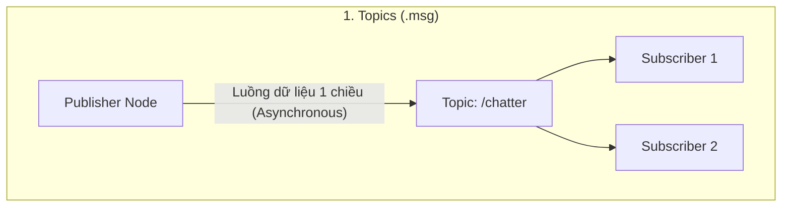
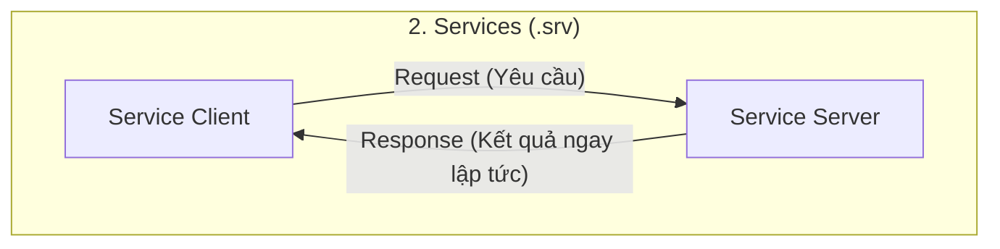
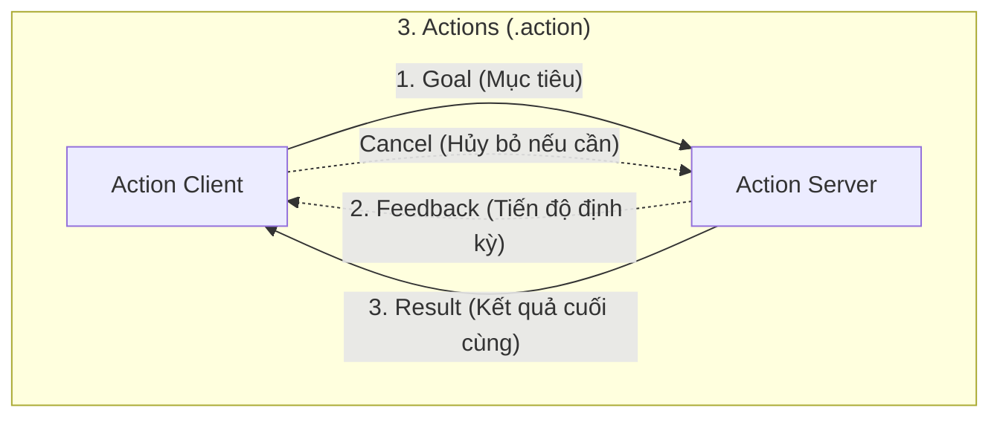

---
tags:
  - ros2
  - concepts
  - interfaces
  - topics
  - services
  - actions
  - idl
  - type-system
created: 2026-08-25
aliases:
  - Khái niệm Giao diện Truyền thông trong ROS 2
  - Interfaces (topics, services, actions)
---

# 📜 Khái niệm Giao diện Truyền thông trong ROS 2 (Interfaces: Topics, Services, Actions)

> [!INFO] **Tổng quan Khái niệm**
> Giao diện (**Interfaces**) trong ROS 2 quy định cấu trúc và cách thức các [[03 - Understanding Nodes|Node]] trao đổi dữ liệu qua lại trong mạng. Hệ thống cung cấp **3 mô hình giao tiếp chủ đạo**: **Topics** (Luồng dữ liệu liên tục), **Services** (Yêu cầu / Phản hồi đồng bộ nhanh) và **Actions** (Tác vụ thời gian dài kèm phản hồi tiến độ), được định nghĩa thông qua ngôn ngữ mô tả giao diện **IDL (Interface Definition Language)**.
> - **Cấp độ:** Toàn diện (Beginner $\to$ Advanced)
> - **Mục lục tổng quan:** [[ROS 2 Learning Path]]
> - **Chuyên đề thực hành liên quan:** [[08 - Creating Custom Interfaces (msg and srv)|Tạo Custom Interfaces]], [[02 - Creating Custom Actions|Tạo Custom Actions]], [[03 - DDS Keyed Topics in ROS 2|DDS Keyed Topics]], [[02 - Enabling Topic Statistics (C++)|Topic Statistics]]

---

## 🧭 So sánh 3 Mô hình Giao tiếp Cốt lõi







| Tiêu chí | [[04 - Understanding Topics\|Topics (.msg)]] | [[05 - Understanding Services\|Services (.srv)]] | [[07 - Understanding Actions\|Actions (.action)]] |
| :--- | :--- | :--- | :--- |
| **Mô hình kiến trúc** | **Publish / Subscribe** (Xuất bản / Đăng ký) | **Request / Response** (Yêu cầu / Trả lời) | **Goal / Feedback / Result** |
| **Hướng truyền tin** | 1 chiều (One-way) | 2 chiều (Two-way) | 2 chiều kèm kênh Feedback định kỳ |
| **Tính chất thời gian** | Bất đồng bộ liên tục (*Continuous*) | Đồng bộ / Trả kết quả tức thì (*Quick RPC*) | Không đồng bộ, tác vụ kéo dài (*Long-running*) |
| **Khả năng Hủy (Cancel)** | ❌ Không hỗ trợ | ❌ Không hỗ trợ | ✅ Hỗ trợ Hủy / Ngắt giữa chừng (*Preemption*) |
| **Ví dụ thực tế** | Dữ liệu quét Lidar, Camera, Vận tốc `/cmd_vel` | Bật/tắt đèn, Reset vị trí, Cài đặt thông số | Di chuyển đến tọa độ xa (Nav2), Gắp thả vật thể |

---

## 📡 1. Topics và Đo lường Hiệu năng Luồng Dữ liệu

Topic là một đường truyền dữ liệu nặc danh (**Anonymous**) và định kiểu tĩnh (**Strongly-typed**):
- Node nhận không cần biết ai gửi và Node gửi không quan tâm ai đang nghe.
- **Topic Keys:** Cho phép gắn thẻ định danh `@key` vào thông điệp để phân biệt các cảm biến khác nhau phát chung trên 1 topic (Xem chi tiết: [[03 - DDS Keyed Topics in ROS 2]]).
- **Topic Statistics:** Cơ chế tự động đo đạc độ trễ gói tin (*Message Age*) và chu kỳ phát (*Message Period / Jitter*) xuất bản định kỳ lên topic `/statistics` (Xem chi tiết: [[02 - Enabling Topic Statistics (C++)]]).

---

## 🛠️ 2. Cú pháp Định nghĩa File Giao diện (.msg, .srv, .action)

### A. Định nghĩa Message (`.msg`)
Đặt trong thư mục `msg/`. Cấu tạo từ các trường (`fields`) và hằng số (`constants`):

```text
# msg/CustomData.msg
int32 id
string label "default_robot"   # Có thể gán giá trị mặc định
float64[3] fixed_position      # Mảng tĩnh 3 phần tử
int32[] dynamic_samples        # Mảng động vô hạn
string<=50 limited_string      # Chuỗi có giới hạn ký tự tối đa

# Khai báo Hằng số (Bắt buộc viết HOA)
int32 MAX_SPEED=100
```

---

### B. Bảng Ánh xạ Kiểu Dữ liệu Tích hợp (Primitive Types)

| ROS Type | C++ Type | Python Type | DDS IDL Type |
| :--- | :--- | :--- | :--- |
| **`bool`** | `bool` | `bool` | `boolean` |
| **`byte` / `uint8`** | `uint8_t` | `bytes` / `int` | `octet` |
| **`int8`** | `int8_t` | `int` | `octet` |
| **`int16` / `uint16`** | `int16_t` / `uint16_t` | `int` | `short` / `unsigned short` |
| **`int32` / `uint32`** | `int32_t` / `uint32_t` | `int` | `long` / `unsigned long` |
| **`int64` / `uint64`** | `int64_t` / `uint64_t` | `int` | `long long` / `unsigned long long` |
| **`float32`** | `float` | `float` | `float` |
| **`float64`** | `double` | `float` | `double` |
| **`string`** | `std::string` | `str` | `string` |
| **`wstring`** | `std::u16string` | `str` | `wstring` |

---

### C. Định nghĩa Service (`.srv`)
Đặt trong thư mục `srv/`. Phân tách giữa **Request (Yêu cầu)** và **Response (Kết quả)** bởi dấu 3 gạch ngang `---`:

```text
# srv/AddTwoInts.srv
int64 a
int64 b
---
int64 sum
```

---

### D. Định nghĩa Action (`.action`)
Đặt trong thư mục `action/`. Phân tách 3 phần **Goal (Mục tiêu)**, **Result (Kết quả)** và **Feedback (Phản hồi)** bởi 2 hàng `---`:

```text
# action/Fibonacci.action
int32 order             # 1. Goal: Số bước Fibonacci cần tính
---
int32[] sequence        # 2. Result: Mảng kết quả cuối cùng hoàn chỉnh
---
int32[] partial_sequence # 3. Feedback: Tiến độ tính toán gửi định kỳ
```

---

## 📌 Tóm tắt (Summary)
- Lựa chọn đúng loại giao diện là bước thiết kế kiến trúc quan trọng nhất trong phát triển phần mềm Robot: Dùng **Topic** cho luồng stream, **Service** cho tác vụ tính toán ngắn tức thì, và **Action** cho các mệnh lệnh vận động dài có thể hủy bỏ.

---

## 🔗 Liên kết & Bài học Thực hành
- 📖 Thực hành tạo Message & Service: [[08 - Creating Custom Interfaces (msg and srv)|Tạo Custom Interfaces]]
- 📖 Thực hành tạo Action: [[02 - Creating Custom Actions|Tạo Custom Actions]]
- 📖 Lập trình Pub/Sub: [[04 - Writing PubSub (C++)|PubSub C++]], [[05 - Writing PubSub (Python)|PubSub Python]]
- 📖 Lập trình Service: [[06 - Writing Service Client (C++)|Service C++]], [[07 - Writing Service Client (Python)|Service Python]]
- 📖 Lập trình Action: [[03 - Writing Action Server and Client (C++)|Action C++]], [[04 - Writing Action Server and Client (Python)|Action Python]]
