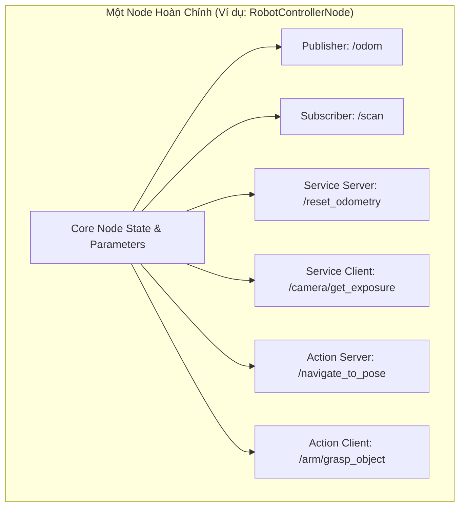
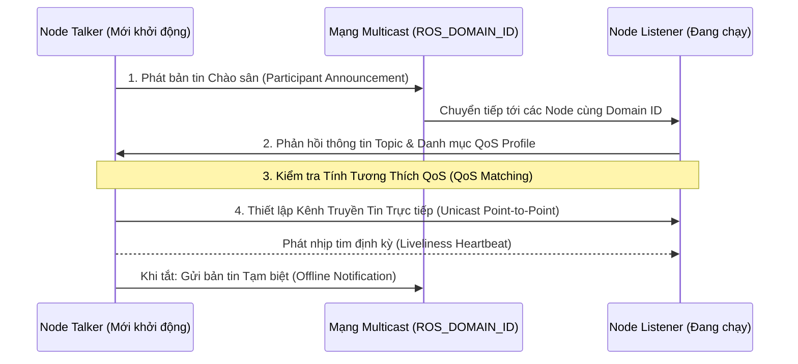

---
tags:
  - ros2
  - concepts
  - nodes
  - discovery
  - ros-graph
  - daemon
  - networking
created: 2026-08-25
aliases:
  - Khái niệm Node và Cơ chế Tìm kiếm Phân tán trong ROS 2
  - Nodes and Distributed Discovery
---

# 🌐 Khái niệm Node và Cơ chế Tìm kiếm Phân tán (Nodes & Distributed Discovery)

> [!INFO] **Tổng quan Khái niệm**
> **Node** là đơn vị tính toán và thực thi cơ sở trong đồ thị tính toán (**ROS Graph**). Khác với ROS 1 dựa vào một Master tập trung (`roscore`), ROS 2 sử dụng **Giao thức Tìm kiếm Phân tán (Distributed Dynamic Discovery)** hoàn toàn tự động dựa trên tiêu chuẩn DDS, kết hợp cùng tiến trình ngầm **ROS 2 Daemon** để tăng tốc tra cứu dòng lệnh.
> - **Cấp độ:** Toàn diện (Beginner $\to$ Advanced)
> - **Mục lục tổng quan:** [[ROS 2 Learning Path]]
> - **Chuyên đề thực hành liên quan:** [[03 - Understanding Nodes|Tìm hiểu về Nodes]], [[01 - Configuring Environment|Cấu hình Môi trường]], [[05 - Fast DDS Discovery Server Architecture|Fast DDS Discovery Server]], [[07 - Configuring Discovery Range and Static Peers|Cấu hình Discovery Range]]

---

## 🧩 Bản chất Đa Năng của một Node

Một Node trong ROS 2 hiếm khi chỉ làm một việc đơn thuần. Nó thường là sự kết hợp đồng thời của nhiều thực thể giao tiếp:



---

## 🔍 Quy trình Tìm kiếm Nút mạng Tự động (Distributed Discovery)

Khi một Node khởi động, việc kết nối diễn ra tự động qua 4 giai đoạn:



---

## 👻 Tiến trình Ngầm ROS 2 Daemon (Background Discovery Service)

Do việc quét tìm phân tán tốn thời gian (vài giây), ROS 2 sử dụng một tiến trình ngầm (**Daemon**) để duy trì bộ nhớ đệm đồ thị mạng (*Graph Cache*):

- **Tự động kích hoạt:** Khi bạn gõ `ros2 node list` hoặc `ros2 topic list`, công cụ sẽ tự động khởi động daemon nếu chưa có.
- **Phân tách theo Domain:** Mỗi giá trị `ROS_DOMAIN_ID` sẽ có một instance Daemon riêng biệt chạy trên một cổng socket cục bộ (`127.0.0.1`).
- **Chẩn đoán Lỗi:** Nếu lệnh CLI bị treo không hiện thông tin, bạn có thể khởi động lại daemon:
  ```bash
  ros2 daemon stop
  ros2 daemon start
  ```
- **Chạy Daemon ở Chế độ Foreground để Debug:**
  ```bash
  _ros2_daemon --ros-domain-id 0 --rmw-implementation rmw_fastrtps_cpp
  ```

---

## 📌 Tóm tắt (Summary)
- Kiến trúc không phụ thuộc ROS Master giúp hệ thống ROS 2 có khả năng chịu lỗi cao (không có Single Point of Failure), các node tự tìm thấy nhau và phục hồi kết nối tự động khi mạng chập chờn.

---

## 🔗 Liên kết & Bài học Thực hành
- 📖 Thao tác CLI với Node: [[03 - Understanding Nodes|Tìm hiểu về Nodes]]
- 📖 Lập trình Node C++: [[04 - Writing PubSub (C++)|PubSub C++]]
- 📖 Lập trình Node Python: [[05 - Writing PubSub (Python)|PubSub Python]]
- 📖 Tối ưu Discovery trên mạng lớn: [[05 - Fast DDS Discovery Server Architecture|Kiến trúc Fast DDS Discovery Server]]
