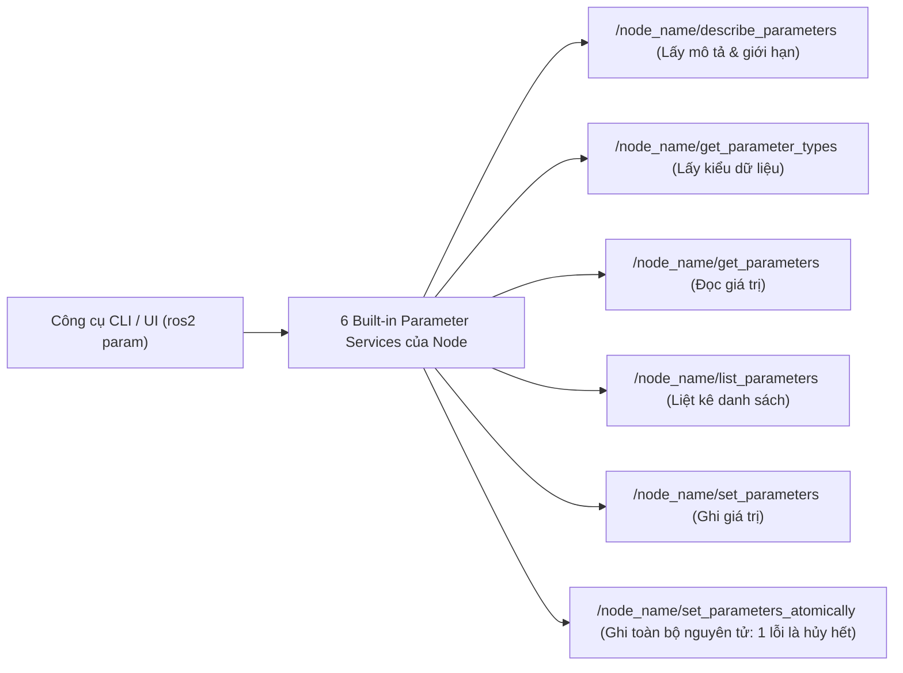
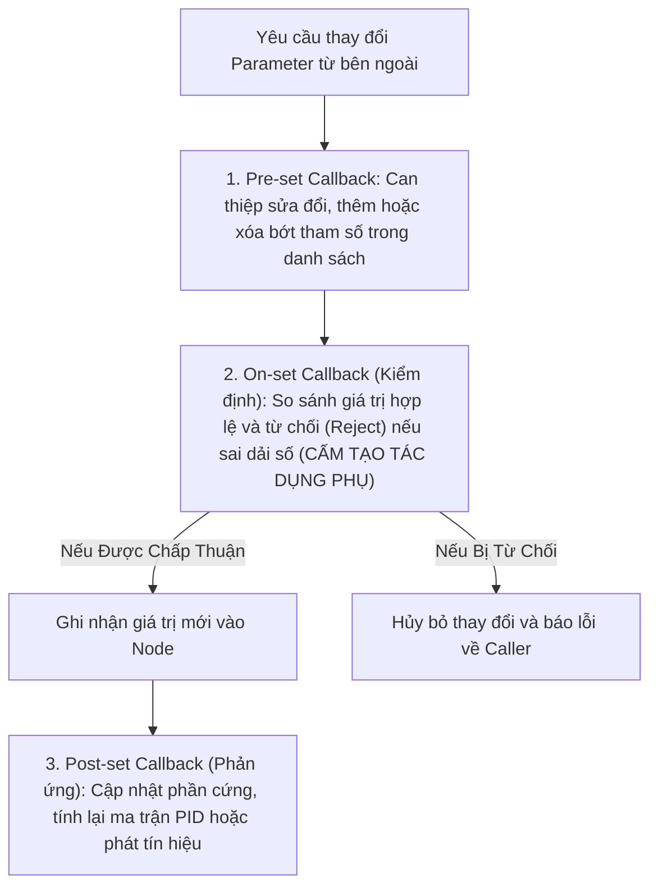

---
tags:
  - ros2
  - concepts
  - parameters
  - dynamic-reconfigure
  - callbacks
  - configuration
  - yaml
created: 2026-08-25
aliases:
  - Hệ thống Parameters và Cơ chế Callback Động trong ROS 2
  - Parameters System and Dynamic Callbacks
---

# ⚙️ Hệ thống Parameters và Cơ chế Callback Động (Parameters Architecture & Callbacks)

> [!INFO] **Tổng quan Khái niệm**
> **Parameters (Tham số cấu hình)** trong ROS 2 là các giá trị cấu hình gắn liền với từng Node cụ thể, cho phép tinh chỉnh hành vi của robot lúc khởi động hoặc ngay khi đang vận hành (*Runtime Reconfiguration*) mà không cần sửa code hoặc biên dịch lại. Khác với ROS 1 sử dụng Parameter Server tập trung, ROS 2 sử dụng **Kiến trúc Dịch vụ Tham số Phân tán (Distributed Parameter Services)**.
> - **Cấp độ:** Toàn diện (Beginner $\to$ Advanced)
> - **Mục lục tổng quan:** [[ROS 2 Learning Path]]
> - **Chuyên đề thực hành liên quan:** [[06 - Understanding Parameters|Tìm hiểu Parameters]], [[09 - Using Parameters in a Class (C++)|Parameters C++]], [[10 - Using Parameters in a Class (Python)|Parameters Python]], [[10 - Monitoring Parameter Changes (C++)|Theo dõi Parameter C++]], [[11 - Monitoring Parameter Changes (Python)|Theo dõi Parameter Python]]

---

## 🏛️ Kiến trúc Dịch vụ Tham số Tích hợp (Built-in Parameter Services)

Khi bất kỳ Node nào được khởi tạo, ROS 2 tự động tạo sẵn **6 Dịch vụ ngầm (Services)** phục vụ việc truy vấn và chỉnh sửa cấu hình:

---

## 🛡️ Kiểu Dữ liệu và Mô tả Tham số (Parameter Descriptors)

Mỗi Parameter gồm 3 thành phần: **Key (Tên chuỗi)**, **Value (Giá trị)** và **Descriptor (Mô tả & Ràng buộc)**:
- **Kiểu dữ liệu hỗ trợ:** `bool`, `int64`, `float64`, `string`, `byte[]`, `bool[]`, `int64[]`, `float64[]`, `string[]`.
- **Khai báo bắt buộc (Explicit Declaration):** Node bắt buộc phải khai báo tên và kiểu trước khi dùng. Nếu muốn nhận tham số tùy biến không báo trước, phải đặt cờ `allow_undeclared_parameters: true`.
- **Đổi kiểu động (`dynamic_typing`):** Mặc định, bạn không thể gán một giá trị `string` vào một tham số ban đầu là `int`. Muốn cho phép đổi kiểu tự do, phải bật `descriptor.dynamic_typing = true`.

---

## 🔄 3 Loại Callback Xử lý Sự kiện Thay đổi Parameter

Để can thiệp vào quy trình thay đổi tham số, ROS 2 cung cấp chuỗi **3 hàm Callback liên tiếp**:

> [!CAUTION] **Cảnh báo về `On-set Callback`:**
> Tuyệt đối **không được tạo tác dụng phụ (*No Side-effects*)** trong On-set Callback (như thay đổi biến nội bộ của class), vì nếu có một On-set Callback khác trong chuỗi từ chối giá trị, node của bạn sẽ bị lệch trạng thái với giá trị thực tế của Parameter! Hãy dùng **`Post-set Callback`** hoặc **`ParameterEventHandler`** để phản ứng với thay đổi đã thành công.

---

## 📌 Tóm tắt (Summary)
- Hệ thống Parameter trong ROS 2 kết hợp giữa sự an toàn kiểu dữ liệu tĩnh và tính linh hoạt của các cơ chế Callback thời gian thực.

---

## 🔗 Liên kết & Bài học Thực hành
- 📖 Thao tác CLI: [[06 - Understanding Parameters|Tìm hiểu về Parameters]]
- 📖 Lập trình C++: [[09 - Using Parameters in a Class (C++)|Parameters trong C++]], [[10 - Monitoring Parameter Changes (C++)|Theo dõi Parameter C++]]
- 📖 Lập trình Python: [[10 - Using Parameters in a Class (Python)|Parameters trong Python]], [[11 - Monitoring Parameter Changes (Python)|Theo dõi Parameter Python]]
