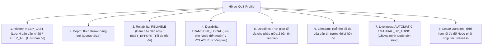

---
tags:
  - ros2
  - concepts
  - qos
  - quality-of-service
  - reliability
  - durability
  - compatibility-matrix
  - networking
created: 2026-08-25
aliases:
  - Chất lượng Dịch vụ QoS và Bảng Ma trận Tương thích trong ROS 2
  - Quality of Service settings
---

# 📶 Chất lượng Dịch vụ QoS và Ma trận Tương thích (Quality of Service Architecture)

> [!INFO] **Tổng quan Khái niệm**
> **Quality of Service (QoS)** là một trong những nâng cấp kiến trúc đột phá nhất của ROS 2 so với ROS 1. Dựa trên tiêu chuẩn mạng DDS, QoS cho phép lập trình viên tinh chỉnh từng thông số truyền tin: từ mức độ tin cậy tuyệt đối như TCP (**Reliable**) đến tốc độ siêu nhanh chấp nhận mất gói tin trên mạng WiFi như UDP (**Best Effort**), đảm bảo dữ liệu cảm biến luôn mới nhất và phục vụ các hệ thống thời gian thực khắt khe.
> - **Cấp độ:** Toàn diện (Beginner $\to$ Advanced)
> - **Mục lục tổng quan:** [[ROS 2 Learning Path]]
> - **Chuyên đề thực hành liên quan:** [[04 - Understanding Topics|Tìm hiểu Topics & QoS]], [[03 - DDS Keyed Topics in ROS 2|DDS Keyed Topics & Transient Local]], [[06 - Unlocking Fast DDS XML Profiles and Features|Fast DDS XML QoS Profiles]]

---

## 🧭 8 Chính sách QoS Cốt lõi (QoS Policies)

---

## 📦 Các Hồ sơ QoS Chuẩn hóa (Predefined QoS Profiles)

| Profile Tích hợp sẵn | History & Depth | Reliability | Durability | Mục đích sử dụng |
| :--- | :--- | :--- | :--- | :--- |
| **`Default`** | `KEEP_LAST (10)` | `RELIABLE` | `VOLATILE` | Giao tiếp thông thường (hành vi giống ROS 1). |
| **`SensorData`** | `KEEP_LAST (5)` | `BEST_EFFORT` | `VOLATILE` | Camera, Lidar, IMU tần số cao trên mạng WiFi. |
| **`Services`** | `KEEP_LAST (10)` | `RELIABLE` | `VOLATILE` | Giao tiếp Service Server và Client. |
| **`Parameters`** | `KEEP_LAST (1000)` | `RELIABLE` | `VOLATILE` | Đảm bảo không mất bản tin cấu hình tham số. |
| **`SystemDefault`** | Tùy RMW | Tùy RMW | Tùy RMW | Sử dụng thiết lập mặc định của nhà sản xuất DDS. |

---

## 🤝 Mô hình Đề nghị vs Yêu cầu (Request vs Offered Model)

Nguyên lý tương thích:
- **Publisher (Bên Cung cấp):** Đưa ra mức chất lượng tối đa có thể cung cấp (**$QoS_{Offered}$**).
- **Subscription (Bên Nhận):** Đưa ra mức chất lượng tối thiểu chấp nhận được (**$QoS_{Requested}$**).
- **Quy tắc:** Kết nối chỉ được thành lập khi $QoS_{Offered} \ge QoS_{Requested}$.

---

## 📊 Ma trận Tương thích Chi tiết (Compatibility Matrices)

### 1. Ma trận Độ Tin Cậy (Reliability)
| Publisher (Offered) | Subscription (Requested) | Tương thích? | Kết quả |
| :--- | :--- | :---: | :--- |
| `Best Effort` | `Best Effort` | ✅ **Có** | Giao tiếp bình thường |
| `Best Effort` | `Reliable` | ❌ **KHÔNG** | **Mất kết nối! (Sub đòi Reliable nhưng Pub chỉ có Best Effort)** |
| `Reliable` | `Best Effort` | ✅ **Có** | Giao tiếp bình thường |
| `Reliable` | `Reliable` | ✅ **Có** | Giao tiếp bình thường |

---

### 2. Ma trận Độ Bền Vững (Durability)
| Publisher (Offered) | Subscription (Requested) | Tương thích? | Kết quả |
| :--- | :--- | :---: | :--- |
| `Volatile` | `Volatile` | ✅ **Có** | Chỉ nhận các bản tin mới sau khi kết nối |
| `Volatile` | `Transient Local` | ❌ **KHÔNG** | **Mất kết nối! (Sub muốn nhận tin cũ nhưng Pub không lưu)** |
| `Transient Local` | `Volatile` | ✅ **Có** | Chỉ nhận tin mới |
| `Transient Local` | `Transient Local` | ✅ **Có** | **Nhận đủ cả bản tin cũ (Latched Topic) và bản tin mới** |

---

## 🚨 Sự kiện QoS (QoS Events & Matched Events)

Lập trình viên có thể đăng ký Callback để hệ thống tự động cảnh báo khi xảy ra sự cố mạng:
- **`Offered/Requested Incompatible QoS`**: Kích hoạt khi phát hiện có Node khác kết nối nhưng bất tương thích về cấu hình QoS.
- **`Offered/Requested Deadline Missed`**: Kích hoạt khi cảm biến bị treo hoặc mạng lag làm trễ quá thời gian Deadline cho phép.
- **`Liveliness Lost`**: Kích hoạt khi một Publisher gặp sự cố không thể gửi tín hiệu định kỳ.
- **`Matched Events`**: Kích hoạt mỗi khi có một Subscriber mới tham gia hoặc ngắt kết nối khỏi mạng.

---

## 📌 Tóm tắt (Summary)
- Nắm vững QoS là chìa khóa để xử lý triệt để các lỗi "Publisher phát nhưng Subscriber không nhận được tin" và tối ưu hóa băng thông cho robot thực tế.

---

## 🔗 Liên kết & Bài học Thực hành
- 📖 Thao tác lệnh: [[04 - Understanding Topics|Tìm hiểu Topics và QoS]]
- 📖 Cấu hình Chuyên sâu qua XML: [[06 - Unlocking Fast DDS XML Profiles and Features|Khai phá Sức mạnh Cấu hình XML trong Fast DDS]]
- 📖 Ứng dụng Transient Local: [[03 - DDS Keyed Topics in ROS 2|Cơ chế Phân loại Khóa Topic (DDS Keyed Topics)]]
