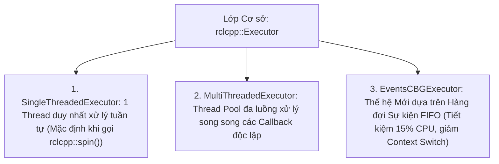

---
tags:
  - ros2
  - concepts
  - executors
  - callback-groups
  - multithreading
  - scheduling
  - real-time
created: 2026-08-25
aliases:
  - Kiến trúc Executors, Callback Groups và Ngữ nghĩa Lập lịch
  - Executors and Callback Groups
---

# 🧵 Kiến trúc Executors, Callback Groups và Ngữ nghĩa Lập lịch (Execution Management)

> [!INFO] **Tổng quan Khái niệm**
> Trong ROS 2, việc điều phối luồng thực thi của CPU để xử lý các hàm Callback (từ Subscription, Timer, Service, Action) được quản lý tập trung bởi **Executors**. Khác với vòng lặp `spin()` đơn giản của ROS 1, ROS 2 cung cấp cơ chế phân nhóm **Callback Groups** (Độc quyền tương hỗ vs Đồng thời), các loại Executor đa luồng và thế hệ **EventsCBGExecutor** tối ưu hóa CPU.
> - **Cấp độ:** Toàn diện (Beginner $\to$ Advanced)
> - **Mục lục tổng quan:** [[ROS 2 Learning Path]]
> - **Chuyên đề thực hành liên quan:** [[06 - Writing a Composable Node (C++)|Composable Nodes C++]], [[07 - Composing Multiple Nodes in a Single Process|Kết hợp nhiều Node trong 1 Tiến trình]], [[05 - Writing Async Node with asyncio (Python)|Async Node Python]], [[08 - Implementing Custom Real-Time Memory Allocator (C++)|Real-Time Custom Allocator]]

---

## 🏛️ 3 Loại Executor trong `rclcpp`



---

## 🗂️ 2 Loại Phân nhóm Callback Groups

Khi chạy `MultiThreadedExecutor`, việc hai Callback có được phép chạy song song trên 2 luồng CPU khác nhau hay không phụ thuộc vào loại **Callback Group**:

```mermaid
graph TD
    subgraph G1 ["1. MutuallyExclusiveCallbackGroup (Độc quyền tương hỗ)"]
        CB1["Callback A (Ví dụ: Timer 100Hz)"]
        CB2["Callback B (Ví dụ: /cmd_vel Sub)"]
        CB1 -. "KHÔNG ĐƯỢC CHẠY CÙNG LÚC\n(Bảo vệ biến dùng chung, chống Race Condition)" .- CB2
    end

    subgraph G2 ["2. ReentrantCallbackGroup (Đồng thời tự do)"]
        CB3["Callback C1 (Lần gọi 1)"]
        CB4["Callback C2 (Lần gọi 2)"]
        CB3 === "CHO PHÉP CHẠY SONG SONG TRÊN NHIỀU THREADS" === CB4
    end
```

| Loại Callback Group | Hành vi Thực thi | Trường hợp sử dụng |
| :--- | :--- | :--- |
| **`MutuallyExclusive`** *(Mặc định)* | **Chỉ 1 Callback trong nhóm được chạy tại một thời điểm**. Các callback khác phải xếp hàng chờ. | Khi các callback cùng đọc/ghi vào một biến trạng thái nội bộ của Node. |
| **`Reentrant`** | **Nhiều luồng có thể thực thi các callback trong nhóm đồng thời**, kể cả các lần gọi tiếp theo của chính callback đó. | Service Server nhận nhiều request liên tục, thuật toán xử lý hình ảnh không lưu trạng thái. |

---

## ⏱️ Ngữ nghĩa Lập lịch (Scheduling Semantics: WaitSet vs FIFO Events)

### Cơ chế Cũ (WaitSet):
Executor sử dụng một mặt nạ bit (*Wait Set*) để thăm dò xem topic nào có tin mới:
- Nếu nhiều topic cùng có tin, Executor sẽ xử lý theo thuật toán **Xoay vòng (Round-Robin)** thay vì theo thứ tự thời gian tin đến (FIFO).
- Điều này có thể dẫn đến hiện tượng **Nghịch đảo Độ ưu tiên (Priority Inversion)**: tác vụ điều khiển động cơ quan trọng có thể bị chặn bởi một tin nhắn log không quan trọng.

### Cơ chế Mới (`EventsCBGExecutor`):
Thay vì thăm dò định kỳ (*polling*), tầng middleware đẩy trực tiếp sự kiện vào một **Hàng đợi Sự kiện FIFO**:
- Xử lý chính xác theo thứ tự xảy ra sự kiện.
- Tiết kiệm 10% – 15% CPU do loại bỏ hoàn toàn chi phí thăm dò vô ích khi không có dữ liệu.

---

## ⚡ Giải pháp Lập trình Thời gian Thực (Hard Real-Time)

Đối với các ứng dụng robot yêu cầu tính tiền định tuyệt đối:
1. **`rclcpp::WaitSet` API**: Cho phép lập trình viên tự viết vòng lặp chờ và quyết định thứ tự thực thi chính xác của từng topic mà không thông qua Executor.
2. **`rclc::Executor` (micro-ROS)**: Cung cấp mô hình thực thi theo thời gian logic (**Logical Execution Time - LET**) cho vi điều khiển.

---

## 📌 Tóm tắt (Summary)
- Sử dụng đúng loại Callback Group và Executor là yếu tố quyết định để tránh hiện tượng treo ứng dụng (*Deadlock*) và tối ưu hóa năng lực tính toán đa nhân của CPU.

---

## 🔗 Liên kết & Bài học Thực hành
- 📖 Kết hợp đa Node: [[07 - Composing Multiple Nodes in a Single Process|Kết hợp nhiều Node trong một Tiến trình]]
- 📖 Lập trình bất đồng bộ Python: [[05 - Writing Async Node with asyncio (Python)|Viết Async Node thuần asyncio trong Python]]
- 📖 Lập trình an toàn bộ nhớ: [[08 - Implementing Custom Real-Time Memory Allocator (C++)|Tự Triển khai Memory Allocator Thời gian Thực (C++)]]
