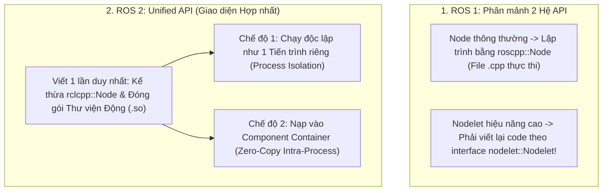

---
tags:
  - ros2
  - concepts
  - composition
  - components
  - containers
  - intra-process
  - zero-copy
  - performance
created: 2026-08-25
aliases:
  - Kiến trúc Ghép nối Components và Container trong ROS 2
  - Composition and Component Containers
---

# 📦 Kiến trúc Ghép nối Components và Container (Composition Architecture)

> [!INFO] **Tổng quan Khái niệm**
> **Composition (Ghép nối thành phần)** là mô hình thiết kế chuẩn mực của ROS 2 thay thế cho cơ chế Nodelet phân mảnh của ROS 1. Với **Unified API (Giao diện Lập trình Hợp nhất)**, một Node C++ được viết theo chuẩn **Component** có thể được triển khai linh hoạt lúc chạy (*Deploy-time Decision*): chạy như một tiến trình độc lập hoặc nạp động vào một **Component Container** dùng chung không gian bộ nhớ để truyền dữ liệu **Zero-Copy**.
> - **Cấp độ:** Toàn diện (Beginner $\to$ Advanced)
> - **Mục lục tổng quan:** [[ROS 2 Learning Path]]
> - **Chuyên đề thực hành liên quan:** [[06 - Writing a Composable Node (C++)|Viết Composable Node]], [[07 - Composing Multiple Nodes in a Single Process|Kết hợp nhiều Node trong 1 Tiến trình]]

---

## 📖 So sánh Kiến trúc ROS 1 vs ROS 2



---

## 🏛️ Các Loại Component Container Tiêu chuẩn

Container là một tiến trình chủ (*Host Process*) quản lý vòng đời và điều phối luồng cho các Components nạp động bên trong:

| Kiểu Container | Cấu hình lệnh CLI | Đặc tính kiến trúc |
| :--- | :--- | :--- |
| **Mặc định** | `ros2 run rclcpp_components component_container` | Sử dụng 1 `SingleThreadedExecutor` duy nhất cho toàn bộ components. |
| **Đa luồng** | `component_container --executor-type multi-threaded` | Sử dụng `MultiThreadedExecutor` dùng chung luồng (`thread_num`). |
| **Events FIFO** | `component_container --executor-type events-cbg` | Sử dụng `EventsCBGExecutor` tối ưu CPU. |
| **Cô lập (Isolated)** | `component_container --executor-type single-threaded --isolated` | **Mỗi Component sở hữu một Executor riêng biệt**, tránh việc component nặng làm tắc nghẽn component khác. |

---

## 🛠️ 2 Macro Đăng ký CMake Cốt lõi

Để đăng ký Component với hệ thống nạp động của ROS 2:

### 1. `rclcpp_components_register_node`
Đăng ký component **VÀ đồng thời tự động sinh ra một file thực thi (Executable) độc lập**:
```cmake
add_library(talker_component SHARED src/talker_component.cpp)
rclcpp_components_register_node(talker_component
  PLUGIN "composition::Talker"
  EXECUTABLE talker_node)
```

### 2. `rclcpp_components_register_nodes`
Đăng ký thuần túy một hoặc nhiều component vào thư viện chia sẻ mà **không tạo file thực thi độc lập** (dành cho các thư viện plugin thuần):
```cmake
add_library(talker_component SHARED src/talker_component.cpp)
rclcpp_components_register_nodes(talker_component "composition::Talker")
```

---

## 📌 Tóm tắt (Summary)
- Viết mã nguồn dưới dạng Composable Node là phương pháp thực hành tốt nhất (*Best Practice*) trong ROS 2, cho phép chuyển đổi giữa an toàn phân lập tiến trình và hiệu năng tối đa mà không cần sửa đổi mã nguồn.

---

## 🔗 Liên kết & Bài học Thực hành
- 📖 Viết Composable Node: [[06 - Writing a Composable Node (C++)|Viết Composable Node bằng C++]]
- 📖 Ghép nối nhiều Node trong 1 Container: [[07 - Composing Multiple Nodes in a Single Process|Kết hợp nhiều Node trong một Tiến trình]]
