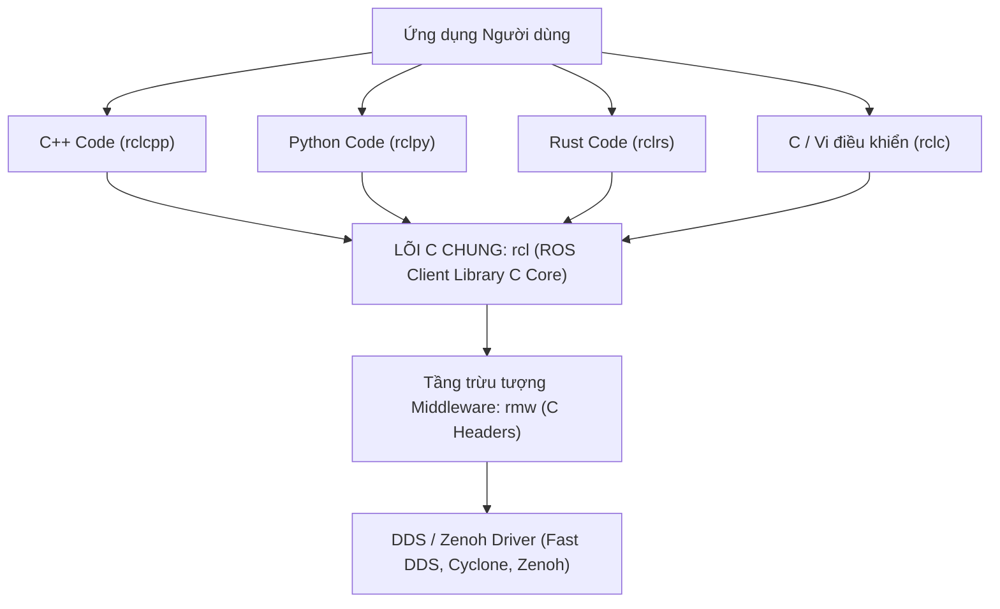

---
tags:
  - ros2
  - concepts
  - client-libraries
  - rclcpp
  - rclpy
  - rcl
  - rclc
  - rust
  - architecture
created: 2026-08-25
aliases:
  - Kiến trúc Thư viện Khách (rclcpp, rclpy và rcl Core)
  - Client libraries Architecture
---

# 📚 Kiến trúc Thư viện Khách (Client Libraries Architecture: rclcpp, rclpy & rcl)

> [!INFO] **Tổng quan Khái niệm**
> **Client Libraries (Thư viện Khách)** là lớp giao diện lập trình ứng dụng (API) cho phép kỹ sư viết mã nguồn điều khiển robot bằng ngôn ngữ ưa thích (C++, Python, Rust, C). Không như ROS 1 xây dựng các thư viện độc lập từ con số 0 dẫn đến hành vi không nhất quán, ROS 2 sử dụng kiến trúc **Lõi C Chung (`rcl`)** đảm bảo 100% tính nhất quán về logic định danh, thời gian và tham số giữa mọi ngôn ngữ.
> - **Cấp độ:** Toàn diện (Beginner $\to$ Advanced)
> - **Mục lục tổng quan:** [[ROS 2 Learning Path]]
> - **Chuyên đề thực hành liên quan:** [[04 - Writing PubSub (C++)|PubSub C++]], [[05 - Writing PubSub (Python)|PubSub Python]], [[06 - Writing Service Client (C++)|Service C++]], [[07 - Writing Service Client (Python)|Service Python]], [[05 - Writing Async Node with asyncio (Python)|Async Node Python]]

---

## 🏛️ Sơ đồ Phân tầng Kiến trúc Đa Ngôn ngữ

---

## 🔍 Chi tiết 2 Thư viện Khách Chính thức

### 1. `rclcpp` (Thư viện C++)
- Được tối ưu cho hiệu năng tối đa, tận dụng chuẩn **C++17 / C++20**.
- Sử dụng mã nguồn tạo bởi `rosidl_generator_cpp` (con trỏ `std::shared_ptr`, `std::unique_ptr` hỗ trợ Zero-Copy).
- Quản lý luồng bằng các lớp `Executor` chuyên dụng.

---

### 2. `rclpy` (Thư viện Python)
- Cung cấp trải nghiệm lập trình Pythonic chuẩn mực (hỗ trợ `asyncio`, lists, context managers).
- **Cơ chế Chuyển đổi Dữ liệu:** Tất cả thao tác dữ liệu diễn ra trên đối tượng Python gốc. Khi cần gửi qua mạng, `rclpy` mới chuyển đổi (*marshalling*) sang cấu trúc C của `rcl` để tối ưu hiệu năng.

---

## 🌐 Các Thư viện do Cộng đồng Phát triển (Community Libraries)

| Thư viện | Ngôn ngữ / Nền tảng | Điểm nổi bật & Ứng dụng |
| :--- | :--- | :--- |
| **`rclc`** | **C thuần (C99)** | Trọng tâm của **micro-ROS**, chạy trên chip vi điều khiển ESP32, STM32, Arduino không có hệ điều hành. |
| **`rclrs`** | **Rust** | An toàn bộ nhớ tuyệt đối (*Memory Safety*), không lo rò rỉ RAM hay Race Condition. |
| **`rclnodejs`**| **Node.js / JavaScript** | Xây dựng Dashboard điều khiển Web, WebSockets và ứng dụng IoT. |
| **`ros2-dotnet`**| **C# / .NET Core** | Lập trình ứng dụng Desktop Windows, giao diện WPF, nhúng vào Unity 3D mô phỏng. |
| **`Flutter / Dart`** | **Dart** | Phát triển ứng dụng điều khiển robot trên điện thoại di động Android / iOS. |

---

## 📌 Tóm tắt (Summary)
- Kiến trúc Lõi C `rcl` giúp ROS 2 có khả năng mở rộng sang bất kỳ ngôn ngữ lập trình nào trong tương lai mà vẫn giữ trọn vẹn toàn bộ tính năng cốt lõi của hệ sinh thái.

---

## 🔗 Liên kết & Bài học Thực hành
- 📖 Lập trình C++: [[04 - Writing PubSub (C++)|PubSub C++]], [[06 - Writing Service Client (C++)|Service C++]]
- 📖 Lập trình Python: [[05 - Writing PubSub (Python)|PubSub Python]], [[07 - Writing Service Client (Python)|Service Python]]
- 📖 Lập trình Async Python: [[05 - Writing Async Node with asyncio (Python)|Viết Async Node với asyncio]]
