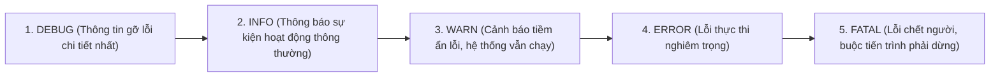
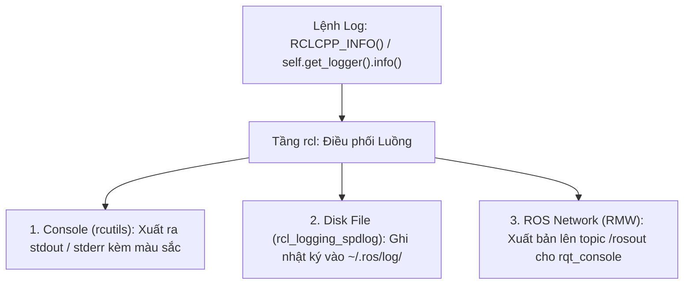

---
tags:
  - ros2
  - concepts
  - logging
  - logger
  - spdlog
  - rcutils
  - diagnostics
created: 2026-08-25
aliases:
  - Hệ thống Logging và Cấu hình Ghi Nhật ký trong ROS 2
  - Logging and logger configuration
---

# 📝 Hệ thống Logging và Cấu hình Ghi Nhật ký (Logging Subsystem)

> [!INFO] **Tổng quan Khái niệm**
> Hệ thống **Logging** trong ROS 2 chịu trách nhiệm ghi nhận, định dạng và phân phối các thông điệp chẩn đoán vận hành từ mã nguồn đến 3 đích đến đồng thời: **Màn hình Console**, **Tệp tin trên Ổ cứng (`~/.ros/log`)** và **Mạng ROS 2 qua topic `/rosout`**. Kiến trúc hỗ trợ phân cấp Logger cha-con và nạp động các Backend ghi nhật ký hiệu năng cao (**`spdlog`** vs **`noop`**).
> - **Cấp độ:** Toàn diện (Beginner $\to$ Advanced)
> - **Mục lục tổng quan:** [[ROS 2 Learning Path]]
> - **Chuyên đề thực hành liên quan:** [[08 - Using RQt Console|Quản lý Logs với RQt Console]]

---

## 🧭 5 Cấp độ Nghiêm trọng (Severity Levels)

Hệ thống lọc và chỉ xuất ra các bản tin có mức độ nghiêm trọng lớn hơn hoặc bằng mức đã thiết lập cho Node:



---

## 🏛️ Sơ đồ Luồng Dữ liệu Phân phối Logs



---

## 🛠️ Biến Môi trường Tinh chỉnh Toàn cục (Global Settings)

| Biến Môi trường | Chức năng & Tùy chọn | Ví dụ sử dụng |
| :--- | :--- | :--- |
| **`RCL_LOGGING_IMPLEMENTATION`** | Chọn Backend ghi log: `rcl_logging_spdlog` (Mặc định) hoặc `rcl_logging_noop` (Tắt toàn bộ để tối đa FPS). | `export RCL_LOGGING_IMPLEMENTATION=rcl_logging_noop` |
| **`RCUTILS_CONSOLE_OUTPUT_FORMAT`** | Tùy biến định dạng in ra console (`{severity}`, `{time}`, `{name}`, `{file_name}`, `{line_number}`, `{message}`). | `export RCUTILS_CONSOLE_OUTPUT_FORMAT="[{severity}] [{time}]: {message}"` |
| **`RCUTILS_COLORIZED_OUTPUT`** | Bật (`1`) hoặc tắt (`0`) in màu trên terminal. | `export RCUTILS_COLORIZED_OUTPUT=1` |
| **`ROS_LOG_DIR`** | Chỉ định thư mục lưu trữ file log thay vì mặc định. | `export ROS_LOG_DIR=/var/log/robot` |

---

## 🚀 Tinh chỉnh Mức Log lúc Khởi chạy Node

```bash
# Đổi mức log của talker thành DEBUG
ros2 run demo_nodes_cpp talker --ros-args --log-level talker:=DEBUG

# Tắt xuất bản /rosout để tiết kiệm băng thông mạng
ros2 run demo_nodes_cpp talker --ros-args --disable-rosout-logs
```

---

## 📌 Tóm tắt (Summary)
- Hệ thống logging linh hoạt của ROS 2 giúp việc giám sát và chẩn đoán sự cố robot từ xa trở nên chuẩn hóa và dễ dàng.

---

## 🔗 Liên kết & Bài học Thực hành
- 📖 Kiểm tra Logs trực quan: [[08 - Using RQt Console|Quản lý và Kiểm tra Logs với RQt Console]]
