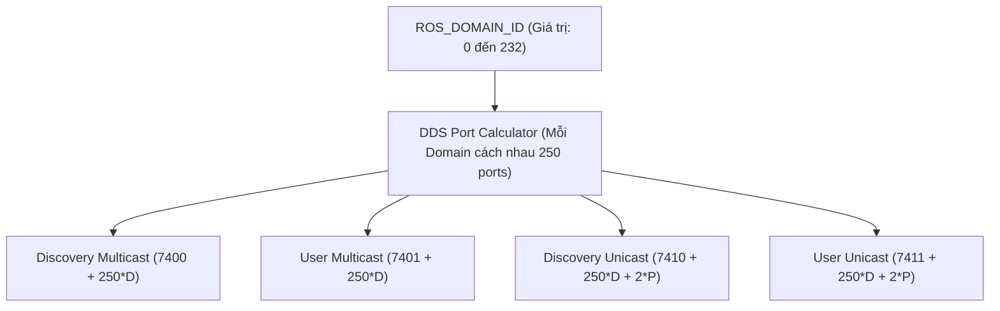

---
tags:
  - ros2
  - concepts
  - networking
  - domain-id
  - udp-ports
  - ephemeral-ports
  - dds-math
created: 2026-08-25
aliases:
  - Công thức Tính toán Cổng UDP và Phân vùng ROS_DOMAIN_ID
  - The ROS_DOMAIN_ID
---

# 🔢 Công thức Tính toán Cổng UDP và Phân vùng ROS_DOMAIN_ID (Domain ID & UDP Ports)

> [!INFO] **Tổng quan Khái niệm**
> Biến môi trường **`ROS_DOMAIN_ID`** là cơ chế phân vùng mạng ảo cốt lõi của tiêu chuẩn DDS: các Node có cùng Domain ID sẽ tự động tìm thấy và trao đổi dữ liệu với nhau, trong khi các Node khác Domain ID sẽ hoàn toàn vô hình. Dải số Domain ID được quy đổi trực tiếp thành **các dải số hiệu Cổng mạng UDP (UDP Port Numbers)**, đòi hỏi kỹ sư phải hiểu rõ toán học đằng sau để tránh xung đột với dải cổng ngắn hạn (**Ephemeral Ports**) của hệ điều hành.
> - **Cấp độ:** Toàn diện (Beginner $\to$ Advanced)
> - **Mục lục tổng quan:** [[ROS 2 Learning Path]]
> - **Chuyên đề thực hành liên quan:** [[01 - Configuring Environment|Cấu hình Môi trường]], [[07 - Configuring Discovery Range and Static Peers|Cấu hình Discovery Range & Static Peers]]

---

## 📐 Công thức Toán học Tính Cổng UDP trong DDS

Mỗi Node (tương ứng với 1 Participant) chiếm **4 cổng UDP**: 2 cổng Multicast dùng chung cho toàn Domain và 2 cổng Unicast riêng cho từng Participant:

$$\text{Port}_{\text{Discovery Multicast}} = 7400 + (250 \times \text{DomainID})$$
$$\text{Port}_{\text{User Multicast}} = 7401 + (250 \times \text{DomainID})$$
$$\text{Port}_{\text{Discovery Unicast}} = 7410 + (250 \times \text{DomainID}) + (2 \times \text{ParticipantID})$$
$$\text{Port}_{\text{User Unicast}} = 7411 + (250 \times \text{DomainID}) + (2 \times \text{ParticipantID})$$

---

## 🛡️ Dải Domain ID An toàn trên Linux

Do cổng UDP tối đa là `65535`, và nhân Linux mặc định sử dụng dải cổng **32768 – 60999** cho các tiến trình mạng ngắn hạn (*Ephemeral Ports*):

| Dải Domain ID | Trạng thái An toàn trên Linux | Giải thích |
| :--- | :---: | :--- |
| **`0 – 101`** | 🟢 **AN TOÀN TUYỆT ĐỐI** *(Khuyên dùng)* | Cổng UDP nằm từ 7400 đến 32661, không bao giờ chạm dải Ephemeral. |
| **`102 – 214`** | 🔴 **NGUY CƠ XUNG ĐỘT** | Trùng với dải cổng Ephemeral của Linux kernel (`/proc/sys/net/ipv4/ip_local_port_range`). |
| **`215 – 232`** | 🟢 **AN TOÀN** | Cổng UDP nằm từ 61150 đến 65411. |
| **`> 232`** | ❌ **KHÔNG HỢP LỆ** | Vượt quá giới hạn cổng 16-bit `65535`. |

---

## ⚠️ Giới hạn Số lượng Tiến trình (Participants) trên 1 Máy

- Mỗi Domain ID được cấp một khoảng cách **250 cổng**.
- Do mỗi Participant chiếm 2 cổng Unicast, nên **tối đa 120 tiến trình ROS 2** được phép chạy đồng thời trên cùng một máy trong một Domain ID.
- Nếu bạn chạy quá 120 tiến trình, các cổng Unicast của Domain 1 sẽ bị **tràn sang đè lên cổng của Domain 2**!

---

## 📌 Tóm tắt (Summary)
- Quy tắc vàng: **Luôn chọn `ROS_DOMAIN_ID` trong khoảng từ 0 đến 101** để hệ thống vận hành ổn định và không bao giờ bị lỗi mất gói tin bí ẩn do xung đột cổng mạng hệ điều hành.

---

## 🔗 Liên kết & Bài học Thực hành
- 📖 Cấu hình môi trường: [[01 - Configuring Environment|Cấu hình Môi trường ROS 2]]
- 📖 Cô lập mạng nâng cao: [[07 - Configuring Discovery Range and Static Peers|Cấu hình Phạm vi Discovery và Danh sách Static Peers]]
