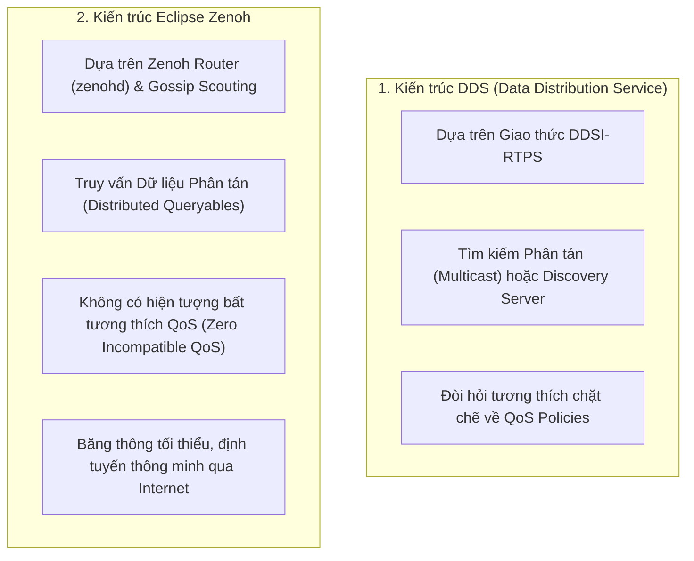

---
tags:
  - ros2
  - concepts
  - middleware
  - rmw
  - dds
  - fastdds
  - cyclonedds
  - zenoh
  - connext
created: 2026-08-25
aliases:
  - Các Nhà cung cấp Middleware và Kiến trúc RMW (DDS vs Zenoh)
  - Different ROS 2 middleware vendors
---

# 🔌 Các Nhà cung cấp Middleware và Kiến trúc RMW (DDS vs Zenoh)

> [!INFO] **Tổng quan Khái niệm**
> ROS 2 được thiết kế theo nguyên lý **Độc lập Nhà cung cấp Middleware (Vendor Agnostic)**: tầng giao tiếp không bị trói buộc vào một công nghệ duy nhất mà hoạt động thông qua giao diện trừu tượng **RMW (ROS Middleware Interface)**. Hệ sinh thái hỗ trợ nhiều tiêu chuẩn công nghiệp: các biến thể **DDS/RTPS** (Fast DDS, Cyclone DDS, Connext) và giao thức IoT thế hệ mới **Zenoh**.
> - **Cấp độ:** Toàn diện (Beginner $\to$ Advanced)
> - **Mục lục tổng quan:** [[ROS 2 Learning Path]]
> - **Chuyên đề thực hành liên quan:** [[05 - Fast DDS Discovery Server Architecture|Fast DDS Discovery Server]], [[06 - Unlocking Fast DDS XML Profiles and Features|Fast DDS XML Profiles]], [[11 - Creating a Custom RMW Implementation|Xây dựng RMW Tùy biến]]

---

## 🏛️ Bảng So sánh các Triển khai RMW Chính thức

| Sản phẩm Middleware | Giấy phép | Tên gói RMW | Đặc tính nổi bật & Ứng dụng |
| :--- | :--- | :--- | :--- |
| **eProsima Fast DDS** | Apache 2.0 | **`rmw_fastrtps_cpp`** | **Mặc định trong ROS 2**. Tích hợp Discovery Server, hỗ trợ Keyed Topics và cấu hình XML mạnh mẽ. |
| **Eclipse Cyclone DDS** | EPL 2.0 | **`rmw_cyclonedds_cpp`** | Cực kỳ nhẹ, tối ưu cho giao tiếp xác định thời gian thực (Deterministic Real-time). |
| **RTI Connext DDS** | Thương mại | **`rmw_connextdds`** | Chuẩn công nghiệp quốc phòng và hàng không vũ trụ, đạt chứng chỉ an toàn nghiêm ngặt. |
| **Eclipse Zenoh** | EPL 2.0 | **`rmw_zenoh_cpp`** | **Giao thức IoT thế hệ mới**. Siêu nhẹ, giải quyết bài toán mạng WiFi yếu và kết nối Robot với Cloud. |

---

## ⚡ So sánh Kiến trúc DDS vs Zenoh



---

## 🗺️ Cách `rmw_zenoh_cpp` Ánh xạ Thực thể ROS 2

Do Zenoh không có khái niệm Node hay Service của DDS, RMW thực hiện ánh xạ qua **Khóa Định danh (Keys)** và **Thẻ Sống (Liveliness Tokens)**:

| Thực thể ROS 2 | Khái niệm tương ứng trong Zenoh | Thẻ Liveliness Token |
| :--- | :--- | :---: |
| **Node** | Quản lý logic trên Zenoh Session | **`NN`** *(Node Name)* |
| **Publisher** | Zenoh Publisher (theo Key Expression) | **`MP`** *(Message Publisher)* |
| **Subscriber** | Zenoh Subscriber Callback | **`MS`** *(Message Subscriber)* |
| **Service Client** | Phát truy vấn `z_get` (Kèm Sequence ID & GUID) | **`SC`** *(Service Client)* |
| **Service Server** | Zenoh Queryable (`z_declare_queryable`) | **`SS`** *(Service Server)* |

---

## 🔄 Chuyển đổi RMW tức thì lúc Runtime

Người dùng có thể chuyển đổi toàn bộ công nghệ truyền tin mà không cần sửa code:

```bash
# Chuyển sang Cyclone DDS
export RMW_IMPLEMENTATION=rmw_cyclonedds_cpp

# Chuyển sang Zenoh
export RMW_IMPLEMENTATION=rmw_zenoh_cpp
```

---

## 📌 Tóm tắt (Summary)
- Sự đa dạng của các giải pháp RMW đảm bảo ROS 2 có thể vận hành trơn tru từ các vi điều khiển nhỏ nhất cho đến các cụm máy chủ đám mây khổng lồ.

---

## 🔗 Liên kết & Bài học Thực hành
- 📖 Vận hành Discovery Server: [[05 - Fast DDS Discovery Server Architecture|Kiến trúc Fast DDS Discovery Server]]
- 📖 Tự viết driver Middleware: [[11 - Creating a Custom RMW Implementation|Xây dựng Tầng Middleware RMW Tùy biến]]
