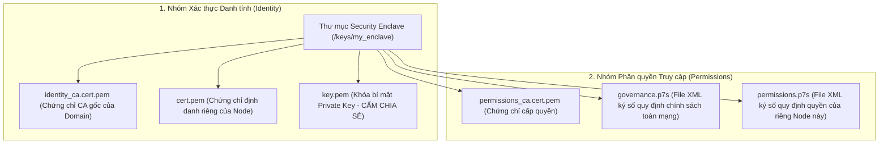

---
tags:
  - ros2
  - concepts
  - security
  - sros2
  - dds-security
  - encryption
  - pki
  - enclaves
created: 2026-08-25
aliases:
  - Khung Bảo mật SROS2 và Phân vùng An ninh Enclaves
  - ROS 2 Security
---

# 🔐 Khung Bảo mật SROS2 và Phân vùng An ninh Enclaves (ROS 2 Security Architecture)

> [!INFO] **Tổng quan Khái niệm**
> Trong các ứng dụng robot quân sự, y tế và công nghiệp, bảo mật dữ liệu là ưu tiên hàng đầu. ROS 2 tích hợp chuẩn bảo mật **DDS-Security** thông qua bộ công cụ **SROS2**: cung cấp khả năng **Mã hóa Dữ liệu Truyền tải (Encryption)**, **Xác thực Danh tính Nút mạng (Authentication)**, **Chống Giả mạo Dữ liệu (Integrity)** và **Kiểm soát Quyền Truy cập (Access Control)** dựa trên hạ tầng khóa công khai **PKI (Public Key Infrastructure)**.
> - **Cấp độ:** Toàn diện (Beginner $\to$ Advanced)
> - **Mục lục tổng quan:** [[ROS 2 Learning Path]]
> - **Chuyên đề thực hành liên quan:** [[01 - Configuring Environment|Cấu hình Môi trường]]

---

## 🏛️ 6 Tệp tin Cấu hình An ninh Bắt buộc trong một Enclave

Một **Security Enclave (Phân vùng An ninh)** định nghĩa chính sách bảo mật cho một hoặc nhiều Node, bao gồm **6 tệp tin chuẩn hóa**:



---

## 🔑 2 Biến Môi trường Kích hoạt Bảo mật

Mặc định bảo mật bị tắt. Để kích hoạt, bạn cần thiết lập:

### 1. `ROS_SECURITY_ENABLE=true`
Công tắc tổng bật toàn bộ cơ chế mã hóa và xác thực của RMW.

### 2. `ROS_SECURITY_STRATEGY=Enforce`
Quy định chiến lược xử lý khi phát hiện vi phạm:
- **`Enforce` *(Bắt buộc)*:** Node nào thiếu chứng chỉ hoặc vi phạm quyền sẽ **bị từ chối khởi chạy ngay lập tức**.
- **`Permissive` *(Cho phép)*:** Node sai chứng chỉ vẫn chạy nhưng không có tính năng bảo mật (chỉ dùng khi phát triển).

```bash
export ROS_SECURITY_ENABLE=true
export ROS_SECURITY_STRATEGY=Enforce
export ROS_SECURITY_KEYSTORE=/path/to/keystore
```

---

## 📌 Tóm tắt (Summary)
- Chuẩn DDS-Security bảo vệ robot toàn diện trước các nguy cơ tấn công nghe lén gói tin (*Eavesdropping*), giả mạo lệnh điều khiển (*Man-in-the-Middle*) và chiếm quyền điều khiển trái phép.

---

## 🔗 Liên kết & Bài học Thực hành
- 📖 Cấu hình môi trường cơ bản: [[01 - Configuring Environment|Cấu hình Môi trường ROS 2]]
