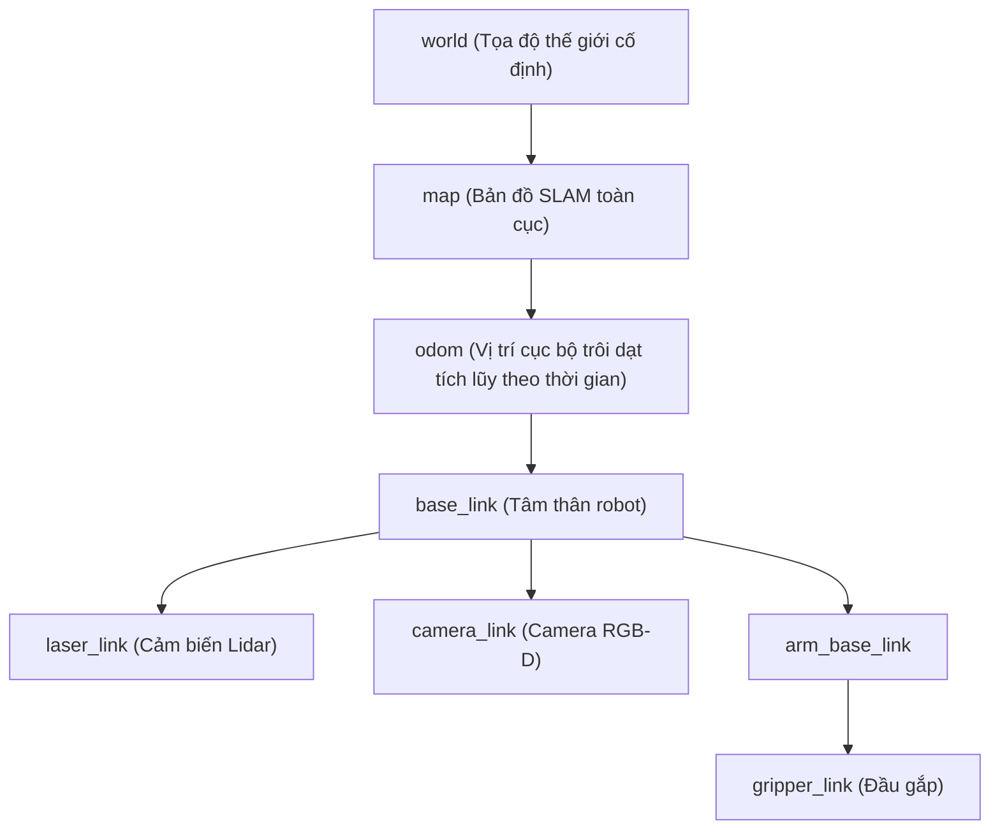

---
tags:
  - ros2
  - concepts
  - tf2
  - transformations
  - coordinate-frames
  - kinematics
  - math
  - 3d-geometry
created: 2026-08-25
aliases:
  - Nguyên lý Biến đổi Hình học và Cây Tọa độ tf2
  - Tf2 Concepts
---

# 📐 Nguyên lý Biến đổi Hình học và Cây Tọa độ tf2 (tf2 Principles)

> [!INFO] **Tổng quan Khái niệm**
> **`tf2`** là thư viện biến đổi tọa độ không gian và thời gian chuẩn mực của ROS 2. `tf2` duy trì mối quan hệ hình học giữa hàng chục hệ trục tọa độ (**Coordinate Frames**) dưới dạng một **Cấu trúc Cây (Tree Structure)** có đệm thời gian (*Time-buffered*), cho phép người dùng chuyển đổi tọa độ điểm, vector, vận tốc và dữ liệu cảm biến giữa hai khung tọa độ bất kỳ tại bất kỳ thời điểm nào trong quá khứ.
> - **Cấp độ:** Toàn diện (Beginner $\to$ Advanced)
> - **Mục lục tổng quan:** [[ROS 2 Learning Path]]
> - **Chuyên đề thực hành liên quan:** [[01 - Introduction to tf2 and Static Broadcaster (Python)|Static Broadcaster]], [[06 - Writing a Listener (C++)|Listener C++]], [[09 - Using Time and Timeouts in tf2 (C++)|Thời gian & Timeouts]], [[10 - Time Travel with tf2 (C++)|Du hành Thời gian tf2]], [[11 - Quaternion Fundamentals in ROS 2|Cơ bản về Quaternion 3D]], [[13 - Using Sensor Messages with MessageFilter (C++ & Python)|MessageFilter Cảm biến]]

---

## 🌳 Bản chất Cây Tọa độ Không Gian (Transform Tree)

Trong một hệ thống robot, mỗi bộ phận (Bánh xe, Cảm biến Lidar, Camera, Khâu tay máy) đều có một hệ trục tọa độ riêng:

> [!IMPORTANT] **Quy tắc Bất biến của Cây tf2:**
> 1. Mỗi khung tọa độ con (**Child Frame**) chỉ được có **duy nhất 1 khung tọa độ cha (**Parent Frame**).
> 2. Tuyệt đối **không được tạo chu trình lặp (No Loops)** trong cây tf2.

---

## 🔄 Nghịch đảo Biến đổi: Tọa độ Điểm vs Khung Tọa độ

Một trong những nguồn gốc gây nhầm lẫn lớn nhất trong hình học robot:
- Khi chuyển đổi **Tọa độ của một Điểm dữ liệu** từ Frame B về Frame A, ma trận biến đổi cần áp dụng là **Nghịch đảo ($\mathbf{T}^{-1}$)** của phép biến đổi vị trí của Frame B đối với Frame A.
- Rất may mắn, hàm **`tf2_buffer.lookup_transform(target_frame, source_frame, time)`** hoặc hàm **`tf2::doTransform()`** sẽ tự động tính toán phép nghịch đảo này một cách hoàn toàn chính xác!

---

## 🚀 Biến đổi Vận tốc 3D (Velocity Transformations)

Vận tốc của một vật thể trong không gian 3D được mô tả bởi 3 yếu tố:
1. **Khung chuyển động (Moving Frame):** Vật thể đang di chuyển (ví dụ Xe A).
2. **Khung tham chiếu (Reference Frame):** Điểm tựa đo vận tốc (ví dụ Trái Đất).
3. **Khung quan sát (Observational Frame):** Hệ tọa độ dùng để biểu diễn vector vận tốc.

Muốn cộng trừ hoặc so sánh 2 vector vận tốc, bạn bắt buộc phải chuyển đổi chúng về **cùng một Khung quan sát chung**.

---

## 📌 Tóm tắt (Summary)
- `tf2` giải phóng các kỹ sư robot khỏi hàng ngàn phép nhân ma trận đồng nhất $4\times 4$ phức tạp và xử lý trễ thời gian cảm biến một cách tự động.

---

## 🔗 Liên kết & Bài học Thực hành
- 📖 Toán học Quaternion: [[11 - Quaternion Fundamentals in ROS 2|Cơ bản về Quaternion trong ROS 2]]
- 📖 Du hành thời gian: [[10 - Time Travel with tf2 (C++)|Du hành Thời gian với tf2 trong C++]]
- 📖 Xử lý Lidar/Camera: [[13 - Using Sensor Messages with MessageFilter (C++ & Python)|Xử lý Dữ liệu Cảm biến với tf2 MessageFilter]]
