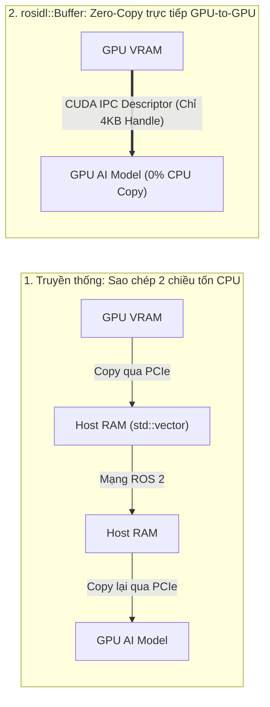
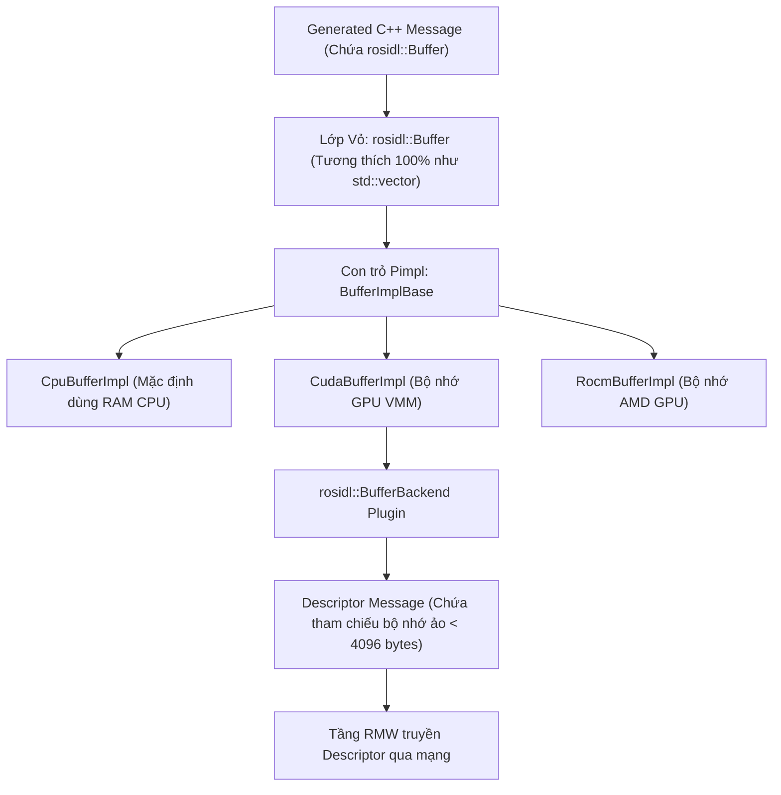

---
tags:
  - ros2
  - concepts
  - zero-copy
  - rosidl-buffer
  - gpu-acceleration
  - cuda
  - memory-management
  - deep-learning
created: 2026-08-25
aliases:
  - Tăng tốc Zero-Copy trên GPU/NPU với rosidl Buffer Backends
  - About rosidl::Buffer backends
---

# 🚀 Tăng tốc Zero-Copy trên GPU/NPU với rosidl Buffer Backends (GPU Direct ROS 2)

> [!INFO] **Tổng quan Khái niệm**
> **`rosidl::Buffer<T>`** là kiểu dữ liệu container thế hệ mới của ROS 2 thay thế cho `std::vector<T>` trong các trường mảng byte (`uint8[]`, `float32[]`) của file `.msg`. Tính năng này cho phép dữ liệu nhị phân dung lượng khổng lồ (Ảnh Camera 4K, Đám mây điểm PointCloud, Tensors học sâu AI) **nằm trực tiếp trong VRAM của GPU hoặc NPU** và truyền sang tiến trình khác qua **CUDA IPC** mà không cần tốn bất kỳ bản sao chép (*Copy*) nào vào bộ nhớ RAM của CPU.
> - **Cấp độ:** Toàn diện (Beginner $\to$ Advanced)
> - **Mục lục tổng quan:** [[ROS 2 Learning Path]]
> - **Chuyên đề thực hành liên quan:** [[08 - Implementing Custom Real-Time Memory Allocator (C++)|Custom Allocator]], [[11 - Creating a Custom RMW Implementation|Custom RMW Implementation]]

---

## 📖 Nỗi đau Sao chép Dữ liệu Bộ nhớ ngoài CPU (Non-CPU Memory)

Trước đây, khi Camera xuất ảnh trực tiếp vào VRAM của GPU để mô hình AI xử lý:
1. Bạn buộc phải copy 20 MB ảnh từ **GPU VRAM $\to$ Host RAM (CPU)** để nhét vào `std::vector<uint8_t>` của message ROS 2.
2. Node nhận lại phải copy từ **Host RAM (CPU) $\to$ GPU VRAM** của node AI.
3. $\implies$ Làm nghẽn băng thông bus PCIe và tiêu tốn 100% tài nguyên CPU chỉ để sao chép mảng byte vô ích!

---

## 🏛️ Kiến trúc Phân tầng của `rosidl::Buffer<T>`

---

## 🔄 Cơ chế Tự Động Rút lui An toàn (Fallback Mechanism)

Nếu hai Node chạy trên 2 máy tính khác nhau (hoặc không cùng card GPU hỗ trợ chia sẻ VMM):
- `BufferBackend` sẽ tự động phát hiện sự không tương thích trong quá trình Discovery.
- Hệ thống sẽ **tự động chuyển về cơ chế tuần tự hóa CPU thông thường** để đảm bảo dữ liệu vẫn truyền đi thành công mà không bị crash ứng dụng!

---

## 📌 Tóm tắt (Summary)
- `rosidl::Buffer` mang lại hiệu năng cấp độ trung tâm dữ liệu cho các robot thông minh tích hợp trí tuệ nhân tạo (AI Vision, Edge Computing).

---

## 🔗 Liên kết & Bài học Thực hành
- 📖 Quản trị bộ nhớ chuyên sâu: [[08 - Implementing Custom Real-Time Memory Allocator (C++)|Tự Triển khai Memory Allocator Thời gian Thực (C++)]]
- 📖 Kiến trúc tầng RMW: [[11 - Creating a Custom RMW Implementation|Xây dựng Tầng Middleware RMW Tùy biến]]
