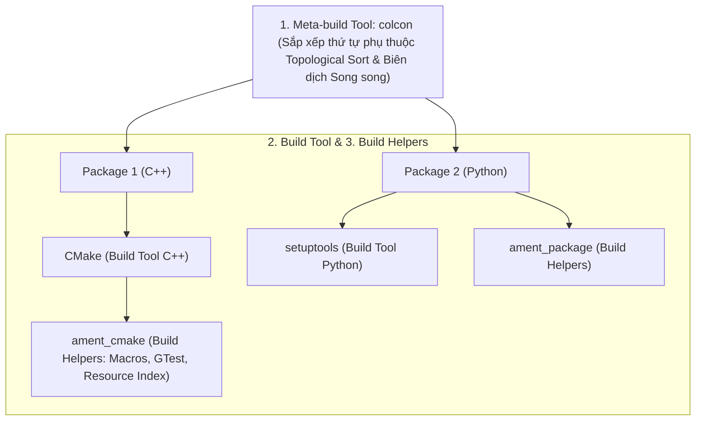

---
tags:
  - ros2
  - concepts
  - build-system
  - ament
  - cmake
  - colcon
  - package-xml
  - packaging
created: 2026-08-25
aliases:
  - Hệ thống Biên dịch và Đóng gói (ament, package.xml và colcon)
  - The build system
---

# 🏗️ Hệ thống Biên dịch và Đóng gói (Build System: ament, package.xml & colcon)

> [!INFO] **Tổng quan Khái niệm**
> Hệ thống biên dịch (**Build System**) trong ROS 2 chịu trách nhiệm quản lý phụ thuộc, biên dịch mã nguồn và cấu hình môi trường thực thi cho hàng trăm gói phần mềm. Hệ thống vận hành dựa trên **3 trụ cột kiến trúc**: **Công cụ Biên dịch Cục bộ (Build Tool: CMake / setuptools)**, **Bộ Tiện ích Hỗ trợ (Build Helpers: `ament`)** và **Công cụ Siêu Biên dịch (Meta-build Tool: `colcon`)**.
> - **Cấp độ:** Toàn diện (Beginner $\to$ Advanced)
> - **Mục lục tổng quan:** [[ROS 2 Learning Path]]
> - **Chuyên đề thực hành liên quan:** [[01 - Using Colcon to Build Packages|Sử dụng colcon]], [[03 - Creating a Package|Tạo Package]], [[09 - Code Quality Assurance with Ament Lint CLI|Ament Lint CLI]]

---

## 🏛️ 3 Trụ cột Cốt lõi của Hệ thống Biên dịch

---

## 📋 Tệp Manifest `package.xml` (Chuẩn REP 127 & 140)

Mọi package ROS 2 bắt buộc phải có file `package.xml` tại thư mục gốc:
- Đóng vai trò là **Điểm mốc nhận diện Package (Marker File)** để `colcon` tìm thấy trên ổ đĩa.
- Khai báo tên duy nhất toàn cầu, tác giả, giấy phép bản quyền và danh mục các gói phụ thuộc (`<depend>`, `<build_depend>`, `<exec_depend>`).
- Khai báo kiểu biên dịch trong thẻ `<export><build_type>ament_cmake</build_type></export>`.

---

## ⚡ Các Tính năng Đột phá của `ament_cmake_core`

1. **Cài đặt Liên kết Động (`--symlink-install`):**  
   Tạo Symbolic Link từ thư mục nguồn `src/` sang thư mục `install/`. Cho phép bạn sửa mã nguồn Python hoặc file cấu hình YAML/Launch và có hiệu lực ngay lập tức mà **không cần chạy lại lệnh build** (thay thế hoàn toàn *devel space* phức tạp của ROS 1).
2. **Chỉ mục Tài nguyên Package (Resource Indexing):**  
   Cơ chế đánh chỉ mục siêu tốc cho phép hệ thống tra cứu xem package nào chứa plugin hoặc tài nguyên nào chỉ trong vài micro-giây bằng cách đọc một thư mục chỉ mục duy nhất trong `/share/ament_index/`.
3. **Environment Hooks (`setup.bash`):**  
   Tự động sinh các đoạn mã shell script gán biến môi trường (`AMENT_PREFIX_PATH`, `PYTHONPATH`) khi bạn chạy lệnh `source install/setup.bash`.

---

## 📌 Tóm tắt (Summary)
- Sự kết hợp giữa `package.xml`, `ament` và `colcon` tạo nên một quy trình phát triển phần mềm chuẩn hóa, hỗ trợ xây dựng các hệ thống robot công nghiệp khổng lồ hàng triệu dòng code.

---

## 🔗 Liên kết & Bài học Thực hành
- 📖 Thao tác colcon: [[01 - Using Colcon to Build Packages|Sử dụng colcon để build packages]]
- 📖 Tạo Package mới: [[03 - Creating a Package|Tạo một Package trong ROS 2]]
- 📖 Kiểm chuẩn mã nguồn: [[09 - Code Quality Assurance with Ament Lint CLI|Đảm bảo Chất lượng Mã nguồn với Ament Lint CLI]]
