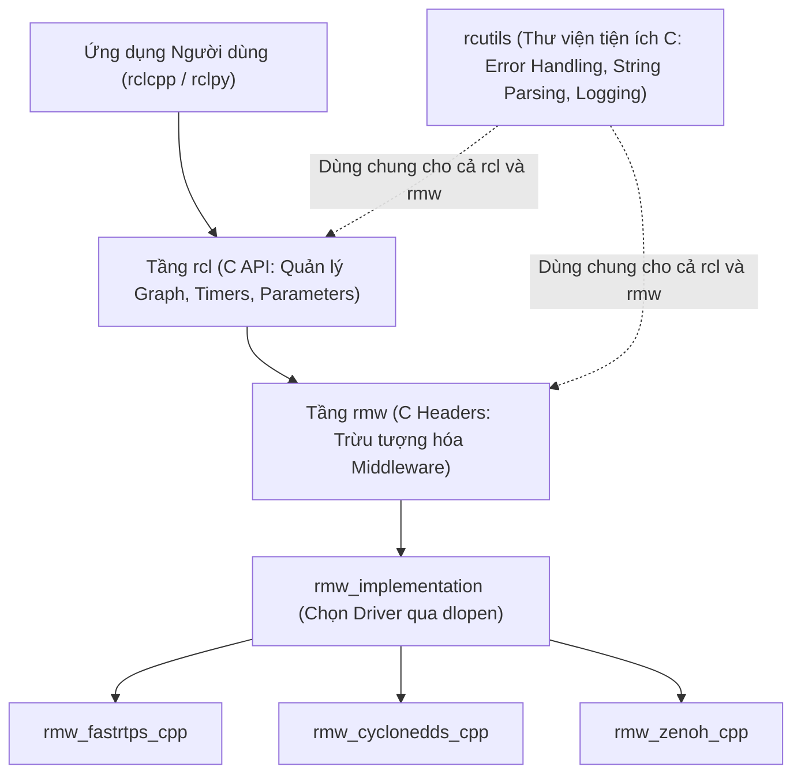
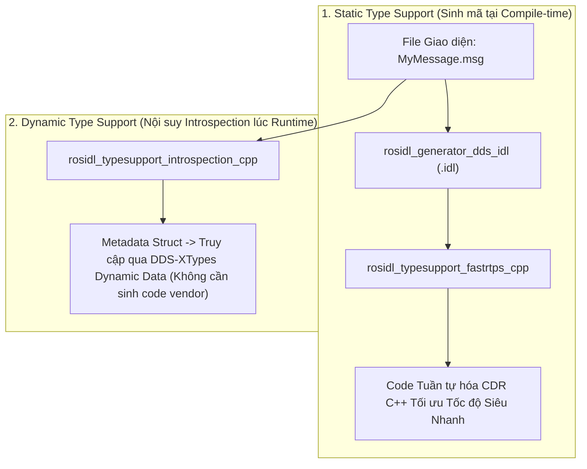

---
tags:
  - ros2
  - concepts
  - internal-apis
  - type-support
  - rosidl
  - rcutils
  - xtypes
  - metaprogramming
  - cpp26
created: 2026-08-25
aliases:
  - Kiến trúc API Nội bộ và Hệ thống Hỗ trợ Định kiểu Type Support
  - Internal ROS 2 interfaces
---

# 🧬 Kiến trúc API Nội bộ và Hệ thống Type Support (Internal APIs & Type Support)

> [!INFO] **Tổng quan Khái niệm**
> Để hiểu cách một thông điệp `.msg` chuyển đổi thành các chuỗi byte nhị phân chạy trên cáp mạng, ta cần khám phá **Kiến trúc Phân tầng API Nội bộ (Internal API Architecture)** của ROS 2: mối quan hệ phân tầng giữa **`rcl`**, **`rmw`**, **`rcutils`**, sự khác biệt giữa **Static Type Support (Hỗ trợ Tĩnh)** và **Dynamic Type Support (Hỗ trợ Động qua DDS-XTypes)**, cùng các kỹ thuật siêu lập trình C++ tiên tiến (**`as_tuple_ref`**).
> - **Cấp độ:** Toàn diện (Chuyên sâu Tối thượng)
> - **Mục lục tổng quan:** [[ROS 2 Learning Path]]
> - **Chuyên đề thực hành liên quan:** [[08 - Creating Custom Interfaces (msg and srv)|Tạo Custom Interfaces]], [[11 - Creating a Custom RMW Implementation|Xây dựng RMW Tùy biến]]

---

## 🏛️ Sơ đồ Phân tầng API Nội bộ (Internal API Stack)



---

## ⚙️ So sánh Static Type Support vs Dynamic Type Support

Khi biên dịch một file `.msg`, hệ thống có 2 phương pháp sinh mã nguồn để tuần tự hóa dữ liệu:



| Tiêu chí | 1. Static Type Support | 2. Dynamic Type Support (Introspection) |
| :--- | :--- | :--- |
| **Tốc độ Thực thi** | 🟢 **Nhanh nhất (Tối ưu hóa mã máy)** | 🟡 Chậm hơn (Phải duyệt metadata lúc chạy) |
| **Kích thước Thư viện Binary** | 🔴 Lớn hơn (Sinh file `.so` cho từng message) | 🟢 Nhỏ gọn, ít tốn dung lượng ổ đĩa |
| **Yêu cầu Middleware** | Biên dịch riêng cho từng hãng DDS | Đòi hỏi DDS hỗ trợ chuẩn **DDS-XTypes** |

---

## 🔮 Siêu Lập trình C++ với `as_tuple_ref` (Metaprogramming)

Trong `rosidl_generator_cpp`, ROS 2 cung cấp hàm tiện ích **`as_tuple_ref`** (đón đầu chuẩn phản chiếu C++26 Reflection):
- Cho phép duyệt qua tất cả các trường dữ liệu của một bản tin ROS 2 dưới dạng một `std::tuple` tham chiếu.
- Lập trình viên có thể viết các hàm generic tự động lặp qua mọi trường mà không cần biết trước tên biến:

```cpp
#include <tuple>
#include <builtin_interfaces/msg/time.hpp>

builtin_interfaces::msg::Time time_msg;

// Tăng giá trị tất cả các trường trong struct mà không cần gọi time_msg.sec
std::apply([](auto & ... member) {
  ((member += 1), ...); // C++17 Fold Expression
}, as_tuple_ref(time_msg));
```

---

## 📌 Tóm tắt (Summary)
- Kiến trúc phân tầng tách bạch của ROS 2 giúp đảm bảo tính tương thích lâu dài và cho phép cộng đồng phát triển các công nghệ mới mà không làm vỡ các ứng dụng sẵn có.

---

## 🔗 Liên kết & Bài học Thực hành
- 📖 Tạo Message tùy chỉnh: [[08 - Creating Custom Interfaces (msg and srv)|Tạo Message và Service tùy chỉnh với rosidl]]
- 📖 Tìm hiểu sâu RMW: [[11 - Creating a Custom RMW Implementation|Xây dựng Tầng Middleware RMW Tùy biến]]
