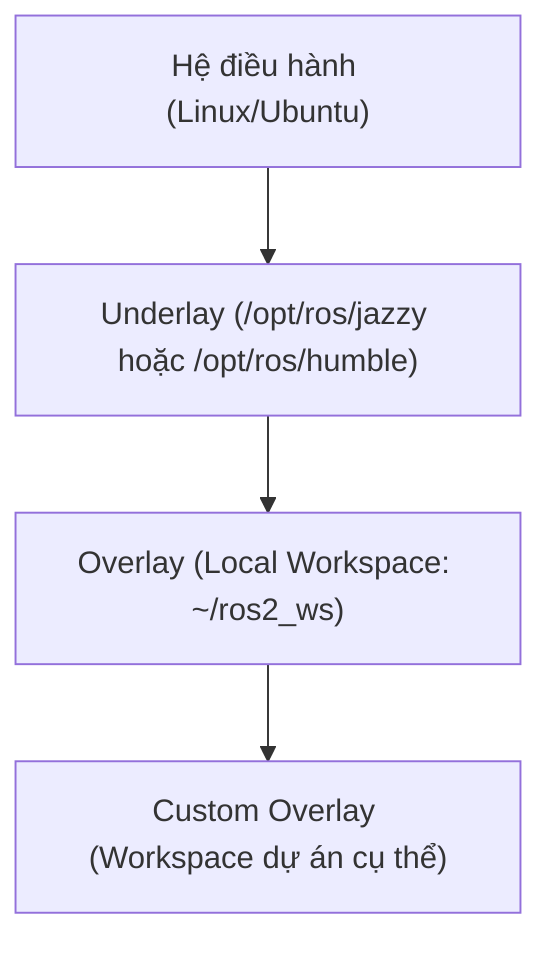

---
tags:
  - ros2
  - environment
  - cli
  - beginner
created: 2026-08-25
aliases:
  - Cấu hình môi trường ROS 2
  - Configuring environment
---

# ⚙️ Cấu hình môi trường ROS 2 (Configuring Environment)

> [!INFO] **Mục tiêu bài học**
> Bài viết này hướng dẫn cách chuẩn bị và cấu hình môi trường shell để làm việc với ROS 2.
> - **Cấp độ:** Beginner
> - **Thời lượng ước tính:** 5 phút
> - **Mục lục tổng quan:** [[ROS 2 Learning Path]]
> - **Bài tiếp theo:** [[02 - Using Turtlesim, ROS 2, and RQt|Làm quen với Turtlesim, ros2 CLI và RQt]]

---

## 📖 Bối cảnh (Background)

ROS 2 hoạt động dựa trên cơ chế kết hợp các **workspace** thông qua môi trường shell.

- **Workspace:** Là thuật ngữ trong ROS chỉ vị trí thư mục trên hệ thống nơi bạn phát triển các gói phần mềm (packages) ROS 2.
- **Underlay:** Bản cài đặt ROS 2 gốc (ví dụ: `/opt/ros/<distro>`) đóng vai trò là lớp nền (*underlay*).
- **Overlay:** Một local workspace được `source` sau bản cài đặt gốc được gọi là *overlay* vì nó được xếp chồng lên trên underlay. Cùng một workspace có thể đóng vai trò là underlay cho một workspace khác được `source` sau đó.



> [!TIP] **Lợi ích của việc phân lớp Workspace:**
> - Cho phép phát triển ứng dụng trên các phiên bản ROS 2 khác nhau mà không bị xung đột.
> - Dễ dàng chuyển đổi giữa các bản phân phối (distributions / distros) khác nhau trên cùng một máy tính tính toán.
> - Không làm thay đổi hay ảnh hưởng đến thư viện hệ thống gốc.

Để sử dụng được các công cụ của ROS 2 trong terminal, bạn bắt buộc phải **source** các setup file mỗi khi mở shell mới, hoặc thêm lệnh `source` vào file khởi động shell (như `~/.bashrc`). Nếu không, terminal sẽ không nhận diện được các lệnh `ros2`.

---

## 🛠️ Các bước thực hiện (Tasks)

### 1. Source các setup files
Mỗi khi mở một cửa sổ terminal mới, bạn cần chạy lệnh sau để nạp các biến môi trường của ROS 2:

```bash
# Thay thế <distro> bằng phiên bản ROS 2 bạn đang dùng (ví dụ: humble, jazzy, iron, lyrical...)
source /opt/ros/<distro>/setup.bash
```

> [!NOTE]
> Thay đổi đuôi `.bash` tùy theo shell bạn đang sử dụng:
> - Bash: `setup.bash`
> - Zsh: `setup.zsh`
> - Shell cơ bản: `setup.sh`

---

### 2. Tự động hóa Sourcing trong file khởi động Shell
Nếu bạn không muốn phải gõ lệnh `source` thủ công mỗi lần mở terminal mới, hãy thêm lệnh này vào file `~/.bashrc`:

```bash
echo "source /opt/ros/<distro>/setup.bash" >> ~/.bashrc
```

> [!TIP]
> Để áp dụng ngay thay đổi trong terminal hiện tại mà không cần mở lại:
> ```bash
> source ~/.bashrc
> ```
> Để hủy tự động hóa, chỉ cần mở file `~/.bashrc` bằng trình soạn thảo (ví dụ `nano ~/.bashrc` hoặc `gedit ~/.bashrc`) và xóa dòng `source` tương ứng ở cuối file.

---

### 3. Kiểm tra các biến môi trường (Environment Variables)
Khi `source` setup file thành công, nhiều biến môi trường quan trọng sẽ được thiết lập. Bạn có thể kiểm tra bằng lệnh:

```bash
printenv | grep -i ROS
```

Kết quả mẫu:
```text
ROS_VERSION=2
ROS_PYTHON_VERSION=3
ROS_DISTRO=humble
```

#### 3.1 Biến `ROS_DOMAIN_ID`
Trong mạng nội bộ (LAN), các máy tính chạy ROS 2 mặc định sẽ tự động nhận diện và giao tiếp với nhau qua DDS. Nếu bạn muốn cô lập hệ thống của mình (hoặc chia nhóm các robot riêng biệt), hãy đặt biến `ROS_DOMAIN_ID` (giá trị là số nguyên từ 0 đến 101 cho hầu hết DDS):

```bash
export ROS_DOMAIN_ID=<your_domain_id>
```

Thêm vào `~/.bashrc` để duy trì cố định:
```bash
echo "export ROS_DOMAIN_ID=<your_domain_id>" >> ~/.bashrc
```

#### 3.2 Biến `ROS_AUTOMATIC_DISCOVERY_RANGE`
Mặc định ROS 2 có thể khám phá các node trên toàn mạng LAN. Biến `ROS_AUTOMATIC_DISCOVERY_RANGE` giúp giới hạn phạm vi khám phá (ví dụ: chỉ giới hạn trong `LOCALHOST` hoặc trong subnet), rất hữu ích trong môi trường lớp học/phòng lab để tránh các robot publish trùng topic gây xung đột.

```bash
export ROS_AUTOMATIC_DISCOVERY_RANGE=LOCALHOST
```

---

## 📌 Tóm tắt (Summary)
- Môi trường phát triển ROS 2 cần được thiết lập đúng trước khi sử dụng.
- Hai cách thực hiện: `source` thủ công trên từng terminal hoặc cấu hình vĩnh viễn trong `~/.bashrc`.
- Khi gặp lỗi không tìm thấy package hay lệnh `ros2`, bước kiểm tra đầu tiên luôn là `printenv | grep -i ROS`.

---

## 🔗 Liên kết & Bài tiếp theo
- ⬅️ Trở về: [[ROS 2 Learning Path|Lộ trình học ROS 2]]
- ➡️ Bài tiếp theo: [[02 - Using Turtlesim, ROS 2, and RQt|Sử dụng Turtlesim, ros2 CLI và RQt]]
