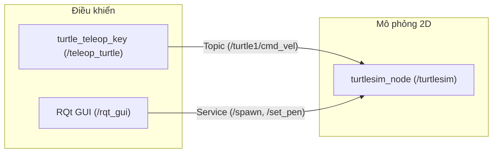

---
tags:
  - ros2
  - turtlesim
  - rqt
  - cli
  - beginner
created: 2026-08-25
aliases:
  - Sử dụng Turtlesim và RQt
  - Using turtlesim, ros2, and rqt
---

# 🐢 Làm quen với Turtlesim, ros2 CLI và RQt (Using turtlesim, ros2, and rqt)

> [!INFO] **Mục tiêu bài học**
> Cài đặt và sử dụng gói mô phỏng **turtlesim** cùng công cụ đồ họa **rqt** để chuẩn bị cho việc thực hành các khái niệm cốt lõi trong ROS 2.
> - **Cấp độ:** Beginner
> - **Thời lượng ước tính:** 15 phút
> - **Bài trước:** [[01 - Configuring Environment|Cấu hình môi trường ROS 2]]
> - **Bài tiếp theo:** [[03 - Understanding Nodes|Tìm hiểu về Nodes trong ROS 2]]

---

## 📖 Bối cảnh (Background)

- **Turtlesim:** Là công cụ mô phỏng 2D nhẹ nhàng, trực quan dành cho người mới học ROS 2. Nó minh họa cách ROS 2 vận hành ở mức cơ bản nhất (điều khiển chuyển động, vẽ đường đi, gọi service) trước khi làm việc với robot thật.
- **Công cụ `ros2` CLI:** Bộ công cụ dòng lệnh tiêu chuẩn để quản lý, giám sát và tương tác với hệ thống ROS (chạy node, set parameter, lắng nghe topic, gọi service, v.v.).
- **RQt:** Công cụ giao diện người dùng đồ họa (GUI) cho ROS 2. Mọi thao tác qua CLI đều có thể trực quan hóa và thực hiện dễ dàng qua RQt.



---

## 🛠️ Các bước thực hiện (Tasks)

### 1. Cài đặt Turtlesim
Đảm bảo bạn đã `source` môi trường ROS 2 trên terminal:

```bash
sudo apt update
sudo apt install ros-<distro>-turtlesim
```
*(Thay `<distro>` bằng phiên bản ROS 2 của bạn, ví dụ `humble`, `jazzy`, `iron`...)*

Kiểm tra danh sách các file thực thi (executables) có trong package `turtlesim`:
```bash
ros2 pkg executables turtlesim
```
Kết quả trả về:
```text
turtlesim draw_square
turtlesim mimic
turtlesim turtle_teleop_key
turtlesim turtlesim_node
```

---

### 2. Khởi chạy Turtlesim
Mở terminal và chạy executable `turtlesim_node`:

```bash
ros2 run turtlesim turtlesim_node
```
Cửa sổ mô phỏng Turtlesim sẽ xuất hiện với một chú rùa ngẫu nhiên ở giữa màn hình (tọa độ mặc định x=5.54, y=5.54, theta=0).

---

### 3. Điều khiển rùa di chuyển
Mở một terminal mới (nhớ `source` ROS 2) và khởi chạy node điều khiển bàn phím:

```bash
ros2 run turtlesim turtle_teleop_key
```

> [!TIP] **Cách điều khiển:**
> - Giữ terminal chạy `turtle_teleop_key` ở trạng thái active (đang chọn cửa sổ đó).
> - Dùng các phím **mũi tên** (Arrow keys) để di chuyển rùa tiến/lùi và rẽ trái/phải. Chú rùa sẽ dùng "bút vẽ" (pen) để vẽ đường đi trên màn hình.

Bạn có thể liệt kê nhanh các thành phần đang hoạt động bằng các lệnh CLI:
```bash
ros2 node list      # Liệt kê các node đang chạy
ros2 topic list     # Liệt kê các topic đang có
ros2 service list   # Liệt kê các service đang cung cấp
ros2 action list    # Liệt kê các action đang khả dụng
```

---

### 4. Cài đặt và sử dụng RQt
Cài đặt RQt và các plugin phổ biến:

```bash
sudo apt update
sudo apt install ros-<distro>-rqt ros-<distro>-rqt-common-plugins
```

Khởi chạy RQt:
```bash
rqt
```

> [!NOTE]
> Lần đầu mở RQt giao diện có thể trống. Trên thanh menu, chọn **Plugins > Services > Service Caller**.
> Nếu menu Plugins chưa hiển thị đầy đủ, hãy đóng rqt và chạy lệnh `rqt --force-discover`.

---

### 5. Tương tác với Service qua RQt

#### 5.1 Tạo rùa mới với Service `/spawn`
1. Nhấn nút **Refresh** bên cạnh dropdown list Service.
2. Chọn service `/spawn`.
3. Trong bảng tham số:
   - `x`: nhập `1.0`
   - `y`: nhập `1.0`
   - `theta`: `0.0`
   - `name`: nhấp đúp vào ô giá trị và nhập `'turtle2'`
4. Nhấn nút **Call** ở góc trên bên phải. Chú rùa thứ 2 (`turtle2`) sẽ xuất hiện tại tọa độ (1.0, 1.0).

#### 5.2 Đổi màu bút vẽ với Service `/set_pen`
1. Chọn service `/turtle1/set_pen`.
2. Đặt các giá trị RGB: `r: 255`, `g: 0`, `b: 0` (màu đỏ) và độ dày nét vẽ `width: 5`.
3. Nhấn **Call**. Khi quay lại điều khiển `turtle1`, nét vẽ sẽ chuyển sang màu đỏ dày 5 pixel.

---

### 6. Khái niệm Remapping (Ánh xạ lại)
Hiện tại `turtle_teleop_key` mặc định điều khiển `turtle1`. Để điều khiển `turtle2`, ta cần ánh xạ lại (remap) topic `cmd_vel` và action `rotate_absolute`:

```bash
ros2 run turtlesim turtle_teleop_key --ros-args --remap turtle1/cmd_vel:=turtle2/cmd_vel --remap turtle1/rotate_absolute:=turtle2/rotate_absolute
```
Bây giờ, terminal mới này sẽ nhận phím và truyền lệnh điều khiển riêng cho `turtle2`!

---

### 7. Tắt mô phỏng
- Nhấn `Ctrl + C` tại terminal chạy `turtlesim_node` và `rqt`.
- Nhấn phím `q` tại terminal chạy `turtle_teleop_key`.

---

## 📌 Tóm tắt (Summary)
- **Turtlesim** và **RQt** là bộ công cụ thực hành trực quan lý tưởng để làm quen với các khái niệm [[03 - Understanding Nodes|Node]], [[04 - Understanding Topics|Topic]], [[05 - Understanding Services|Service]], và [[07 - Understanding Actions|Action]].
- Kỹ thuật **remapping** cho phép tái sử dụng các node có sẵn mà không cần sửa đổi mã nguồn.

---

## 🔗 Liên kết & Bài tiếp theo
- ⬅️ Bài trước: [[01 - Configuring Environment|Cấu hình môi trường ROS 2]]
- ➡️ Bài tiếp theo: [[03 - Understanding Nodes|Tìm hiểu về Nodes trong ROS 2]]
