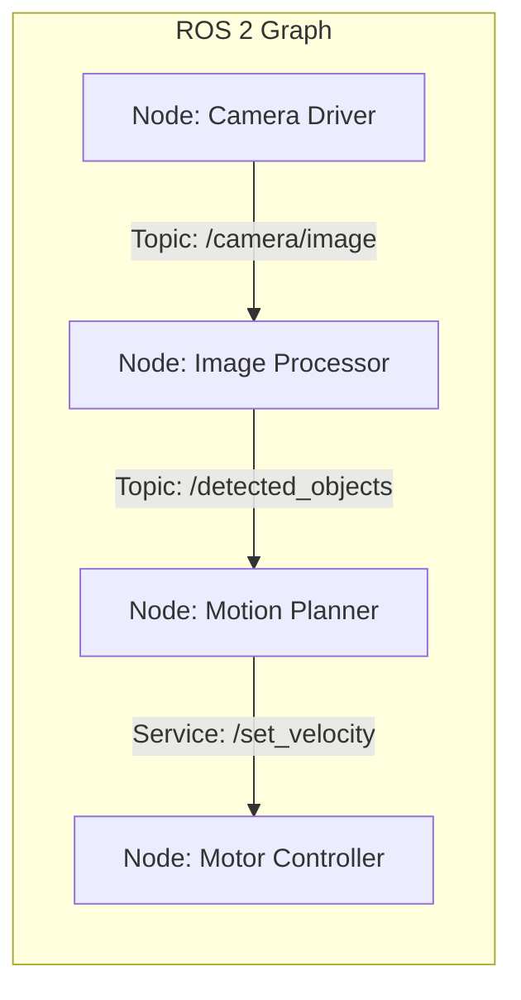

---
tags:
  - ros2
  - nodes
  - ros-graph
  - cli
  - beginner
created: 2026-08-25
aliases:
  - Tìm hiểu về Nodes trong ROS 2
  - Understanding nodes
---

# 🧩 Tìm hiểu về Nodes trong ROS 2 (Understanding Nodes)

> [!INFO] **Mục tiêu bài học**
> Hiểu rõ chức năng của **Node** trong hệ thống ROS 2 và làm chủ các công cụ dòng lệnh (CLI) để quản lý và kiểm tra thông tin của Node.
> - **Cấp độ:** Beginner
> - **Thời lượng ước tính:** 10 phút
> - **Bài trước:** [[02 - Using Turtlesim, ROS 2, and RQt|Làm quen với Turtlesim, ros2 CLI và RQt]]
> - **Bài tiếp theo:** [[04 - Understanding Topics|Tìm hiểu về Topics trong ROS 2]]

---

## 📖 Bối cảnh (Background)

### 1. Khái niệm Đồ thị ROS 2 (The ROS 2 Graph)
**ROS Graph** là một mạng lưới các thành phần ROS 2 cùng nhau xử lý dữ liệu đồng thời trong thời gian thực. Đồ thị này bao gồm toàn bộ các file thực thi (executables) và các kết nối truyền thông dữ liệu giữa chúng (Topics, Services, Actions, Parameters).



### 2. Node trong ROS 2 là gì?
- Mỗi **Node** trong ROS được thiết kế cho một **mục đích đơn lẻ, mang tính mô-đun (modular)** (ví dụ: một node chuyên đọc dữ liệu từ cảm biến LiDAR, một node chuyên điều khiển động cơ bánh xe, một node chuyên tính toán đường đi).
- Một hệ thống robot hoàn chỉnh là sự phối hợp nhịp nhàng giữa hàng chục hoặc hàng trăm node.
- Các node trao đổi dữ liệu với nhau qua 4 cơ chế chính:
  - [[04 - Understanding Topics|Topics (Publish/Subscribe)]]
  - [[05 - Understanding Services|Services (Request/Response)]]
  - [[07 - Understanding Actions|Actions (Goal/Feedback/Result)]]
  - [[06 - Understanding Parameters|Parameters (Cấu hình)]]
- Trong ROS 2, một file thực thi (`executable` viết bằng C++ hoặc Python) có thể chứa **một hoặc nhiều node**.

---

## 🛠️ Các công cụ quản lý Node (Tasks)

### 1. Khởi chạy Node với `ros2 run`
Cú pháp cơ bản để chạy một executable từ một package:

```bash
ros2 run <package_name> <executable_name>
```

*Ví dụ khởi chạy turtlesim:*
```bash
ros2 run turtlesim turtlesim_node
```
Trong đó:
- `turtlesim` là tên **package**.
- `turtlesim_node` là tên **executable**.

---

### 2. Liệt kê các Node đang chạy với `ros2 node list`
Mở một terminal mới và kiểm tra danh sách tất cả các node đang hoạt động trên hệ thống:

```bash
ros2 node list
```
Kết quả trả về:
```text
/turtlesim
```

Mở tiếp terminal thứ 3 và chạy node điều khiển:
```bash
ros2 run turtlesim turtle_teleop_key
```

Chạy lại `ros2 node list`, bạn sẽ thấy cả 2 node:
```text
/turtlesim
/teleop_turtle
```

#### 2.1 Đổi tên Node bằng kỹ thuật Remapping
Kỹ thuật **Remapping** cho phép gán lại các thuộc tính mặc định của node (như tên node, tên topic, tên service) lúc khởi chạy:

```bash
ros2 run turtlesim turtlesim_node --ros-args --remap __node:=my_turtle
```

Khi chạy lại `ros2 node list`, hệ thống sẽ có 3 node:
```text
/my_turtle
/turtlesim
/teleop_turtle
```

---

### 3. Kiểm tra chi tiết Node với `ros2 node info`
Lệnh `ros2 node info` giúp xem toàn bộ các kết nối trong ROS graph liên quan đến node đó:

```bash
ros2 node info /my_turtle
```

Kết quả trả về chi tiết các cổng giao tiếp:
```yaml
/my_turtle
  Subscribers:
    /parameter_events: rcl_interfaces/msg/ParameterEvent
    /turtle1/cmd_vel: geometry_msgs/msg/Twist
  Publishers:
    /parameter_events: rcl_interfaces/msg/ParameterEvent
    /rosout: rcl_interfaces/msg/Log
    /turtle1/color_sensor: turtlesim_msgs/msg/Color
    /turtle1/pose: turtlesim_msgs/msg/Pose
  Service Servers:
    /clear: std_srvs/srv/Empty
    /kill: turtlesim_msgs/srv/Kill
    /reset: std_srvs/srv/Empty
    /spawn: turtlesim_msgs/srv/Spawn
    /turtle1/set_pen: turtlesim_msgs/srv/SetPen
    /turtle1/teleport_absolute: turtlesim_msgs/srv/TeleportAbsolute
    /turtle1/teleport_relative: turtlesim_msgs/srv/TeleportRelative
  Service Clients:

  Action Servers:
    /turtle1/rotate_absolute: turtlesim_msgs/action/RotateAbsolute
  Action Clients:
```

> [!TIP]
> Nhìn vào thông tin trên, bạn có thể biết chính xác:
> - Node `/my_turtle` đang **lắng nghe** topic `/turtle1/cmd_vel` với kiểu dữ liệu `geometry_msgs/msg/Twist`.
> - Node đang **cung cấp** action server `/turtle1/rotate_absolute`.
> - Node đang **publish** trạng thái vị trí lên topic `/turtle1/pose`.

---

## 📌 Tóm tắt (Summary)
- **Node** là viên gạch nền tảng của ROS 2, phục vụ một chức năng chuyên biệt.
- Sử dụng `ros2 run` để chạy node, `ros2 node list` để tìm các node đang chạy, và `ros2 node info` để nội soi (introspect) các kết nối của node.
- Remapping là công cụ mạnh mẽ để thay đổi cấu hình node linh hoạt từ CLI.

---

## 🔗 Liên kết & Bài tiếp theo
- ⬅️ Bài trước: [[02 - Using Turtlesim, ROS 2, and RQt|Sử dụng Turtlesim, ros2 CLI và RQt]]
- ➡️ Bài tiếp theo: [[04 - Understanding Topics|Tìm hiểu về Topics trong ROS 2]]
