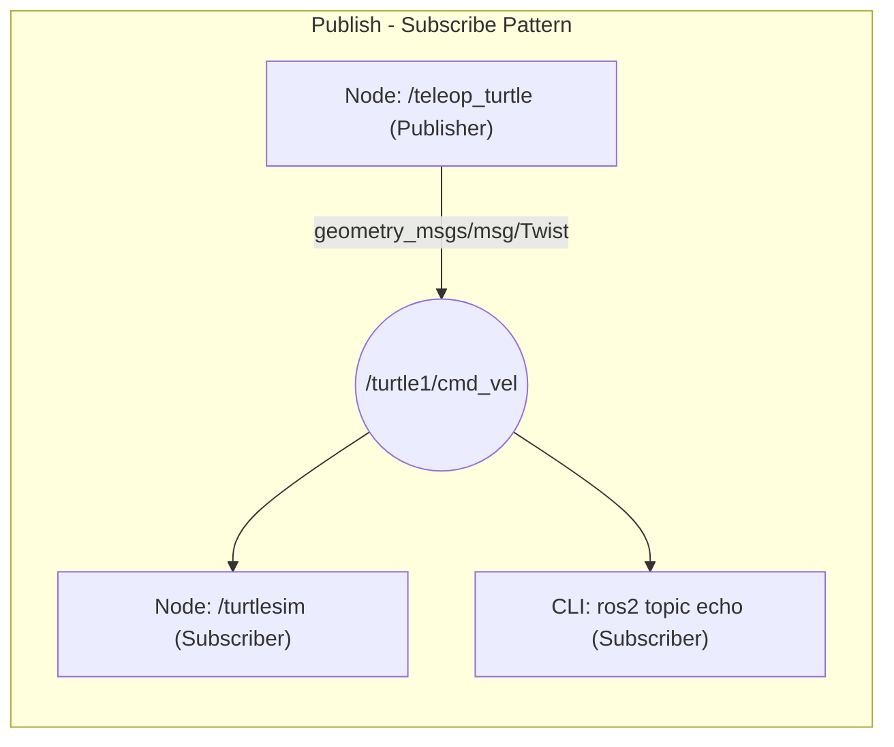

---
tags:
  - ros2
  - topics
  - publisher
  - subscriber
  - messages
  - cli
  - beginner
created: 2026-08-25
aliases:
  - Tìm hiểu về Topics trong ROS 2
  - Understanding topics
---

# 📡 Tìm hiểu về Topics trong ROS 2 (Understanding Topics)

> [!INFO] **Mục tiêu bài học**
> Sử dụng công cụ đồ họa `rqt_graph` và bộ lệnh CLI `ros2 topic` để giám sát, phân tích và xuất bản dữ liệu trên các **Topic** trong ROS 2.
> - **Cấp độ:** Beginner
> - **Thời lượng ước tính:** 20 phút
> - **Bài trước:** [[03 - Understanding Nodes|Tìm hiểu về Nodes trong ROS 2]]
> - **Bài tiếp theo:** [[05 - Understanding Services|Tìm hiểu về Services trong ROS 2]]

---

## 📖 Bối cảnh (Background)

**Topic** là thành phần sống còn của ROS Graph, đóng vai trò như một đường bus truyền thông tin giúp các [[03 - Understanding Nodes|Node]] trao đổi thông điệp (messages) liên tục theo mô hình **Publisher - Subscriber**:

- **Publisher (Bên phát):** Node gửi dữ liệu lên một topic cụ thể.
- **Subscriber (Bên nhận):** Node đăng ký lắng nghe dữ liệu từ topic đó.
- **Mối quan hệ:** Có thể là 1-1, 1-nhiều (1 publisher -> nhiều subscriber), nhiều-1, hoặc nhiều-nhiều.
- **Đặc điểm:** Bất đồng bộ (asynchronous), hướng luồng dữ liệu (data streaming liên tục như dữ liệu cảm biến, vận tốc điều khiển).



---

## 🛠️ Các bước thực hiện & Lệnh CLI (Tasks)

### 1. Khởi động môi trường thực hành
Chạy hai node quen thuộc trên 2 terminal:
```bash
# Terminal 1
ros2 run turtlesim turtlesim_node

# Terminal 2
ros2 run turtlesim turtle_teleop_key
```

---

### 2. Trực quan hóa kết nối với `rqt_graph`
Chạy công cụ vẽ đồ thị node và topic:
```bash
ros2 run rqt_graph rqt_graph
```
*(Hoặc mở `rqt` > chọn menu **Plugins > Introspection > Node Graph**)*

`rqt_graph` sẽ hiển thị node `/teleop_turtle` đang publish vào topic `/turtle1/cmd_vel`, và node `/turtlesim` đang subscribe topic này.

---

### 3. Liệt kê các Topic với `ros2 topic list`
Xem danh sách tất cả các topic đang hoạt động trong hệ thống:
```bash
ros2 topic list
```

Thêm cờ `-t` để hiển thị kèm **kiểu thông điệp (message type)**:
```bash
ros2 topic list -t
```
Kết quả mẫu:
```text
/parameter_events [rcl_interfaces/msg/ParameterEvent]
/rosout [rcl_interfaces/msg/Log]
/turtle1/cmd_vel [geometry_msgs/msg/Twist]
/turtle1/color_sensor [turtlesim_msgs/msg/Color]
/turtle1/pose [turtlesim_msgs/msg/Pose]
```

> [!NOTE]
> Kiểu thông điệp (ví dụ `geometry_msgs/msg/Twist`) là tiêu chuẩn dữ liệu giúp Publisher và Subscriber hiểu đúng cấu trúc dữ liệu gửi qua lại.

---

### 4. Lắng nghe dữ liệu trực tiếp với `ros2 topic echo`
Để in trực tiếp dữ liệu đang được truyền trên topic ra terminal:

```bash
ros2 topic echo /turtle1/cmd_vel
```
Khi bạn nhấn phím điều khiển ở cửa sổ teleop, terminal echo sẽ in ra dữ liệu vận tốc:
```yaml
linear:
  x: 2.0
  y: 0.0
  z: 0.0
angular:
  x: 0.0
  y: 0.0
  z: 0.0
---
```

---

### 5. Kiểm tra thông tin Topic với `ros2 topic info`
Xem số lượng Publisher và Subscriber đang kết nối vào topic:

```bash
ros2 topic info /turtle1/cmd_vel
```
Kết quả:
```text
Type: geometry_msgs/msg/Twist
Publisher count: 1
Subscription count: 2
```

Thêm cờ `--verbose` (hoặc `-v`) để xem chi tiết tên các Node, Endpoint GID và các thông số **QoS Profile** (Reliability, Durability, History depth...):
```bash
ros2 topic info /turtle1/cmd_vel --verbose
```

---

### 6. Xem cấu trúc Message với `ros2 interface show`
Để biết định dạng và các trường dữ liệu bên trong một message type:

```bash
ros2 interface show geometry_msgs/msg/Twist
```
Kết quả:
```text
# This expresses velocity in free space broken into its linear and angular parts.
    Vector3  linear
            float64 x
            float64 y
            float64 z
    Vector3  angular
            float64 x
            float64 y
            float64 z
```

---

### 7. Xuất bản dữ liệu từ dòng lệnh với `ros2 topic pub`
Cú pháp:
```bash
ros2 topic pub <topic_name> <msg_type> '<args_in_yaml>'
```

#### 7.1 Publish liên tục (mặc định 1 Hz):
Làm cho rùa chạy vòng tròn liên tục:
```bash
ros2 topic pub /turtle1/cmd_vel geometry_msgs/msg/Twist "{linear: {x: 2.0}, angular: {z: 1.8}}"
```

#### 7.2 Publish một lần duy nhất với `--once`:
```bash
ros2 topic pub --once -w 2 /turtle1/cmd_vel geometry_msgs/msg/Twist "{linear: {x: 2.0, y: 0.0, z: 0.0}, angular: {x: 0.0, y: 0.0, z: 1.8}}"
```
- `--once`: Gửi đúng 1 message rồi thoát lệnh.
- `-w 2`: Đợi ít nhất 2 subscriber kết nối trước khi gửi.

#### 7.3 Tự động điền Timestamp (Thời gian):
Với các message có trường Header:
```bash
ros2 topic pub /pose geometry_msgs/msg/PoseStamped '{header: "auto", pose: {position: {x: 1.0, y: 2.0, z: 3.0}}}'
```

---

### 8. Đo tần số truyền tin với `ros2 topic hz`
Kiểm tra tần số (tốc độ publish/giây) của dữ liệu:
```bash
ros2 topic hz /turtle1/pose
```
Kết quả:
```text
average rate: 59.354
  min: 0.005s max: 0.027s std dev: 0.00284s window: 58
```

---

### 9. Đo băng thông với `ros2 topic bw`
Kiểm tra dung lượng mạng mà topic đang tiêu thụ:
```bash
ros2 topic bw /turtle1/pose
```

---

### 10. Tìm kiếm Topic theo Message Type với `ros2 topic find`
Tìm tất cả các topic đang sử dụng một kiểu message nhất định:
```bash
ros2 topic find geometry_msgs/msg/Twist
```
Kết quả trả về: `/turtle1/cmd_vel`.

---

## 📌 Tóm tắt (Summary)
- **Topic** là cơ chế giao tiếp Publish-Subscribe không đồng bộ phục vụ cho dòng dữ liệu liên tục.
- `ros2 topic` cung cấp đầy đủ công cụ để khám phá (`list`, `find`), phân tích (`info`, `echo`, `hz`, `bw`), và kiểm thử phát tin (`pub`).

---

## 🔗 Liên kết & Bài tiếp theo
- ⬅️ Bài trước: [[03 - Understanding Nodes|Tìm hiểu về Nodes trong ROS 2]]
- ➡️ Bài tiếp theo: [[05 - Understanding Services|Tìm hiểu về Services trong ROS 2]]
