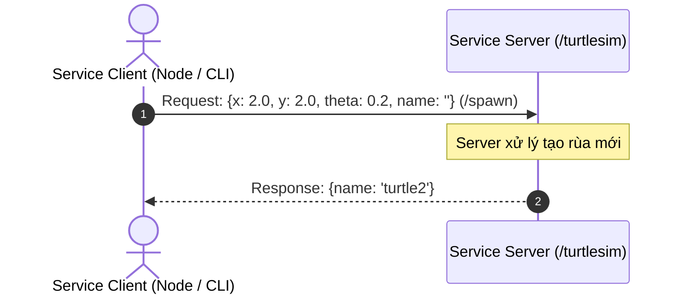

---
tags:
  - ros2
  - services
  - client
  - server
  - request-response
  - cli
  - beginner
created: 2026-08-25
aliases:
  - Tìm hiểu về Services trong ROS 2
  - Understanding services
---

# 🛎️ Tìm hiểu về Services trong ROS 2 (Understanding Services)

> [!INFO] **Mục tiêu bài học**
> Làm quen với mô hình giao tiếp theo yêu cầu - phản hồi (**Request - Response**) của **Services** trong ROS 2 và các công cụ CLI để gọi và kiểm tra service.
> - **Cấp độ:** Beginner
> - **Thời lượng ước tính:** 10 phút
> - **Bài trước:** [[04 - Understanding Topics|Tìm hiểu về Topics trong ROS 2]]
> - **Bài tiếp theo:** [[06 - Understanding Parameters|Tìm hiểu về Parameters trong ROS 2]]

---

## 📖 Bối cảnh (Background)

Khác với [[04 - Understanding Topics|Topics]] là luồng dữ liệu phát liên tục (Publish-Subscribe), **Service** hoạt động dựa trên mô hình **Gọi - Phản hồi (Call-and-Response / Request-Response)**:

- **Service Server (Máy chủ cung cấp dịch vụ):** Node lắng nghe yêu cầu từ client, xử lý logic và trả về kết quả.
- **Service Client (Bên gọi dịch vụ):** Node gửi một gói yêu cầu (Request) và đợi nhận kết quả phản hồi (Response).
- **Khi nào nên dùng Service?** Dùng cho các hành động diễn ra trong thời gian ngắn hoặc chỉ thực hiện khi có yêu cầu rời rạc (ví dụ: bật/tắt động cơ, tính toán nghịch đảo động học, reset bản đồ, chụp 1 bức ảnh).



---

## 🛠️ Các lệnh CLI với Service (Tasks)

### 1. Khởi động môi trường
Chạy hai node turtlesim quen thuộc:
```bash
ros2 run turtlesim turtlesim_node
ros2 run turtlesim turtle_teleop_key
```

---

### 2. Liệt kê các Service với `ros2 service list`
```bash
ros2 service list
```
Kết quả trả về danh sách các service khả dụng:
```text
/clear
/kill
/reset
/spawn
/turtle1/set_pen
/turtle1/teleport_absolute
/turtle1/teleport_relative
/turtlesim/describe_parameters
...
```

> [!NOTE]
> Các service có hậu tố `..._parameters` là các service hạ tầng quản lý cấu hình node (sẽ được tìm hiểu ở bài [[06 - Understanding Parameters|Parameters]]).

---

### 3. Kiểm tra kiểu của Service với `ros2 service type`
Mỗi service được định nghĩa bởi một kiểu giao tiếp bao gồm 2 phần: kiểu Request và kiểu Response.

```bash
ros2 service type /clear
# Trả về: std_srvs/srv/Empty (Không yêu cầu dữ liệu gửi đi và không có dữ liệu trả về)
```

Xem danh sách tất cả các service kèm kiểu của chúng:
```bash
ros2 service list -t
```
Kết quả:
```text
/clear [std_srvs/srv/Empty]
/kill [turtlesim_msgs/srv/Kill]
/reset [std_srvs/srv/Empty]
/spawn [turtlesim_msgs/srv/Spawn]
/turtle1/set_pen [turtlesim_msgs/srv/SetPen]
```

---

### 4. Kiểm tra cấu trúc Service với `ros2 interface show`
Dùng lệnh này để xem chi tiết các trường dữ liệu của Request và Response. Dấu phân cách `---` ngăn cách giữa phần **Request (ở trên)** và phần **Response (ở dưới)**:

```bash
ros2 interface show turtlesim_msgs/srv/Spawn
```

Kết quả:
```text
float32 x
float32 y
float32 theta
string name # Tùy chọn. Nếu để trống, hệ thống sẽ tự sinh tên duy nhất.
---
string name # Tên của rùa vừa được tạo
```

---

### 5. Gọi Service từ dòng lệnh với `ros2 service call`
Cú pháp:
```bash
ros2 service call <service_name> <service_type> <arguments_in_yaml>
```

#### 5.1 Gọi Service rỗng (`std_srvs/srv/Empty`):
Xóa sạch các nét vẽ trên màn hình turtlesim:
```bash
ros2 service call /clear std_srvs/srv/Empty
```

#### 5.2 Gọi Service có tham số:
Tạo một chú rùa mới tại tọa độ (2, 2):
```bash
ros2 service call /spawn turtlesim_msgs/srv/Spawn "{x: 2.0, y: 2.0, theta: 0.2, name: ''}"
```
Kết quả phản hồi trên terminal:
```text
requester: making request: turtlesim_msgs.srv.Spawn_Request(x=2.0, y=2.0, theta=0.2, name='')

response:
turtlesim_msgs.srv.Spawn_Response(name='turtle2')
```

---

### 6. Tìm kiếm Service theo kiểu với `ros2 service find`
Tìm tất cả service đang chạy có cùng kiểu dữ liệu:
```bash
ros2 service find std_srvs/srv/Empty
# Kết quả: /clear, /reset
```

---

### 7. Xem thông tin Server/Client với `ros2 service info`
```bash
ros2 service info /clear
```
Thêm cờ `--verbose` để xem middleware GID và cấu hình QoS endpoints:
```bash
ros2 service info --verbose /clear
```

---

### 8. Lắng nghe gói tin Service với `ros2 service echo`
*(Yêu cầu bật tính năng Service Introspection)*

```bash
ros2 service echo --flow-style /add_two_ints
```
Lệnh này cho phép "nội soi" các gói tin `REQUEST_SENT`, `REQUEST_RECEIVED`, `RESPONSE_SENT`, `RESPONSE_RECEIVED` trao đổi giữa Client và Server trong thời gian thực.

---

## 📌 Tóm tắt (Summary)
- **Service** là mô hình giao tiếp 1-1, đồng bộ/bất đồng bộ kiểu **Request-Response**.
- Sử dụng cho các tác vụ ngắn hạn hoặc chỉ kích hoạt khi có lệnh.
- Phân biệt:
  - **Topic:** Luồng dữ liệu 1 chiều liên tục.
  - **Service:** Hỏi và đáp (Request/Response) rời rạc.
  - **Action:** Dành cho các tác vụ mất nhiều thời gian (xem [[07 - Understanding Actions]]).

---

## 🔗 Liên kết & Bài tiếp theo
- ⬅️ Bài trước: [[04 - Understanding Topics|Tìm hiểu về Topics trong ROS 2]]
- ➡️ Bài tiếp theo: [[06 - Understanding Parameters|Tìm hiểu về Parameters trong ROS 2]]
