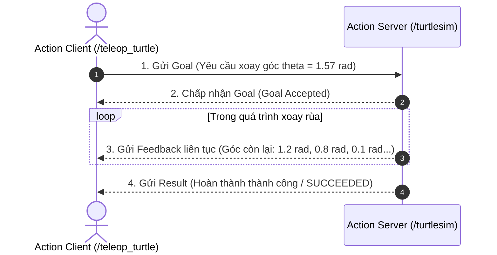

---
tags:
  - ros2
  - actions
  - goal
  - feedback
  - result
  - cli
  - beginner
created: 2026-08-25
aliases:
  - Tìm hiểu về Actions trong ROS 2
  - Understanding actions
---

# 🎯 Tìm hiểu về Actions trong ROS 2 (Understanding Actions)

> [!INFO] **Mục tiêu bài học**
> Khám phá cơ chế truyền thông **Actions** dành cho các tác vụ dài hạn (long-running tasks) trong ROS 2 và các công cụ CLI để gửi mục tiêu (goal), theo dõi tiến trình (feedback) và hủy tác vụ.
> - **Cấp độ:** Beginner
> - **Thời lượng ước tính:** 15 phút
> - **Bài trước:** [[06 - Understanding Parameters|Tìm hiểu về Parameters trong ROS 2]]
> - **Bài tiếp theo:** [[08 - Using RQt Console|Quản lý Log với RQt Console]]

---

## Viết action
Các bước chính để viết một action server:
1. Vì ở phía server, chúng ta phải chọn tên action và interface. Thông thường, bạn sẽ cần tạo một custom interface (trong một package chuyên dụng).
2. Sau đó, import interface vào code và khởi tạo một action server trong constructor. Tại đây, bạn sẽ đăng ký 3 phương thức callback
    - **Goal callback:** Khi server nhận được một mục tiêu, quyết định chấp nhận hay từ chối nó.
    - **Execute callback:** Sau khi mục tiêu được chấp nhận, tiến hành thực thi nó. Trong quá trình thực thi, bạn cũng có thể xuất bản (publish) các phản hồi feedback tùy chọn.
    - **Cancel callback (cơ chế tùy chọn):** Nếu nhận được yêu cầu hủy, bạn có thể chấp nhận hoặc từ chối. Nếu chấp nhận, bạn sẽ phải hủy tiến trình thực thi mục tiêu hiện tại.

Để viết một action client, bạn thực hiện theo các bước:
1. Xác định tên và interface cần dùng để có thể giao tiếp với server.
2. Import interface vào code và khởi tạo một action client trong constructor.
3. Thêm một phương thức để gửi goal. Sau khi gửi goal, bạn sẽ cần viết một số callback:
    - **Goal response callback:** Giúp bạn biết goal đã được server chấp nhận hay bị từ chối.
    - **Goal result callback:** Sau khi goal được server thực thi xong, bạn sẽ nhận được kết quả và trạng thái cuối cùng của goal tại đây.
    - **Feedback callback (tùy chọn):** Nhận các phản hồi trung gian nếu 
4. Cuối cùng, từ bất kỳ vị trí nào trong mã nguồn, bạn đều có thể quyết định hủy việc thực thi của một goal đang hoạt động.

## 📖 Bối cảnh (Background)

Trong lập trình robot, có những công việc mất nhiều giây, vài phút hoặc thậm chí hàng giờ để hoàn thành (ví dụ: điều hướng robot di chuyển đến phòng họp, cánh tay robot gắp vật thể, quét bản đồ 3D). 

Nếu dùng [[05 - Understanding Services|Service]], chương trình sẽ bị "treo" chờ kết quả và không biết quá trình thực hiện tới đâu, cũng không hủy được giữa chừng. Do đó, ROS 2 cung cấp **Action**:

- **Bản chất:** Action được xây dựng kết hợp từ [[04 - Understanding Topics|Topics]] và [[05 - Understanding Services|Services]].
- **Mô hình Client - Server:**
  - **Action Client:** Node gửi mục tiêu (*Goal*) đến Server.
  - **Action Server:** Tiếp nhận Goal, thực thi tác vụ, liên tục gửi phản hồi tiến độ (*Feedback*) và trả về kết quả cuối cùng (*Result*).
- **Khả năng kiểm soát:** Cho phép hủy tác vụ (*Cancel*) bất kỳ lúc nào từ phía Client hoặc Server tự hủy (*Abort*) khi gặp sự cố.



---

## 🛠️ Trải nghiệm Action trên Turtlesim & CLI (Tasks)

### 1. Khởi động môi trường
```bash
ros2 run turtlesim turtlesim_node
ros2 run turtlesim turtle_teleop_key
```

Quan sát dòng hướng dẫn ở terminal `turtle_teleop_key`:
```text
Use arrow keys to move the turtle.
Use G|B|V|C|D|E|R|T keys to rotate to absolute orientations. 'F' to cancel a rotation.
```
- Các phím `G`, `B`, `V`, `C`, `D`, `E`, `R`, `T` gửi mục tiêu (Goal) quay rùa theo hướng tuyệt đối tương ứng.
- Phím `F` dùng để **hủy (cancel)** quá trình xoay ngay lập tức.
- Nếu gửi Goal mới khi Goal cũ chưa hoàn thành, Server có thể tự **hủy (abort)** Goal cũ.

---

### 2. Liệt kê và kiểm tra Action với `ros2 action list`
Xem tất cả action đang có trong hệ thống:
```bash
ros2 action list
# Trả về: /turtle1/rotate_absolute
```

Thêm cờ `-t` để xem kiểu của action:
```bash
ros2 action list -t
# Trả về: /turtle1/rotate_absolute [turtlesim_msgs/action/RotateAbsolute]
```

---

### 3. Xem số lượng Client/Server với `ros2 action info`
```bash
ros2 action info /turtle1/rotate_absolute
```
Kết quả:
```text
Action: /turtle1/rotate_absolute
Action clients: 1
    /teleop_turtle
Action servers: 1
    /turtlesim
```

---

### 4. Kiểm tra cấu trúc Action với `ros2 interface show`
Cấu trúc một file định nghĩa Action (`.action`) luôn có **2 dấu phân cách `---`** chia làm 3 phần:
1. **Goal Request** (Mục tiêu yêu cầu)
2. **Result** (Kết quả trả về khi kết thúc)
3. **Feedback** (Dữ liệu tiến độ gửi định kỳ)

```bash
ros2 interface show turtlesim_msgs/action/RotateAbsolute
```

Kết quả:
```text
# 1. Goal: Góc hướng mong muốn (radian)
float32 theta
---
# 2. Result: Độ dịch chuyển góc so với ban đầu (radian)
float32 delta
---
# 3. Feedback: Góc còn lại cần phải xoay (radian)
float32 remaining
```

---

### 5. Gửi mục tiêu Action từ CLI với `ros2 action send_goal`
Cú pháp:
```bash
ros2 action send_goal <action_name> <action_type> <values_in_yaml>
```

#### 5.1 Gửi Goal cơ bản:
Xoay rùa một góc 1.57 rad (90 độ):
```bash
ros2 action send_goal /turtle1/rotate_absolute turtlesim_msgs/action/RotateAbsolute "{theta: 1.57}"
```

Kết quả trên terminal:
```text
Waiting for an action server to become available...
Sending goal:
   theta: 1.57

Goal accepted with ID: f8db8f44410849eaa93d3feb747dd444

Result:
  delta: -1.568000316619873

Goal finished with status: SUCCEEDED
```

#### 5.2 Gửi Goal kèm theo dõi Feedback liên tục (`--feedback`):
```bash
ros2 action send_goal /turtle1/rotate_absolute turtlesim_msgs/action/RotateAbsolute "{theta: -1.57}" --feedback
```
Terminal sẽ in ra liên tục giá trị `remaining` (góc còn lại cần quay) trong suốt hành trình cho đến khi đạt trạng thái `SUCCEEDED`.

---

### 6. Lắng nghe gói tin Action với `ros2 action echo`
*(Hỗ trợ từ phiên bản ROS 2 mới)*
```bash
ros2 action echo /fibonacci example_interfaces/action/Fibonacci --flow-style
```
Cho phép theo dõi các sự kiện truyền thông của Goal Service, Result Service, Feedback Topic và Status Topic.

---

## 📊 Bảng so sánh tổng kết các hình thức truyền thông ROS 2

| Tiêu chí | [[04 - Understanding Topics\|Topic]] | [[05 - Understanding Services\|Service]] | [[07 - Understanding Actions\|Action]] |
| :--- | :--- | :--- | :--- |
| **Mô hình** | Publish - Subscribe | Request - Response (Client/Server) | Goal - Feedback - Result (Client/Server) |
| **Thời lượng tác vụ** | Dòng dữ liệu liên tục | Ngắn hạn, tức thì | Dài hạn, tốn thời gian |
| **Phản hồi tiến độ** | Không | Không | Có (*Feedback streaming*) |
| **Khả năng hủy** | Không | Không | Có (*Cancel / Abort*) |
| **Ví dụ thực tế** | Dữ liệu LiDAR, Camera, Vận tốc | Chụp ảnh, Bật đèn, Reset vị trí | Di chuyển đến điểm B, Gắp đồ vật |

---

## 🔗 Liên kết & Bài tiếp theo
- ⬅️ Bài trước: [[06 - Understanding Parameters|Tìm hiểu về Parameters trong ROS 2]]
- ➡️ Bài tiếp theo: [[08 - Using RQt Console|Quản lý Log với RQt Console]]
