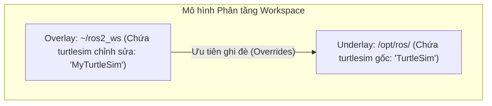

---
tags:
  - ros2
  - workspace
  - overlay
  - underlay
  - rosdep
  - colcon
  - beginner
created: 2026-08-25
aliases:
  - Tạo Workspace và Thiết lập Overlay
  - Creating a workspace
---

# 🏗️ Tạo Workspace và Thiết lập Overlay (Creating a Workspace)

> [!INFO] **Mục tiêu bài học**
> Học cách tạo một **Workspace**, cài đặt các gói phụ thuộc tự động bằng công cụ **`rosdep`**, và hiểu rõ cơ chế ưu tiên của **Overlay** so với **Underlay**.
> - **Cấp độ:** Beginner
> - **Thời lượng ước tính:** 20 phút
> - **Bài trước:** [[01 - Using Colcon to Build Packages|Sử dụng colcon để build packages]]
> - **Bài tiếp theo:** [[03 - Creating a Package|Tạo một Package trong ROS 2]]

---

## 📖 Bối cảnh (Background)

- **Workspace:** Là một thư mục chứa các [[03 - Creating a Package|ROS 2 Package]].
- **Underlay:** Môi trường ROS 2 cơ sở (thường là `/opt/ros/<distro>`).
- **Overlay:** Workspace phụ nơi bạn thêm các package mới hoặc chỉnh sửa mã nguồn của các package có sẵn mà không làm ảnh hưởng đến bản cài gốc.
- **Quy tắc ghi đè (Precedence):** Các package trong **Overlay** luôn có độ ưu tiên cao hơn và sẽ ghi đè (override) lên các package cùng tên ở **Underlay**.



---

## 🛠️ Các bước thực hiện (Tasks)

### 1. Chuẩn bị Workspace mới
Tạo cấu trúc thư mục tiêu chuẩn:

```bash
mkdir -p ~/ros2_ws/src
cd ~/ros2_ws/src
```

---

### 2. Tải mã nguồn mẫu (`ros_tutorials`)
Clone package `turtlesim` từ kho lưu trữ chính thức:

```bash
git clone https://github.com/ros/ros_tutorials.git -b <distro>
```

---

### 3. Tự động giải quyết Dependencies với `rosdep`
Trước khi build, luôn kiểm tra và cài đặt tự động tất cả các thư viện phụ thuộc được khai báo trong file `package.xml`:

Từ thư mục gốc của workspace (`~/ros2_ws`), chạy lệnh:

```bash
cd ~/ros2_ws
rosdep install -i --from-path src --rosdistro <distro> -y
```

> [!TIP] **Giải thích các tham số của `rosdep`:**
> - `-i` (`--ignore-src`): Bỏ qua các package đã có sẵn mã nguồn trong thư mục `src`.
> - `--from-path src`: Quét toàn bộ các file `package.xml` bên trong thư mục `src`.
> - `-y`: Tự động đồng ý cài đặt các gói hệ thống từ `apt` mà không hỏi lại.

---

### 4. Biên dịch Workspace với `colcon`
```bash
colcon build
```

---

### 5. Source Overlay và Chạy thử nghiệm
Mở một terminal mới (tách biệt hoàn toàn với terminal vừa build):

```bash
# 1. Source Underlay
source /opt/ros/<distro>/setup.bash

# 2. Di chuyển vào workspace và Source Overlay
cd ~/ros2_ws
source install/local_setup.bash
```

> [!NOTE] **Phân biệt `local_setup.bash` và `setup.bash`:**
> - `local_setup.bash`: Chỉ nạp các package có trong chính workspace hiện tại (Overlay).
> - `setup.bash`: Nạp cả workspace hiện tại lẫn toàn bộ các Underlay mà nó kế thừa.

Chạy node rùa từ Overlay:
```bash
ros2 run turtlesim turtlesim_node
```

---

### 6. Kiểm chứng cơ chế ghi đè của Overlay
Hãy thử sửa đổi giao diện của `turtlesim` trong workspace của bạn để xem Overlay hoạt động thế nào:

1. Mở file mã nguồn C++: `~/ros2_ws/src/ros_tutorials/turtlesim/src/turtle_frame.cpp`.
2. Tìm hàm `setWindowTitle("TurtleSim");` và đổi thành `setWindowTitle("MyTurtleSim");`.
3. Lưu file và chạy lại `colcon build` tại thư mục gốc workspace.
4. Mở terminal đã source `install/local_setup.bash` và chạy lại `ros2 run turtlesim turtlesim_node`.

Tiêu đề cửa sổ mô phỏng bây giờ sẽ hiển thị **"MyTurtleSim"**!

Khi bạn mở một terminal khác và chỉ source `/opt/ros/<distro>/setup.bash` (chỉ có Underlay), tiêu đề sẽ vẫn là **"TurtleSim"** gốc. Điều này chứng minh Overlay hoàn toàn độc lập và an toàn cho hệ thống.

---

## 📌 Tóm tắt (Summary)
- Sử dụng Overlay là chuẩn mực phát triển trong ROS 2 giúp bạn tùy biến và thử nghiệm an toàn mà không làm hỏng môi trường cài đặt gốc.
- Công cụ `rosdep` là trợ thủ đắc lực giúp cài đặt dependencies tự động và chính xác.

---

## 🔗 Liên kết & Bài tiếp theo
- ⬅️ Bài trước: [[01 - Using Colcon to Build Packages|Sử dụng colcon để build packages]]
- ➡️ Bài tiếp theo: [[03 - Creating a Package|Tạo một Package trong ROS 2]]
