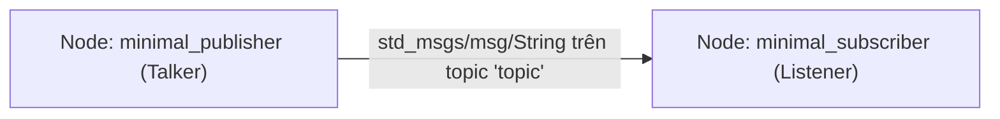

---
tags:
  - ros2
  - cpp
  - rclcpp
  - publisher
  - subscriber
  - topics
  - beginner
created: 2026-08-25
aliases:
  - Viết Publisher và Subscriber (C++)
  - Writing a simple publisher and subscriber (C++)
---

# 💻 Viết Publisher và Subscriber bằng C++ (rclcpp)

> [!INFO] **Mục tiêu bài học**
> Xây dựng hệ thống giao tiếp [[04 - Understanding Topics|Topic]] hoàn chỉnh với 2 node viết bằng C++ (`rclcpp`): Node **Talker (Publisher)** phát thông điệp chuỗi và Node **Listener (Subscriber)** nhận thông điệp.
> - **Cấp độ:** Beginner
> - **Thời lượng ước tính:** 20 phút
> - **Bài trước:** [[03 - Creating a Package|Tạo một Package trong ROS 2]]
> - **Bài song song (Python):** [[05 - Writing PubSub (Python)|Viết Publisher và Subscriber (Python)]]
> - **Bài tiếp theo:** [[06 - Writing Service Client (C++)|Viết Service và Client (C++)]]

---

## 📖 Bối cảnh (Background)

Thư viện client tiêu chuẩn của ROS 2 dành cho C++ là **`rclcpp`**. Trong bài học này, chúng ta sẽ lập trình hướng đối tượng bằng cách kế thừa lớp `rclcpp::Node`.



---

## 🛠️ Các bước thực hiện (Tasks)

### 1. Tạo Package `cpp_pubsub`
Di chuyển vào thư mục `src` của workspace và tạo package:

```bash
cd ~/ros2_ws/src
ros2 pkg create --build-type ament_cmake --license Apache-2.0 cpp_pubsub
```

---

### 2. Viết Node Publisher (`talker`)
Tạo file mã nguồn `src/publisher_member_function.cpp` bên trong package `cpp_pubsub`:

```cpp
#include <chrono>
#include <memory>
#include <string>

#include "rclcpp/rclcpp.hpp"
#include "std_msgs/msg/string.hpp"

using namespace std::chrono_literals;

class MinimalPublisher : public rclcpp::Node
{
public:
  MinimalPublisher()
  : Node("minimal_publisher"), count_(0)
  {
    // 1. Tạo Publisher với kiểu std_msgs::msg::String trên topic "topic", hàng đợi QoS = 10
    publisher_ = this->create_publisher<std_msgs::msg::String>("topic", 10);

    // 2. Tạo Timer định kỳ 500ms (2Hz) gọi lambda callback
    auto timer_callback =
      [this]() -> void {
        auto message = std_msgs::msg::String();
        message.data = "Hello, world! " + std::to_string(this->count_++);
        RCLCPP_INFO(this->get_logger(), "Publishing: '%s'", message.data.c_str());
        this->publisher_->publish(message);
      };
    timer_ = this->create_wall_timer(500ms, timer_callback);
  }

private:
  rclcpp::TimerBase::SharedPtr timer_;
  rclcpp::Publisher<std_msgs::msg::String>::SharedPtr publisher_;
  size_t count_;
};

int main(int argc, char * argv[])
{
  rclcpp::init(argc, argv);
  rclcpp::spin(std::make_shared<MinimalPublisher>());
  rclcpp::shutdown();
  return 0;
}
```

> [!NOTE] **Giải thích các thành phần cốt lõi:**
> - `rclcpp::Node("minimal_publisher")`: Khởi tạo node với tên `minimal_publisher`.
> - `create_publisher<std_msgs::msg::String>("topic", 10)`: Đăng ký kênh phát.
> - `create_wall_timer(500ms, ...)`: Bộ định thời kích hoạt việc xuất bản dữ liệu mỗi nửa giây.
> - `RCLCPP_INFO(...)`: Macro chuẩn để in log ra console (kết nối với [[08 - Using RQt Console|rqt_console]]).
> - `rclcpp::spin(...)`: Giữ node luôn ở trạng thái hoạt động và xử lý các sự kiện/callback.

---

### 3. Viết Node Subscriber (`listener`)
Tạo file mã nguồn `src/subscriber_member_function.cpp`:

```cpp
#include <memory>

#include "rclcpp/rclcpp.hpp"
#include "std_msgs/msg/string.hpp"

class MinimalSubscriber : public rclcpp::Node
{
public:
  MinimalSubscriber()
  : Node("minimal_subscriber")
  {
    // Định nghĩa Callback nhận thông điệp
    auto topic_callback =
      [this](std_msgs::msg::String::UniquePtr msg) -> void {
        RCLCPP_INFO(this->get_logger(), "I heard: '%s'", msg->data.c_str());
      };

    // Tạo Subscriber lắng nghe trên topic "topic"
    subscription_ =
      this->create_subscription<std_msgs::msg::String>("topic", 10, topic_callback);
  }

private:
  rclcpp::Subscription<std_msgs::msg::String>::SharedPtr subscription_;
};

int main(int argc, char * argv[])
{
  rclcpp::init(argc, argv);
  rclcpp::spin(std::make_shared<MinimalSubscriber>());
  rclcpp::shutdown();
  return 0;
}
```

---

### 4. Cập nhật `package.xml` và `CMakeLists.txt`

#### Cập nhật `package.xml`:
Thêm hai phụ thuộc `rclcpp` và `std_msgs`:
```xml
<depend>rclcpp</depend>
<depend>std_msgs</depend>
```

#### Cập nhật `CMakeLists.txt`:
```cmake
cmake_minimum_required(VERSION 3.20)
project(cpp_pubsub)

if(NOT CMAKE_CXX_STANDARD)
  set(CMAKE_CXX_STANDARD 20)
endif()

find_package(ament_cmake REQUIRED)
find_package(rclcpp REQUIRED)
find_package(std_msgs REQUIRED)

# 1. Target Talker (Publisher)
add_executable(talker src/publisher_member_function.cpp)
target_link_libraries(talker PUBLIC rclcpp::rclcpp std_msgs::std_msgs)

# 2. Target Listener (Subscriber)
add_executable(listener src/subscriber_member_function.cpp)
target_link_libraries(listener PUBLIC rclcpp::rclcpp std_msgs::std_msgs)

# 3. Cài đặt các executables vào thư mục lib
install(TARGETS
  talker
  listener
  DESTINATION lib/${PROJECT_NAME})

ament_package()
```

---

### 5. Biên dịch và Chạy thử nghiệm

Tại thư mục gốc workspace `~/ros2_ws`:
```bash
colcon build --packages-select cpp_pubsub
```

Mở 2 terminal để chạy 2 node:

```bash
# Terminal 1 (Talker)
source install/setup.bash
ros2 run cpp_pubsub talker

# Terminal 2 (Listener)
source install/setup.bash
ros2 run cpp_pubsub listener
```

Kết quả: Node `listener` sẽ in ra dòng log *"I heard: 'Hello, world! X'"* ngay khi `talker` xuất bản!

---

## 📌 Tóm tắt (Summary)
- Bạn đã tự viết và liên kết thành công cặp Node Publisher và Subscriber hoàn chỉnh bằng C++ (`rclcpp`).
- Quy trình gồm: Định nghĩa class kế thừa `rclcpp::Node` -> Khởi tạo publisher/subscription -> Cấu hình `package.xml` & `CMakeLists.txt` -> Biên dịch bằng `colcon`.

---

## 🔗 Liên kết & Bài tiếp theo
- ⬅️ Bài trước: [[03 - Creating a Package|Tạo một Package trong ROS 2]]
- 🐍 Phiên bản Python: [[05 - Writing PubSub (Python)|Viết Publisher và Subscriber (Python)]]
- ➡️ Bài tiếp theo: [[06 - Writing Service Client (C++)|Viết Service và Client (C++)]]
