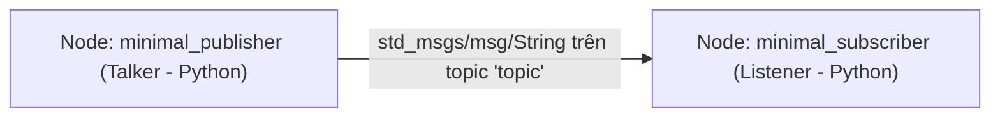

---
tags:
  - ros2
  - python
  - rclpy
  - publisher
  - subscriber
  - topics
  - beginner
created: 2026-08-25
aliases:
  - Viết Publisher và Subscriber (Python)
  - Writing a simple publisher and subscriber (Python)
---

# 🐍 Viết Publisher và Subscriber bằng Python (rclpy)

> [!INFO] **Mục tiêu bài học**
> Xây dựng hệ thống giao tiếp [[04 - Understanding Topics|Topic]] hoàn chỉnh với 2 node viết bằng Python (`rclpy`): Node **Talker (Publisher)** và Node **Listener (Subscriber)**.
> - **Cấp độ:** Beginner
> - **Thời lượng ước tính:** 20 phút
> - **Bài trước:** [[03 - Creating a Package|Tạo một Package trong ROS 2]]
> - **Bài song song (C++):** [[04 - Writing PubSub (C++)|Viết Publisher và Subscriber (C++)]]
> - **Bài tiếp theo:** [[07 - Writing Service Client (Python)|Viết Service và Client (Python)]]

---

## 📖 Bối cảnh (Background)

Thư viện client tiêu chuẩn của ROS 2 dành cho Python là **`rclpy`**. Chúng ta sẽ tạo một package kiểu `ament_python` và lập trình hướng đối tượng bằng cách kế thừa lớp `rclpy.node.Node`.



---

## 🛠️ Các bước thực hiện (Tasks)

### 1. Tạo Package `py_pubsub`
Di chuyển vào thư mục `src` của workspace và tạo package Python:

```bash
cd ~/ros2_ws/src
ros2 pkg create --build-type ament_python --license Apache-2.0 py_pubsub
```

---

### 2. Viết Node Publisher (`publisher_member_function.py`)
Tạo file `publisher_member_function.py` trong thư mục `ros2_ws/src/py_pubsub/py_pubsub/`:

```python
import rclpy
from rclpy.executors import ExternalShutdownException
from rclpy.node import Node
from std_msgs.msg import String


class MinimalPublisher(Node):

    def __init__(self):
        super().__init__('minimal_publisher')
        # 1. Tạo Publisher với kiểu String trên topic 'topic', hàng đợi = 10
        self.publisher_ = self.create_publisher(String, 'topic', 10)
        
        # 2. Tạo Timer chu kỳ 0.5s gọi timer_callback
        timer_period = 0.5  # seconds
        self.timer = self.create_timer(timer_period, self.timer_callback)
        self.i = 0

    def timer_callback(self):
        msg = String()
        msg.data = f'Hello World: {self.i}'
        self.publisher_.publish(msg)
        self.get_logger().info(f'Publishing: "{msg.data}"')
        self.i += 1


def main(args=None):
    try:
        with rclpy.init(args=args):
            minimal_publisher = MinimalPublisher()
            rclpy.spin(minimal_publisher)
    except (KeyboardInterrupt, ExternalShutdownException):
        pass


if __name__ == '__main__':
    main()
```

---

### 3. Viết Node Subscriber (`subscriber_member_function.py`)
Tạo file `subscriber_member_function.py` cùng thư mục với publisher:

```python
import rclpy
from rclpy.executors import ExternalShutdownException
from rclpy.node import Node
from std_msgs.msg import String


class MinimalSubscriber(Node):

    def __init__(self):
        super().__init__('minimal_subscriber')
        # Tạo Subscription lắng nghe topic 'topic'
        self.subscription = self.create_subscription(
            String,
            'topic',
            self.listener_callback,
            10
        )
        self.subscription  # Ngăn cảnh báo unused variable

    def listener_callback(self, msg):
        self.get_logger().info(f'I heard: "{msg.data}"')


def main(args=None):
    try:
        with rclpy.init(args=args):
            minimal_subscriber = MinimalSubscriber()
            rclpy.spin(minimal_subscriber)
    except (KeyboardInterrupt, ExternalShutdownException):
        pass


if __name__ == '__main__':
    main()
```

---

### 4. Cấu hình Dependencies và Entry Points

#### 4.1 Cập nhật `package.xml`:
Thêm các phụ thuộc thực thi vào file `package.xml`:
```xml
<exec_depend>rclpy</exec_depend>
<exec_depend>std_msgs</exec_depend>
```

#### 4.2 Cập nhật `setup.py`:
Khai báo các lệnh thực thi (**entry_points**) để lệnh `ros2 run` nhận diện được:

```python
from setuptools import find_packages, setup

package_name = 'py_pubsub'

setup(
    name=package_name,
    version='0.0.0',
    packages=find_packages(exclude=['test']),
    data_files=[
        ('share/ament_index/resource_index/packages',
            ['resource/' + package_name]),
        ('share/' + package_name, ['package.xml']),
    ],
    install_requires=['setuptools'],
    zip_safe=True,
    maintainer='YourName',
    maintainer_email='you@email.com',
    description='Examples of minimal publisher/subscriber using rclpy',
    license='Apache-2.0',
    tests_require=['pytest'],
    entry_points={
        'console_scripts': [
            'talker = py_pubsub.publisher_member_function:main',
            'listener = py_pubsub.subscriber_member_function:main',
        ],
    },
)
```

---

### 5. Biên dịch và Chạy thử nghiệm

Quay về thư mục gốc workspace và build package:
```bash
cd ~/ros2_ws
colcon build --symlink-install --packages-select py_pubsub
```

Mở 2 terminal để chạy thử:

```bash
# Terminal 1: Chạy Publisher
source install/setup.bash
ros2 run py_pubsub talker

# Terminal 2: Chạy Subscriber
source install/setup.bash
ros2 run py_pubsub listener
```

---

## 📌 Tóm tắt (Summary)
- Node Python trong ROS 2 sử dụng thư viện `rclpy` với cấu trúc rất ngắn gọn, dễ đọc.
- Để biến một hàm `main()` trong Python thành lệnh chạy được qua `ros2 run`, ta đăng ký tại mục `entry_points['console_scripts']` trong file `setup.py`.

---

## 🔗 Liên kết & Bài tiếp theo
- ⬅️ Bài trước: [[03 - Creating a Package|Tạo một Package trong ROS 2]]
- 💻 Phiên bản C++: [[04 - Writing PubSub (C++)|Viết Publisher và Subscriber (C++)]]
- ➡️ Bài tiếp theo: [[07 - Writing Service Client (Python)|Viết Service và Client (Python)]]
