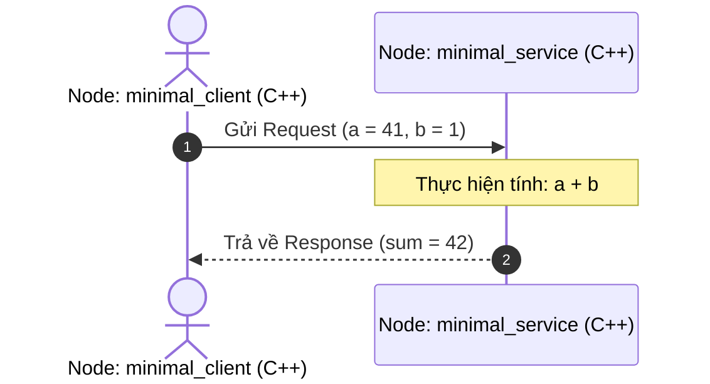

---
tags:
  - ros2
  - cpp
  - rclcpp
  - service
  - client
  - srv
  - beginner
created: 2026-08-25
aliases:
  - Viết Service và Client (C++)
  - Writing a simple service and client (C++)
---

# 🛎️ Viết Service và Client bằng C++ (rclcpp)

> [!INFO] **Mục tiêu bài học**
> Xây dựng hệ thống giao tiếp theo mô hình [[05 - Understanding Services|Service (Request - Response)]] với 2 node C++: Node **Server** tính tổng hai số nguyên và Node **Client** gửi yêu cầu cộng hai số.
> - **Cấp độ:** Beginner
> - **Thời lượng ước tính:** 20 phút
> - **Bài trước:** [[04 - Writing PubSub (C++)|Viết Publisher và Subscriber (C++)]]
> - **Bài song song (Python):** [[07 - Writing Service Client (Python)|Viết Service và Client (Python)]]
> - **Bài tiếp theo:** [[08 - Creating Custom Interfaces (msg and srv)|Tạo Message và Service tùy chỉnh]]

---

## 📖 Bối cảnh (Background)

Bài thực hành này sử dụng kiểu service có sẵn trong package `example_interfaces`: `example_interfaces/srv/AddTwoInts`:

```text
int64 a
int64 b
---
int64 sum
```



---

## 🛠️ Các bước thực hiện (Tasks)

### 1. Tạo Package `cpp_srvcli`
Tạo package C++ với các dependencies tự động khai báo (`rclcpp` và `example_interfaces`):

```bash
cd ~/ros2_ws/src
ros2 pkg create --build-type ament_cmake --license Apache-2.0 cpp_srvcli --dependencies rclcpp example_interfaces
```

---

### 2. Viết Node Service Server (`add_two_ints_server.cpp`)
Tạo file `src/add_two_ints_server.cpp` trong package `cpp_srvcli`:

```cpp
#include <cinttypes>
#include <memory>

#include "example_interfaces/srv/add_two_ints.hpp"
#include "rclcpp/rclcpp.hpp"

using AddTwoInts = example_interfaces::srv::AddTwoInts;
rclcpp::Node::SharedPtr g_node = nullptr;

// Hàm callback xử lý yêu cầu
void handle_service(
  const std::shared_ptr<rmw_request_id_t> request_header,
  const std::shared_ptr<AddTwoInts::Request> request,
  const std::shared_ptr<AddTwoInts::Response> response)
{
  (void)request_header;
  RCLCPP_INFO(
    g_node->get_logger(),
    "Nhan yeu cau: %" PRId64 " + %" PRId64, request->a, request->b);
  
  // Tính tổng và gán vào response
  response->sum = request->a + request->b;
}

int main(int argc, char ** argv)
{
  rclcpp::init(argc, argv);
  g_node = rclcpp::Node::make_shared("minimal_service");
  
  // Tạo Service Server lắng nghe trên tên "add_two_ints"
  auto server = g_node->create_service<AddTwoInts>("add_two_ints", handle_service);
  
  RCLCPP_INFO(g_node->get_logger(), "Service Server san sang cong 2 so.");
  rclcpp::spin(g_node);
  rclcpp::shutdown();
  g_node = nullptr;
  return 0;
}
```

---

### 3. Viết Node Service Client (`add_two_ints_client.cpp`)
Tạo file `src/add_two_ints_client.cpp`:

```cpp
#include <chrono>
#include <cinttypes>
#include <memory>

#include "example_interfaces/srv/add_two_ints.hpp"
#include "rclcpp/rclcpp.hpp"

using AddTwoInts = example_interfaces::srv::AddTwoInts;

int main(int argc, char * argv[])
{
  rclcpp::init(argc, argv);
  auto node = rclcpp::Node::make_shared("minimal_client");
  
  // 1. Tạo Client kết nối tới service "add_two_ints"
  auto client = node->create_client<AddTwoInts>("add_two_ints");

  // 2. Chờ Service Server khả dụng
  while (!client->wait_for_service(std::chrono::seconds(1))) {
    if (!rclcpp::ok()) {
      RCLCPP_ERROR(node->get_logger(), "Client bi ngat trong luc cho Service.");
      return 1;
    }
    RCLCPP_INFO(node->get_logger(), "Dang cho Service xuat hien...");
  }

  // 3. Chuẩn bị Request
  auto request = std::make_shared<AddTwoInts::Request>();
  request->a = 41;
  request->b = 1;

  // 4. Gửi yêu cầu bất đồng bộ (Asynchronous call)
  auto result_future = client->async_send_request(request);

  // 5. Chờ kết quả trả về
  if (rclcpp::spin_until_future_complete(node, result_future) ==
    rclcpp::FutureReturnCode::SUCCESS)
  {
    auto result = result_future.get();
    RCLCPP_INFO(
      node->get_logger(), "Ket qua: %" PRId64 " + %" PRId64 " = %" PRId64,
      request->a, request->b, result->sum);
  } else {
    RCLCPP_ERROR(node->get_logger(), "Goi service that bai :(");
    client->remove_pending_request(result_future);
    return 1;
  }

  rclcpp::shutdown();
  return 0;
}
```

---

### 4. Cập nhật `CMakeLists.txt`
Khai báo 2 executable `server` và `client`:

```cmake
cmake_minimum_required(VERSION 3.20)
project(cpp_srvcli)

if(NOT CMAKE_CXX_STANDARD)
  set(CMAKE_CXX_STANDARD 20)
endif()

find_package(ament_cmake REQUIRED)
find_package(rclcpp REQUIRED)
find_package(example_interfaces REQUIRED)

# 1. Target Server
add_executable(server src/add_two_ints_server.cpp)
target_link_libraries(server PUBLIC rclcpp::rclcpp example_interfaces::example_interfaces)

# 2. Target Client
add_executable(client src/add_two_ints_client.cpp)
target_link_libraries(client PUBLIC rclcpp::rclcpp example_interfaces::example_interfaces)

# 3. Install
install(TARGETS
  server
  client
  DESTINATION lib/${PROJECT_NAME})

ament_package()
```

---

### 5. Biên dịch và Chạy thử nghiệm

```bash
cd ~/ros2_ws
colcon build --packages-select cpp_srvcli
```

Chạy Server và Client trên 2 terminal:

```bash
# Terminal 1: Chạy Server
source install/setup.bash
ros2 run cpp_srvcli server

# Terminal 2: Chạy Client
source install/setup.bash
ros2 run cpp_srvcli client
```

Kết quả in ra ở Client:
```text
[INFO] [minimal_client]: Ket qua: 41 + 1 = 42
```

---

## 📌 Tóm tắt (Summary)
- Tạo Service Server bằng hàm `create_service<InterfaceType>()`.
- Tạo Service Client bằng `create_client<InterfaceType>()`, dùng `wait_for_service()` để đảm bảo Server sẵn sàng trước khi gọi `async_send_request()`.

---

## 🔗 Liên kết & Bài tiếp theo
- ⬅️ Bài trước: [[04 - Writing PubSub (C++)|Viết Publisher và Subscriber (C++)]]
- 🐍 Phiên bản Python: [[07 - Writing Service Client (Python)|Viết Service và Client (Python)]]
- ➡️ Bài tiếp theo: [[08 - Creating Custom Interfaces (msg and srv)|Tạo Message và Service tùy chỉnh]]
