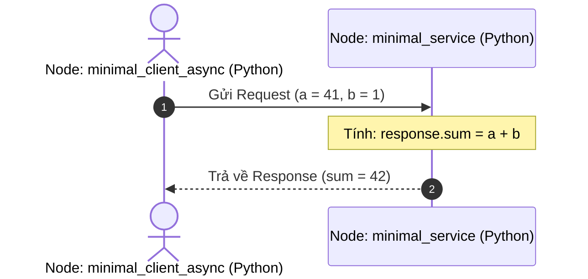

---
tags:
  - ros2
  - python
  - rclpy
  - service
  - client
  - srv
  - beginner
created: 2026-08-25
aliases:
  - Viết Service và Client (Python)
  - Writing a simple service and client (Python)
---

# 🐍 Viết Service và Client bằng Python (rclpy)

> [!INFO] **Mục tiêu bài học**
> Xây dựng hệ thống giao tiếp [[05 - Understanding Services|Service (Request - Response)]] với 2 node Python (`rclpy`): Node **Server** và Node **Client Async**.
> - **Cấp độ:** Beginner
> - **Thời lượng ước tính:** 20 phút
> - **Bài trước:** [[05 - Writing PubSub (Python)|Viết Publisher và Subscriber (Python)]]
> - **Bài song song (C++):** [[06 - Writing Service Client (C++)|Viết Service và Client (C++)]]
> - **Bài tiếp theo:** [[08 - Creating Custom Interfaces (msg and srv)|Tạo Message và Service tùy chỉnh]]

---

## 📖 Bối cảnh (Background)

Chúng ta sử dụng kiểu service `AddTwoInts` từ package `example_interfaces`:
- **Request:** Hai số nguyên `a` và `b` (kiểu `int64`).
- **Response:** Tổng `sum` (kiểu `int64`).



---

## 🛠️ Các bước thực hiện (Tasks)

### 1. Tạo Package `py_srvcli`
Tạo package Python kèm dependencies `rclpy` và `example_interfaces`:

```bash
cd ~/ros2_ws/src
ros2 pkg create --build-type ament_python --license Apache-2.0 py_srvcli --dependencies rclpy example_interfaces
```

---

### 2. Viết Node Service Server (`service_member_function.py`)
Tạo file `ros2_ws/src/py_srvcli/py_srvcli/service_member_function.py`:

```python
from example_interfaces.srv import AddTwoInts
import rclpy
from rclpy.executors import ExternalShutdownException
from rclpy.node import Node


class MinimalService(Node):

    def __init__(self):
        super().__init__('minimal_service')
        # Tạo Service Server với kiểu AddTwoInts, tên 'add_two_ints'
        self.srv = self.create_service(AddTwoInts, 'add_two_ints', self.add_two_ints_callback)

    def add_two_ints_callback(self, request, response):
        response.sum = request.a + request.b
        self.get_logger().info(f'Nhan yeu cau: a={request.a}, b={request.b}')
        return response


def main():
    try:
        with rclpy.init():
            minimal_service = MinimalService()
            rclpy.spin(minimal_service)
    except (KeyboardInterrupt, ExternalShutdownException):
        pass


if __name__ == '__main__':
    main()
```

---

### 3. Viết Node Service Client (`client_member_function.py`)
Tạo file `ros2_ws/src/py_srvcli/py_srvcli/client_member_function.py`:

```python
from example_interfaces.srv import AddTwoInts
import rclpy
from rclpy.executors import ExternalShutdownException
from rclpy.node import Node


class MinimalClientAsync(Node):

    def __init__(self):
        super().__init__('minimal_client_async')
        # 1. Tạo Service Client
        self.cli = self.create_client(AddTwoInts, 'add_two_ints')
        
        # 2. Chờ Service Server khả dụng
        while not self.cli.wait_for_service(timeout_sec=1.0):
            self.get_logger().info('Service chua san sang, dang tiep tuc cho...')
            
        self.req = AddTwoInts.Request()

    def send_request(self):
        self.req.a = 41
        self.req.b = 1
        # Gửi Request bất đồng bộ
        return self.cli.call_async(self.req)


def main(args=None):
    try:
        with rclpy.init(args=args):
            minimal_client = MinimalClientAsync()
            future = minimal_client.send_request()
            
            # Quay vòng node cho đến khi nhận được kết quả
            rclpy.spin_until_future_complete(minimal_client, future)
            
            response = future.result()
            minimal_client.get_logger().info(
                f'Ket qua phep cong: {minimal_client.req.a} + {minimal_client.req.b} = {response.sum}'
            )
    except (KeyboardInterrupt, ExternalShutdownException):
        pass


if __name__ == '__main__':
    main()
```

> [!CAUTION] **Cảnh báo Deadlock (Treo ứng dụng):**
> **KHÔNG BAO GIỜ** gọi `rclpy.spin_until_future_complete()` bên trong một callback của ROS 2 (như Timer callback hoặc Topic subscription callback), vì nó sẽ chiếm dụng luồng thực thi chính và gây ra hiện tượng *Sync Deadlock*.

---

### 4. Khai báo Entry Points trong `setup.py`
Mở `setup.py` và bổ sung 2 entry point:

```python
entry_points={
    'console_scripts': [
        'service = py_srvcli.service_member_function:main',
        'client = py_srvcli.client_member_function:main',
    ],
},
```

---

### 5. Biên dịch và Chạy thử nghiệm

```bash
cd ~/ros2_ws
colcon build --symlink-install --packages-select py_srvcli
```

Mở 2 terminal để chạy thử:

```bash
# Terminal 1: Khởi động Service Server
source install/setup.bash
ros2 run py_srvcli service

# Terminal 2: Chạy Client gửi yêu cầu
source install/setup.bash
ros2 run py_srvcli client
```

Kết quả in ra ở Client:
```text
[INFO] [minimal_client_async]: Ket qua phep cong: 41 + 1 = 42
```

---

## 📌 Tóm tắt (Summary)
- Sử dụng `create_service()` để tạo Server và `create_client()` kết hợp với `call_async()` để gọi Service không gây nghẽn tiến trình.
- `rclpy.spin_until_future_complete()` phù hợp cho các script Client đơn giản chạy độc lập ở hàm `main()`.

---

## 🔗 Liên kết & Bài tiếp theo
- ⬅️ Bài trước: [[05 - Writing PubSub (Python)|Viết Publisher và Subscriber (Python)]]
- 💻 Phiên bản C++: [[06 - Writing Service Client (C++)|Viết Service và Client (C++)]]
- ➡️ Bài tiếp theo: [[08 - Creating Custom Interfaces (msg and srv)|Tạo Message và Service tùy chỉnh]]
