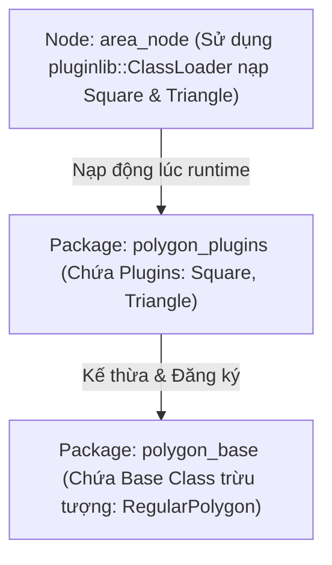

---
tags:
  - ros2
  - cpp
  - pluginlib
  - plugins
  - dynamic-loading
  - beginner
created: 2026-08-25
aliases:
  - Tạo và Sử dụng Plugins (C++)
  - Creating and using plugins (C++)
---

# 🔌 Tạo và Sử dụng Plugins bằng C++ với pluginlib (Creating and using plugins)

> [!INFO] **Mục tiêu bài học**
> Học cách tạo và nạp động (dynamically load) các lớp C++ thông qua thư viện **`pluginlib`** mà không cần liên kết (link) cứng mã nguồn lúc biên dịch.
> - **Cấp độ:** Beginner
> - **Thời lượng ước tính:** 20 phút
> - **Bài trước:** [[11 - Using ROS2 Doctor|Kiểm tra hệ thống với ros2doctor]]
> - **Mục lục tổng quan:** [[ROS 2 Learning Path]]

---

## 📖 Bối cảnh (Background)

**`pluginlib`** là thư viện C++ mạnh mẽ trong ROS 2 cho phép nạp và giải phóng các lớp (classes) động từ các thư viện liên kết động (`.so` / `.dll`) tại thời điểm chạy (runtime):
- Ứng dụng chính không cần biết trước hay liên kết trực tiếp với thư viện chứa plugin.
- Rất phổ biến trong các framework lớn của ROS 2 như **Nav2 (Navigation Plugins, Costmaps, Planners)**, **MoveIt 2 (Kinematics Plugins, Motion Planners)** và **Rviz2 (Display Plugins)** để cho phép mở rộng tính năng linh hoạt.



---

## 🛠️ Các bước thực hiện (Tasks)

### 1. Tạo Package lớp cơ sở (`polygon_base`)
```bash
cd ~/ros2_ws/src
ros2 pkg create --build-type ament_cmake --license Apache-2.0 --dependencies pluginlib --node-name area_node polygon_base
```

#### Định nghĩa Interface Lớp cơ sở (`include/polygon_base/regular_polygon.hpp`):
```cpp
#ifndef POLYGON_BASE_REGULAR_POLYGON_HPP
#define POLYGON_BASE_REGULAR_POLYGON_HPP

#include <class_loader/interface_traits.hpp>

namespace polygon_base
{
  class RegularPolygon
  {
    public:
      // Hàm ảo thuần túy tính diện tích
      virtual double area() = 0;
      virtual ~RegularPolygon() = default;

    protected:
      RegularPolygon() = default;
  };
} // namespace polygon_base

// Chuyên biệt hóa InterfaceTraits để truyền tham số `double` vào constructor của Plugin
template<>
struct class_loader::InterfaceTraits<polygon_base::RegularPolygon>
{
  using constructor_parameters = class_loader::ConstructorParameters<double>;
};

#endif
```

#### Xuất Interface Library trong `polygon_base/CMakeLists.txt`:
```cmake
add_library(${PROJECT_NAME} INTERFACE)
add_library(${PROJECT_NAME}::${PROJECT_NAME} ALIAS ${PROJECT_NAME})
target_compile_features(${PROJECT_NAME} INTERFACE c_std_17 cxx_std_20)
target_include_directories(${PROJECT_NAME} INTERFACE
  $<BUILD_INTERFACE:${CMAKE_CURRENT_SOURCE_DIR}/include>
  $<INSTALL_INTERFACE:include/${PROJECT_NAME}>
)
target_link_libraries(${PROJECT_NAME} INTERFACE pluginlib::pluginlib)

install(DIRECTORY include/ DESTINATION include/${PROJECT_NAME})
install(TARGETS ${PROJECT_NAME} EXPORT export_${PROJECT_NAME})
install(EXPORT export_${PROJECT_NAME} NAMESPACE ${PROJECT_NAME}:: DESTINATION share/${PROJECT_NAME}/cmake)

ament_export_include_directories(include)
ament_export_targets(export_${PROJECT_NAME})
```

---

### 2. Tạo Package chứa Plugin (`polygon_plugins`)
```bash
cd ~/ros2_ws/src
ros2 pkg create --build-type ament_cmake --license Apache-2.0 --dependencies polygon_base pluginlib --library-name polygon_plugins polygon_plugins
```

#### 2.1 Viết mã nguồn Plugin (`src/polygon_plugins.cpp`):
```cpp
#include <polygon_base/regular_polygon.hpp>
#include <cmath>

namespace polygon_plugins
{
  // 1. Plugin Hình Vuông (Square)
  class Square : public polygon_base::RegularPolygon
  {
    public:
      Square(double side_length) : side_length_(side_length) {}
      double area() override { return side_length_ * side_length_; }
    protected:
      double side_length_;
  };

  // 2. Plugin Hình Tam Giác Đều (Triangle)
  class Triangle : public polygon_base::RegularPolygon
  {
    public:
      Triangle(double side_length) : side_length_(side_length) {}
      double area() override {
        return 0.5 * side_length_ * sqrt((side_length_ * side_length_) - ((side_length_ / 2) * (side_length_ / 2)));
      }
    protected:
      double side_length_;
  };
}

#include <pluginlib/class_list_macros.hpp>

// Đăng ký các class thành Plugin chính thức với pluginlib
PLUGINLIB_EXPORT_CLASS(polygon_plugins::Square, polygon_base::RegularPolygon)
PLUGINLIB_EXPORT_CLASS(polygon_plugins::Triangle, polygon_base::RegularPolygon)
```

#### 2.2 Tạo file khai báo XML (`plugins.xml`):
Tạo file `polygon_plugins/plugins.xml`:
```xml
<library path="polygon_plugins">
  <class type="polygon_plugins::Square" base_class_type="polygon_base::RegularPolygon">
    <description>Plugin tinh dien tich hinh vuong.</description>
  </class>
  <class type="polygon_plugins::Triangle" base_class_type="polygon_base::RegularPolygon" name="awesome_triangle">
    <description>Plugin tinh dien tich hinh tam giac.</description>
  </class>
</library>
```

#### 2.3 Khai báo xuất Plugin trong `polygon_plugins/CMakeLists.txt`:
```cmake
pluginlib_export_plugin_description_file(polygon_base plugins.xml)
```

---

### 3. Nạp và Sử dụng Plugin trong Node (`polygon_base/src/area_node.cpp`)

```cpp
#include <pluginlib/class_loader.hpp>
#include <polygon_base/regular_polygon.hpp>
#include <iostream>

int main(int argc, char** argv)
{
  (void) argc; (void) argv;

  // Khởi tạo ClassLoader nạp Base class
  pluginlib::ClassLoader<polygon_base::RegularPolygon> poly_loader(
    "polygon_base", "polygon_base::RegularPolygon"
  );

  try
  {
    // Nạp plugin Tam giác bằng tên gợi nhớ "awesome_triangle" với cạnh = 10.0
    std::shared_ptr<polygon_base::RegularPolygon> triangle =
      poly_loader.createSharedInstance("awesome_triangle", 10.0);

    // Nạp plugin Hình vuông bằng tên đầy đủ "polygon_plugins::Square" với cạnh = 10.0
    std::shared_ptr<polygon_base::RegularPolygon> square =
      poly_loader.createSharedInstance("polygon_plugins::Square", 10.0);

    printf("Dien tich tam giac: %.2f\n", triangle->area());
    printf("Dien tich hinh vuong: %.2f\n", square->area());
  }
  catch (pluginlib::PluginlibException& ex)
  {
    printf("Loi khi nap plugin: %s\n", ex.what());
  }

  return 0;
}
```

---

### 4. Biên dịch và Chạy thử nghiệm

```bash
cd ~/ros2_ws
colcon build --packages-select polygon_base polygon_plugins
source install/setup.bash

# Kiểm tra danh sách plugin đã đăng ký vào hệ thống
ros2 plugin list
```

Kết quả `ros2 plugin list`:
```text
polygon_plugins:
   Plugin(name='polygon_plugins::Square', type='polygon_plugins::Square', base='polygon_base::RegularPolygon')
   Plugin(name='polygon_plugins::Triangle', type='polygon_plugins::Triangle', base='polygon_base::RegularPolygon')
```

Chạy node:
```bash
ros2 run polygon_base area_node
```
Kết quả hiển thị:
```text
Dien tich tam giac: 43.30
Dien tich hinh vuong: 100.00
```

---

## 📌 Tóm tắt (Summary)
- `pluginlib` cung cấp cơ chế mở rộng kiến trúc theo dạng mô-đun cắm ghép (plugin architecture).
- Đăng ký plugin qua `PLUGINLIB_EXPORT_CLASS` và file mô tả `plugins.xml`.
- Nạp plugin an toàn lúc runtime qua `pluginlib::ClassLoader`.

---

## 🔗 Liên kết & Bài tiếp theo
- ⬅️ Trở về: [[ROS 2 Learning Path|Lộ trình học ROS 2]]
- 🚀 Chúc mừng bạn đã hoàn thành trọn bộ kỹ năng phát triển với ROS 2 Client Libraries!
