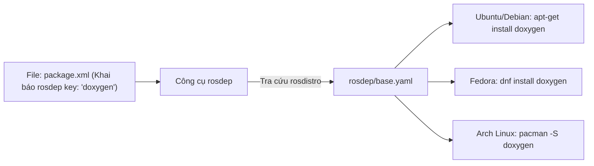

---
tags:
  - ros2
  - rosdep
  - dependencies
  - package_xml
  - intermediate
created: 2026-08-25
aliases:
  - Quản lý Dependencies với rosdep
  - Managing Dependencies with rosdep
---

# 📦 Quản lý Dependencies với rosdep (Managing Dependencies with rosdep)

> [!INFO] **Mục tiêu bài học**
> Hiểu rõ cơ chế hoạt động của **`rosdep`** — công cụ quản lý các thư viện phụ thuộc (system & ROS dependencies), phân biệt các thẻ phụ thuộc trong `package.xml`, tra cứu rosdep keys trên `rosdistro` và tự động cài đặt toàn bộ dependencies cho workspace.
> - **Cấp độ:** Intermediate
> - **Thời lượng ước tính:** 10 phút
> - **Mục lục tổng quan:** [[ROS 2 Learning Path]]
> - **Bài tiếp theo:** [[02 - Creating Custom Actions|Tạo Action tùy chỉnh]]

---

## 📖 Bối cảnh (Background)

**`rosdep`** là một tiện ích quản lý phụ thuộc cấp cao (*meta-package manager*). Bản thân `rosdep` không trực tiếp tải gói tin, mà nó tra cứu cơ sở dữ liệu trung tâm để ánh xạ từ tên định danh (**rosdep key**) sang tên gói cài đặt tương ứng trên trình quản lý gói của hệ điều hành (ví dụ: `apt` trên Ubuntu/Debian, `dnf` trên Fedora/RHEL, `Homebrew` trên macOS).



> [!WARNING] **Hỗ trợ hệ điều hành:**
> Hiện tại `rosdep` hoạt động chính thức trên **Linux** và **macOS**. Trên Windows, dependencies thường được cài thủ công hoặc qua Chocolatey/vcpkg.

---

## 🏷️ Phân biệt các thẻ Dependencies trong `package.xml` (REP-149)

File `package.xml` là nơi `rosdep` quét tìm các phụ thuộc cần thiết. Dưới đây là 5 thẻ chuẩn cần phân biệt:

| Thẻ XML | Mục đích sử dụng | Khi nào nên dùng? |
| :--- | :--- | :--- |
| `<depend>` | Phụ thuộc cả lúc **Build** và lúc **Runtime** | Dùng cho hầu hết các thư viện C++ (`rclcpp`, `std_msgs`, `sensor_msgs`). |
| `<build_depend>` | Chỉ cần thiết lúc **Biên dịch** (Build time) | Công cụ sinh mã, header-only libs không xuất ra ngoài. |
| `<build_export_depend>` | Cần cho các package khác kế thừa header của bạn | Dùng khi header file của bạn `#include` header từ thư viện đó. |
| `<exec_depend>` | Chỉ cần lúc **Chạy** (Runtime) | Script Python, file Launch, node chạy độc lập, file cấu hình. |
| `<test_depend>` | Chỉ cần cho **Unit Test** | `ament_lint_auto`, `ament_cmake_gtest`, `pytest`. |

> [!TIP]
> Đối với package thuần Python (`ament_python`), không có giai đoạn biên dịch C++, vì vậy hãy luôn dùng `<exec_depend>` thay vì `<depend>`.

---

## 🔍 Cách tra cứu rosdep keys

1. **Nếu phụ thuộc vào một ROS Package đã release:**
   - Sử dụng trực tiếp tên package đó (ví dụ: `nav2_bringup`, `geometry_msgs`, `tf2_ros`).
2. **Nếu phụ thuộc vào thư viện hệ thống (Non-ROS system dependencies):**
   - Tra cứu trong kho [rosdistro](https://github.com/ros/rosdistro):
     - `rosdep/base.yaml`: Danh sách các thư viện C/C++ hệ thống (`doxygen`, `boost`, `eigen`, `libusb`).
     - `rosdep/python.yaml`: Danh sách các package Python (`numpy`, `scipy`, `matplotlib`).

*Ví dụ cấu hình ánh xạ key `doxygen` trong `base.yaml`:*
```yaml
doxygen:
  ubuntu: [doxygen]
  fedora: [doxygen]
  arch: [doxygen]
```

---

## 🛠️ Cài đặt & Vận hành rosdep (Tasks)

### 1. Cài đặt `rosdep`
```bash
sudo apt update
sudo apt install python3-rosdep
```

> [!NOTE]
> Nếu máy bạn từng cài `python3-rosdep2`, hãy gỡ bỏ nó trước: `sudo apt remove python3-rosdep2`.

---

### 2. Khởi tạo và Cập nhật cơ sở dữ liệu
Chạy 2 lệnh này sau khi cài đặt hoặc khi muốn đồng bộ index mới nhất từ GitHub:

```bash
sudo rosdep init
rosdep update
```

---

### 3. Tự động cài đặt dependencies cho toàn bộ Workspace
Tại thư mục gốc workspace (`~/ros2_ws`), chạy lệnh:

```bash
rosdep install --from-paths src -y --ignore-src
```

> [!IMPORTANT] **Giải mã các tham số quan trọng:**
> - `--from-paths src`: Quét đệ quy tất cả các file `package.xml` bên trong thư mục `src`.
> - `-y`: Tự động đồng ý (`Yes`) khi trình quản lý gói hệ thống (`apt`) hỏi xác nhận cài đặt.
> - `--ignore-src`: Nếu một dependency đã có sẵn mã nguồn nằm trong thư mục `src` của workspace, `rosdep` sẽ bỏ qua không tải bản binary từ apt để tránh xung đột.

---

## 📌 Tóm tắt (Summary)
- `rosdep` giúp tự động hóa quá trình chuẩn bị môi trường, đảm bảo dự án của bạn có thể build thành công trên bất kỳ máy tính nào chỉ với một lệnh.
- Luôn giữ file `package.xml` chính xác và cập nhật `rosdep update` thường xuyên.

---

## 🔗 Liên kết & Bài tiếp theo
- ⬅️ Trở về: [[ROS 2 Learning Path|Lộ trình học ROS 2]]
- ➡️ Bài tiếp theo: [[02 - Creating Custom Actions|Tạo Action tùy chỉnh]]
