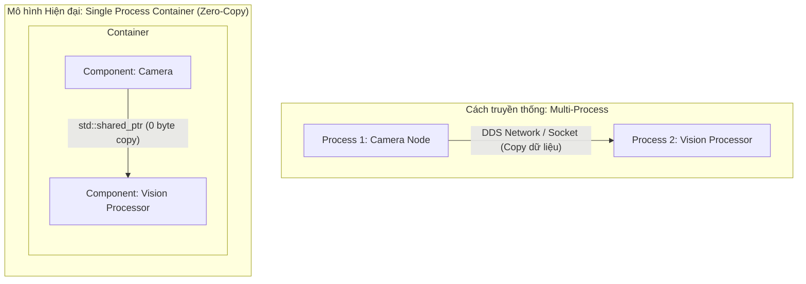

---
tags:
  - ros2
  - cpp
  - rclcpp_components
  - composable-nodes
  - intra-process
  - intermediate
created: 2026-08-25
aliases:
  - Viết Composable Node bằng C++
  - Writing a Composable Node (C++)
---

# 🧩 Viết Composable Node bằng C++ (rclcpp_components)

> [!INFO] **Mục tiêu bài học**
> Học cách chuyển đổi một node C++ thông thường thành **Composable Node (Component)**, cho phép nạp động nhiều node vào cùng **một tiến trình (single process)** duy nhất để tận dụng cơ chế giao tiếp qua bộ nhớ chia sẻ (**Intra-Process Zero-Copy Communication**) với hiệu năng tối đa.
> - **Cấp độ:** Intermediate
> - **Thời lượng ước tính:** 15 phút
> - **Bài trước:** [[03 - Writing Action Server and Client (C++)|Viết Action Server và Client (C++)]]
> - **Bài tiếp theo:** [[07 - Composing Multiple Nodes in a Single Process|Kết hợp nhiều Node trong một Tiến trình]]

---

## 📖 Bối cảnh (Background)

Trong các bài học cơ bản, mỗi node chạy trong một tiến trình OS riêng biệt (`executable` độc lập). Khi truyền các thông điệp dữ liệu lớn (như hình ảnh 4K từ Camera, PointCloud 3D từ LiDAR), dữ liệu phải được tuần tự hóa (serialize) và gửi qua mạng DDS (Inter-Process Communication), gây tốn CPU và độ trễ cao.

**Composable Nodes (Components):**
- Được biên dịch thành thư viện động chia sẻ (`shared library` / `.so`).
- Nhiều node được nạp chung vào một container process (`component_container`).
- Dữ liệu giữa các node được truyền qua **con trỏ `std::shared_ptr` (Zero-Copy)** trực tiếp trong RAM mà không cần copy hay serialize!



---

## 🛠️ Quy trình 4 bước chuyển đổi sang Composable Node

### 1. Bổ sung Dependency `rclcpp_components`
Trong file `package.xml`:
```xml
<depend>rclcpp_components</depend>
```

---

### 2. Cập nhật Constructor của Class
Đảm bảo constructor của class nhận tham số `const rclcpp::NodeOptions & options`:

```cpp
#include "rclcpp/rclcpp.hpp"

namespace my_robot
{
class CameraDriver : public rclcpp::Node
{
public:
  // Constructor nhận NodeOptions
  explicit CameraDriver(const rclcpp::NodeOptions & options)
  : Node("camera_driver", options)
  {
    // Logic khởi tạo node...
  }
};
} // namespace my_robot
```

---

### 3. Xóa hàm `main()` và đăng ký Macro Component
Thay thế toàn bộ hàm `int main(...)` bằng macro đăng ký component:

```cpp
#include <rclcpp_components/register_node_macro.hpp>

// Đăng ký class thành một Component
RCLCPP_COMPONENTS_REGISTER_NODE(my_robot::CameraDriver)
```

---

### 4. Cập nhật `CMakeLists.txt`
Chuyển đổi từ `add_executable` sang `add_library` dạng `SHARED`:

```cmake
find_package(rclcpp REQUIRED)
find_package(rclcpp_components REQUIRED)

# 1. Tạo thư viện Shared
add_library(camera_driver_component SHARED src/camera_driver.cpp)
target_link_libraries(camera_driver_component PUBLIC
  rclcpp::rclcpp
  rclcpp_components::component
)

# 2. Đăng ký Component và sinh file thực thi độc lập (Standalone executable)
rclcpp_components_register_node(
  camera_driver_component
  PLUGIN "my_robot::CameraDriver"
  EXECUTABLE camera_driver
)

# 3. Cài đặt thư viện Target
ament_export_targets(export_camera_driver_component)
install(TARGETS camera_driver_component
  EXPORT export_camera_driver_component
  ARCHIVE DESTINATION lib
  LIBRARY DESTINATION lib
  RUNTIME DESTINATION bin
)
```

> [!TIP]
> Hàm `rclcpp_components_register_node` vừa đăng ký plugin vào hệ thống, vừa tự động sinh luôn một file thực thi `camera_driver` truyền thống để bạn vẫn có thể chạy `ros2 run` độc lập khi cần debug!

---

## 🚀 Khởi chạy Component trong Python Launch File

```python
from launch import LaunchDescription
from launch_ros.actions import ComposableNodeContainer
from launch_ros.descriptions import ComposableNode

def generate_launch_description():
    container = ComposableNodeContainer(
        name='image_pipeline_container',
        namespace='',
        package='rclcpp_components',
        executable='component_container',
        composable_node_descriptions=[
            ComposableNode(
                package='my_robot',
                plugin='my_robot::CameraDriver',
                name='camera_node',
                extra_arguments=[{'use_intra_process_comms': True}] # Kích hoạt Zero-Copy
            ),
        ],
        output='screen',
    )
    return LaunchDescription([container])
```

---

## 📌 Tóm tắt (Summary)
- Chuyển đổi class kế thừa `rclcpp::Node` sang Component chỉ cần: nhận `NodeOptions`, bỏ hàm `main()`, dùng macro `RCLCPP_COMPONENTS_REGISTER_NODE`, và build thành `SHARED library`.
- Cho phép chạy nhiều node chung một process với hiệu năng truyền tin tối ưu nhất trong ROS 2.

---

## 🔗 Liên kết & Bài tiếp theo
- ⬅️ Bài trước: [[03 - Writing Action Server and Client (C++)|Viết Action Server và Client (C++)]]
- ➡️ Bài tiếp theo: [[07 - Composing Multiple Nodes in a Single Process|Kết hợp nhiều Node trong một Tiến trình]]
