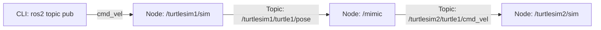

---
tags:
  - ros2
  - launch
  - launch-files
  - xml
  - python
  - intermediate
created: 2026-08-25
aliases:
  - Tạo Launch File chuyên sâu
  - Creating a launch file
---

# 🚀 Tạo Launch File chuyên sâu (Creating a Launch File)

> [!INFO] **Mục tiêu bài học**
> Xây dựng một **Launch File** hoàn chỉnh để khởi động hệ thống robot phức tạp gồm nhiều node, gán namespace độc lập, truyền tham số và cấu hình ánh xạ lại (**Remapping**) để hai chú rùa bắt chước (*mimic*) chuyển động của nhau.
> - **Cấp độ:** Intermediate
> - **Thời lượng ước tính:** 10 phút
> - **Bài trước:** [[10 - Monitoring Parameter Changes (C++)|Theo dõi thay đổi Parameter (C++)]] / [[11 - Monitoring Parameter Changes (Python)|Theo dõi thay đổi Parameter (Python)]]
> - **Bài tiếp theo:** [[13 - Integrating Launch Files into ROS 2 Packages|Tích hợp Launch File vào Package]]

---

## 📖 Bối cảnh (Background)

Hệ thống Launch trong ROS 2 (`launch_ros`) chịu trách nhiệm:
1. Mô tả cấu hình khởi động của hệ thống (chạy những tiến trình nào, ở đâu, với tham số gì).
2. Tái sử dụng các node có sẵn bằng cách gán `namespace` và `remapping` topic/service.
3. Giám sát trạng thái và phản ứng với các sự kiện vòng đời của tiến trình.

Hệ thống hỗ trợ 3 định dạng: **XML**, **YAML**, và **Python**.

---

## 🛠️ Thực hành xây dựng Launch File (Tasks)

Mục tiêu kịch bản: Khởi động 2 cửa sổ Turtlesim (`/turtlesim1` và `/turtlesim2`) và 1 node trung gian `mimic` để rùa ở cửa sổ 2 tự động bám theo rùa ở cửa sổ 1.



---

### Cách 1: Định dạng XML (`launch/turtlesim_mimic_launch.xml`)

```xml
<?xml version="1.0" encoding="UTF-8"?>
<launch>
  <!-- 1. Cửa sổ rùa 1 trong namespace turtlesim1 -->
  <node pkg="turtlesim" exec="turtlesim_node" name="sim" namespace="turtlesim1" args="--ros-args --log-level info" />
  
  <!-- 2. Cửa sổ rùa 2 trong namespace turtlesim2 -->
  <node pkg="turtlesim" exec="turtlesim_node" name="sim" namespace="turtlesim2" ros_args="--log-level warn" />
  
  <!-- 3. Node Mimic thực hiện ánh xạ lại topic (Remapping) -->
  <node pkg="turtlesim" exec="mimic" name="mimic">
    <remap from="/input/pose" to="/turtlesim1/turtle1/pose" />
    <remap from="/output/cmd_vel" to="/turtlesim2/turtle1/cmd_vel" />
  </node>
</launch>
```

---

### Cách 2: Định dạng Python (`launch/turtlesim_mimic_launch.py`)

```python
from launch import LaunchDescription
from launch_ros.actions import Node

def generate_launch_description():
    return LaunchDescription([
        Node(
            package='turtlesim',
            namespace='turtlesim1',
            executable='turtlesim_node',
            name='sim'
        ),
        Node(
            package='turtlesim',
            namespace='turtlesim2',
            executable='turtlesim_node',
            name='sim'
        ),
        Node(
            package='turtlesim',
            executable='mimic',
            name='mimic',
            remappings=[
                ('/input/pose', '/turtlesim1/turtle1/pose'),
                ('/output/cmd_vel', '/turtlesim2/turtle1/cmd_vel'),
            ]
        )
    ])
```

---

## 🚀 Khởi chạy và Kiểm chứng

Khởi chạy file launch trực tiếp:
```bash
ros2 launch launch/turtlesim_mimic_launch.xml
```

Mở terminal khác và ra lệnh cho rùa 1 di chuyển:
```bash
ros2 topic pub -r 1 /turtlesim1/turtle1/cmd_vel geometry_msgs/msg/Twist "{linear: {x: 2.0, y: 0.0, z: 0.0}, angular: {x: 0.0, y: 0.0, z: -1.8}}"
```
Bạn sẽ thấy chú rùa ở cửa sổ 2 (`turtlesim2`) tự động vẽ đường bám theo y hệt rùa 1!

Mở `rqt_graph` để trực quan hóa sơ đồ kết nối:
```bash
ros2 run rqt_graph rqt_graph
```

---

## 📌 Tóm tắt (Summary)
- Sử dụng `namespace` giúp cô lập tên node và topic mà không sợ xung đột.
- Sử dụng `remappings` giúp kết nối đầu ra của node này vào đầu vào của node khác mà không cần sửa code.

---

## 🔗 Liên kết & Bài tiếp theo
- ⬅️ Bài trước: [[10 - Monitoring Parameter Changes (C++)|Theo dõi thay đổi Parameter (C++)]]
- ➡️ Bài tiếp theo: [[13 - Integrating Launch Files into ROS 2 Packages|Tích hợp Launch File vào Package]]
