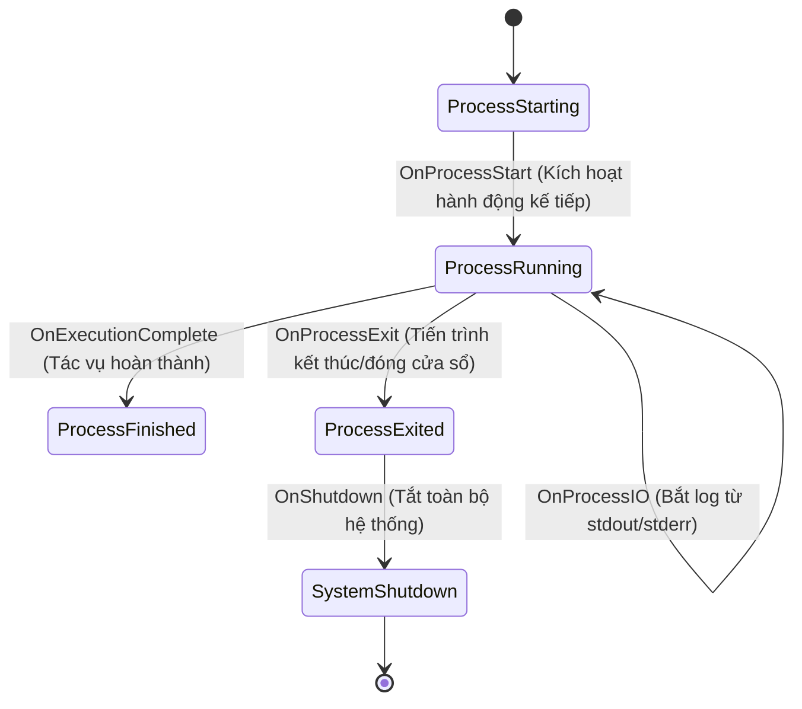

---
tags:
  - ros2
  - launch
  - event-handlers
  - lifecycle
  - intermediate
created: 2026-08-25
aliases:
  - Sử dụng Event Handlers trong Launch File
  - Using event handlers
---

# ⚡ Sử dụng Event Handlers trong Launch File (Using Event Handlers)

> [!INFO] **Mục tiêu bài học**
> Học cách bắt và phản hồi các sự kiện vòng đời của tiến trình (**Process Lifecycle Events**) trong Launch File: khi node khởi động (`OnProcessStart`), khi có dữ liệu I/O (`OnProcessIO`), khi một tiến trình hoàn thành (`OnExecutionComplete`), khi node bị tắt (`OnProcessExit`), và khi toàn bộ hệ thống shutdown (`OnShutdown`).
> - **Cấp độ:** Intermediate
> - **Thời lượng ước tính:** 15 phút
> - **Bài trước:** [[14 - Using Substitutions in Launch Files|Sử dụng Substitutions trong Launch File]]
> - **Bài tiếp theo:** [[16 - Managing Large Projects with Launch Files|Quản lý Dự án lớn với Launch Files]]

---

## 📖 Bối cảnh (Background)

Trong các hệ thống robot phức tạp, nhiều node phụ thuộc tuần tự vào nhau:
- *Ví dụ 1:* Chỉ spawn robot vào mô phỏng **sau khi** thế giới Gazebo đã khởi động xong hoàn toàn (`OnProcessStart`).
- *Ví dụ 2:* Khi người dùng đóng cửa sổ điều khiển hoặc node camera bị lỗi crash (`OnProcessExit`), toàn bộ hệ thống launch phải tự động kích hoạt dừng an toàn (`Shutdown`).

**Event Handlers** cho phép thiết lập các quy tắc phản ứng động dựa trên sự kiện xảy ra trong quá trình chạy file launch.

---

## 📚 5 Loại Event Handlers cốt lõi trong `launch.event_handlers`



| Event Handler | Sự kiện kích hoạt | Hành vi mẫu thường dùng |
| :--- | :--- | :--- |
| **`OnProcessStart`** | Một tiến trình/node bắt đầu chạy | Gọi service khởi tạo hoặc bật các node phụ thuộc. |
| **`OnProcessIO`** | Tiến trình in dữ liệu ra `stdout` hoặc `stderr` | Lọc, bắt log hoặc kiểm tra thông báo trạng thái. |
| **`OnExecutionComplete`** | Một lệnh thực thi `ExecuteProcess` hoàn tất | Kích hoạt chuỗi lệnh tiếp theo (sequential actions). |
| **`OnProcessExit`** | Tiến trình/node bị đóng hoặc kết thúc | Phát sự kiện `Shutdown` để tắt các node còn lại. |
| **`OnShutdown`** | File launch nhận tín hiệu dừng (Ctrl+C / Shutdown) | Dọn dẹp tài nguyên và in lý do tắt hệ thống. |

---

## 🛠️ Triển khai thực tế với Python Launch File

Tạo file `launch/example_event_handlers_launch.py`:

```python
from launch import LaunchDescription
from launch.actions import (
    DeclareLaunchArgument,
    EmitEvent,
    ExecuteProcess,
    LogInfo,
    RegisterEventHandler,
    TimerAction
)
from launch.conditions import IfCondition
from launch.event_handlers import (
    OnExecutionComplete,
    OnProcessExit,
    OnProcessIO,
    OnProcessStart,
    OnShutdown
)
from launch.events import Shutdown
from launch.substitutions import (
    EnvironmentVariable,
    FindExecutable,
    LaunchConfiguration,
    LocalSubstitution,
    PythonExpression
)
from launch_ros.actions import Node


def generate_launch_description():
    turtlesim_ns = LaunchConfiguration('turtlesim_ns')
    use_provided_red = LaunchConfiguration('use_provided_red')
    new_background_r = LaunchConfiguration('new_background_r')

    # 1. Khai báo Arguments
    turtlesim_ns_launch_arg = DeclareLaunchArgument('turtlesim_ns', default_value='turtlesim1')
    use_provided_red_launch_arg = DeclareLaunchArgument('use_provided_red', default_value='False')
    new_background_r_launch_arg = DeclareLaunchArgument('new_background_r', default_value='200')

    # 2. Node chính
    turtlesim_node = Node(
        package='turtlesim',
        namespace=turtlesim_ns,
        executable='turtlesim_node',
        name='sim'
    )

    # 3. Các tiến trình gọi Service & Param
    spawn_turtle = ExecuteProcess(
        cmd=[[
            FindExecutable(name='ros2'),
            ' service call ',
            turtlesim_ns,
            '/spawn ',
            'turtlesim_msgs/srv/Spawn ',
            '"{x: 2, y: 2, theta: 0.2}"'
        ]],
        shell=True
    )

    change_background_r = ExecuteProcess(
        cmd=[[
            FindExecutable(name='ros2'),
            ' param set ',
            turtlesim_ns,
            '/sim background_r ',
            '120'
        ]],
        shell=True
    )

    return LaunchDescription([
        turtlesim_ns_launch_arg,
        use_provided_red_launch_arg,
        new_background_r_launch_arg,
        turtlesim_node,

        # Sự kiện 1: Khi Turtlesim vừa bật -> Gọi lệnh spawn rùa
        RegisterEventHandler(
            OnProcessStart(
                target_action=turtlesim_node,
                on_start=[
                    LogInfo(msg='Turtlesim da khoi dong, bat dau goi spawn con rua thu 2...'),
                    spawn_turtle
                ]
            )
        ),

        # Sự kiện 2: Khi lệnh spawn in ra kết quả stdout -> Log lại kết quả
        RegisterEventHandler(
            OnProcessIO(
                target_action=spawn_turtle,
                on_stdout=lambda event: LogInfo(
                    msg=f'Ket qua tra ve tu spawn: {event.text.decode().strip()}'
                )
            )
        ),

        # Sự kiện 3: Khi lệnh spawn hoan thanh -> Doi mau nen background
        RegisterEventHandler(
            OnExecutionComplete(
                target_action=spawn_turtle,
                on_completion=[
                    LogInfo(msg='Spawn hoan tat, bat dau doi mau nen...'),
                    change_background_r,
                ]
            )
        ),

        # Sự kiện 4: Khi nguoi dung dong cua so Turtlesim -> Tat toan bo Launch
        RegisterEventHandler(
            OnProcessExit(
                target_action=turtlesim_node,
                on_exit=[
                    LogInfo(msg='Cua so Turtlesim da bi dong. Dang tat toan bo he thong...'),
                    EmitEvent(event=Shutdown(reason='Window closed'))
                ]
            )
        ),

        # Sự kiện 5: Khi he thong shutdown -> Ghi log ly do
        RegisterEventHandler(
            OnShutdown(
                on_shutdown=[LogInfo(
                    msg=['Launch shutdown voi ly do: ', LocalSubstitution('event.reason')]
                )]
            )
        ),
    ])
```

---

## 📌 Tóm tắt (Summary)
- `RegisterEventHandler` cung cấp cơ chế điều khiển luồng thực thi hướng sự kiện (Event-driven Architecture) cực kỳ mạnh mẽ trong ROS 2.
- Giúp tự động hóa chuỗi hành động phụ thuộc và quản lý quá trình tắt (shutdown) hệ thống an toàn.

---

## 🔗 Liên kết & Bài tiếp theo
- ⬅️ Bài trước: [[14 - Using Substitutions in Launch Files|Sử dụng Substitutions trong Launch File]]
- ➡️ Bài tiếp theo: [[16 - Managing Large Projects with Launch Files|Quản lý Dự án lớn với Launch Files]]
