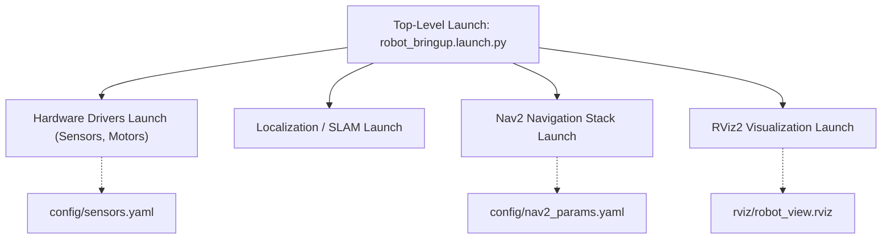

---
tags:
  - ros2
  - launch
  - best-practices
  - architecture
  - rviz2
  - yaml
  - intermediate
created: 2026-08-25
aliases:
  - Quản lý Dự án lớn với Launch Files
  - Managing large projects
---

# 🏛️ Quản lý Dự án lớn với Launch Files: Best Practices (Managing Large Projects)

> [!INFO] **Mục tiêu bài học**
> Tổng hợp toàn bộ các kỹ thuật thiết kế kiến trúc Launch File tiêu chuẩn công nghiệp cho các hệ thống robot quy mô lớn: phân tầng Top-level Launch, cấu hình YAML với ký tự đại diện (**Wildcards `/**`**), quản lý **Namespace toàn cục (`PushROSNamespace`)**, tái sử dụng Node, nạp cấu hình **RViz2** và biến môi trường.
> - **Cấp độ:** Intermediate
> - **Thời lượng ước tính:** 20 phút
> - **Bài trước:** [[15 - Using Event Handlers in Launch Files|Sử dụng Event Handlers trong Launch File]]
> - **Mục lục tổng quan:** [[ROS 2 Learning Path]]

---

## 📖 Triết lý thiết kế Hệ thống Launch (Design Philosophy)

Trong một hệ thống robot thương mại hoặc nghiên cứu lớn (gồm Driver phần cứng, SLAM, Nav2 Navigation, MoveIt Manipulation, Visual SLAM, RViz GUI):
- **Không bao giờ gom tất cả node vào 1 file launch khổng lồ.**
- **Nguyên tắc phân tầng (Layered Architecture):**
  1. **Subcomponent Launch Files:** Mỗi module con (ví dụ `lidar_launch.py`, `camera_launch.py`, `navigation_launch.py`, `description_launch.py`) chịu trách nhiệm riêng về phần của mình.
  2. **Top-level Launch File:** File cấp cao nhất chỉ làm nhiệm vụ `include` các file con và truyền các tham số tổng thể (như `use_sim_time`, `robot_name`, `map_yaml`).



---

## 🛠️ 8 Kỹ thuật cốt lõi trong Dự án lớn

### 1. Phân tầng Top-Level Launch
File launch cha nên ngắn gọn, chủ yếu gồm các lệnh `<include>`:

```xml
<launch>
  <include file="$(find-pkg-share launch_tutorial)/launch/turtlesim_world_1_launch.xml" />
  <include file="$(find-pkg-share launch_tutorial)/launch/turtlesim_world_2_launch.xml" />
  <include file="$(find-pkg-share launch_tutorial)/launch/mimic_launch.xml" />
  <include file="$(find-pkg-share launch_tutorial)/launch/turtlesim_rviz_launch.xml" />
</launch>
```

---

### 2. Nạp Parameter từ File YAML và Sử dụng Wildcard (`/**`)
Khi có nhiều node hoặc nhiều namespace cần dùng chung một bộ thông số, thay vì viết lặp lại tên từng node, hãy dùng ký tự đại diện `/**`:

*File `config/turtlesim.yaml`:*
```yaml
/**:
  ros__parameters:
    background_b: 255
    background_g: 86
    background_r: 150
```

Trong file launch, nạp trực tiếp qua thẻ `<param from="..." />`:
```xml
<node pkg="turtlesim" exec="turtlesim_node" namespace="turtlesim3" name="sim">
  <param from="$(find-pkg-share launch_tutorial)/config/turtlesim.yaml" />
</node>
```

---

### 3. Đẩy Namespace tự động với `PushROSNamespace`
Thay vì phải gán thuộc tính `namespace="..."` thủ công cho từng node trong file con, hãy bọc nhóm trong `<group>` và `<push_ros_namespace>`:

```xml
<group>
  <push_ros_namespace namespace="robot_alpha" />
  <!-- Tất cả các node bên trong file launch này sẽ tự động nhận namespace /robot_alpha -->
  <include file="$(find-pkg-share launch_tutorial)/launch/robot_nodes_launch.xml" />
</group>
```

---

### 4. Tái sử dụng (Reuse) và Nhân bản Node
Khởi chạy cùng một executable nhiều lần với các tên và tham số khác nhau:

```xml
<node pkg="turtle_tf2_py" exec="turtle_tf2_broadcaster" name="broadcaster1">
  <param name="turtlename" value="turtle1" />
</node>
<node pkg="turtle_tf2_py" exec="turtle_tf2_broadcaster" name="broadcaster2">
  <param name="turtlename" value="turtle2" />
</node>
```

---

### 5. Ghi đè tham số khi Include (Parameter Overrides)
Truyền giá trị mới để ghi đè giá trị mặc định của file launch con:

```xml
<include file="$(find-pkg-share launch_tutorial)/launch/broadcaster_listener_launch.xml">
  <let name="target_frame" value="carrot1" />
</include>
```

---

### 6. Ánh xạ lại (Remapping) Topic & Service
Chuyển hướng luồng dữ liệu linh hoạt:
```xml
<node pkg="turtlesim" exec="mimic" name="mimic">
  <remap from="/input/pose" to="/turtle2/pose" />
  <remap from="/output/cmd_vel" to="/turtlesim2/turtle1/cmd_vel" />
</node>
```

---

### 7. Tích hợp cấu hình RViz2
Tự động mở RViz với file lưu cấu hình giao diện `.rviz`:

```xml
<node pkg="rviz2" exec="rviz2" name="rviz2"
      args="-d $(find-pkg-share launch_tutorial)/rviz/turtle_rviz.rviz" />
```

---

### 8. Sử dụng Biến môi trường hệ thống (`env`)
```xml
<arg name="node_prefix" default="$(env USER '')_" />
<node pkg="turtle_tf2_py" exec="fixed_frame_tf2_broadcaster" name="$(var node_prefix)fixed_broadcaster" />
```

---

## 📦 Cấu hình `setup.py` đầy đủ cho Package lớn

Đảm bảo `colcon` cài đặt đầy đủ các thư mục `launch/`, `config/`, `rviz/`:

```python
import os
from glob import glob
from setuptools import find_packages, setup

package_name = 'launch_tutorial'

setup(
    name=package_name,
    version='0.0.0',
    packages=find_packages(exclude=['test']),
    data_files=[
        ('share/ament_index/resource_index/packages', ['resource/' + package_name]),
        ('share/' + package_name, ['package.xml']),
        (os.path.join('share', package_name, 'launch'), glob('launch/*')),
        (os.path.join('share', package_name, 'config'), glob('config/*.yaml')),
        (os.path.join('share', package_name, 'rviz'), glob('rviz/*.rviz')),
    ],
    # ...
)
```

---

## 📌 Tóm tắt (Summary)
- Tổ chức launch file theo mô hình mô-đun hóa: chia nhỏ các subcomponent và kết hợp qua top-level launch.
- Sử dụng triệt để file YAML, Wildcards `/**`, `PushROSNamespace`, và `remapping` để biến hệ thống thành một khối lego lắp ghép linh hoạt.

---

## 🔗 Liên kết & Bài tiếp theo
- ⬅️ Trở về: [[ROS 2 Learning Path|Lộ trình học ROS 2]]
- 🚀 Chúc mừng bạn đã hoàn thành trọn vẹn phần **Intermediate ROS 2**!
