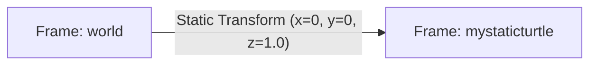

---
tags:
  - ros2
  - tf2
  - transformations
  - static-broadcaster
  - python
  - intermediate
created: 2026-08-25
aliases:
  - Viết Static Broadcaster bằng Python
  - Writing a static broadcaster (Python)
---

# 📍 Viết Static Broadcaster bằng Python (tf2_ros)

> [!INFO] **Mục tiêu bài học**
> Học cách phát xuất bản các hệ quy chiếu tọa độ tĩnh (**Static Coordinate Frames**) lên cây biến đổi không gian `tf2` bằng Python với `StaticTransformBroadcaster`, phân tích cấu trúc bản tin `geometry_msgs/msg/TransformStamped` và sử dụng công cụ CLI `static_transform_publisher`.
> - **Cấp độ:** Intermediate
> - **Thời lượng ước tính:** 15 phút
> - **Mục lục tổng quan:** [[ROS 2 Learning Path]]
> - **Bài song song (C++):** [[02 - Writing a Static Broadcaster (C++)|Viết Static Broadcaster bằng C++]]
> - **Bài tiếp theo:** [[03 - Writing a Dynamic Broadcaster (Python)|Viết Dynamic Broadcaster bằng Python]]

---

## 📖 Bối cảnh (Background)

Trong hệ thống robot, việc xác định vị trí tương đối giữa thân robot (**`base_link`**) và các cảm biến hoặc bộ phận cố định (như LiDAR `laser_frame`, Camera `camera_link`, Ăng-ten GPS) là cực kỳ quan trọng. 

Bởi vì các bộ phận này không thay đổi vị trí theo thời gian so với robot, chúng ta gọi đó là **Static Transform (Biến đổi tọa độ tĩnh)**:
- Chỉ cần phát **1 lần duy nhất** lúc khởi động.
- Được lưu trong topic `/tf_static` với cơ chế QoS Transient Local (lưu giữ tin nhắn cho các node kết nối sau).
- Tiết kiệm băng thông mạng và CPU hơn rất nhiều so với việc phát liên tục ở tần số cao.



---

## 🛠️ Triển khai mã nguồn Python (Tasks)

### 1. Tạo Package `learning_tf2_py`
```bash
cd ~/ros2_ws/src
ros2 pkg create --build-type ament_python --license Apache-2.0 learning_tf2_py
```

---

### 2. Viết Node Static Broadcaster (`learning_tf2_py/static_turtle_tf2_broadcaster.py`)

```python
import math
import sys
from geometry_msgs.msg import TransformStamped
import numpy as np
import rclpy
from rclpy.executors import ExternalShutdownException
from rclpy.node import Node
from tf2_ros.static_transform_broadcaster import StaticTransformBroadcaster


# Hàm chuyển đổi góc Euler (Roll, Pitch, Yaw) sang Quaternion [x, y, z, w]
def quaternion_from_euler(ai, aj, ak):
    ai /= 2.0
    aj /= 2.0
    ak /= 2.0
    ci, si = math.cos(ai), math.sin(ai)
    cj, sj = math.cos(aj), math.sin(aj)
    ck, sk = math.cos(ak), math.sin(ak)
    cc, cs = ci * ck, ci * sk
    sc, ss = si * ck, si * sk

    q = np.empty((4, ))
    q[0] = cj * sc - sj * cs  # x
    q[1] = cj * ss + sj * cc  # y
    q[2] = cj * cs - sj * sc  # z
    q[3] = cj * cc + sj * ss  # w
    return q


class StaticFramePublisher(Node):
    """Phát biến đổi tọa độ tĩnh không thay đổi theo thời gian từ 'world' tới frame con."""

    def __init__(self, transformation):
        super().__init__('static_turtle_tf2_broadcaster')
        # 1. Khởi tạo StaticTransformBroadcaster
        self.tf_static_broadcaster = StaticTransformBroadcaster(self)

        # 2. Phát static transform một lần duy nhất lúc khởi tạo
        self.make_transforms(transformation)

    def make_transforms(self, transformation):
        t = TransformStamped()

        # Metadata
        t.header.stamp = self.get_clock().now().to_msg()
        t.header.frame_id = 'world'           # Frame cha (Parent)
        t.child_frame_id = transformation[1]   # Frame con (Child)

        # Translation (Dịch chuyển tịnh tiến 3D)
        t.transform.translation.x = float(transformation[2])
        t.transform.translation.y = float(transformation[3])
        t.transform.translation.z = float(transformation[4])

        # Rotation (Góc quay dưới dạng Quaternion)
        quat = quaternion_from_euler(
            float(transformation[5]), float(transformation[6]), float(transformation[7])
        )
        t.transform.rotation.x = quat[0]
        t.transform.rotation.y = quat[1]
        t.transform.rotation.z = quat[2]
        t.transform.rotation.w = quat[3]

        # Gửi transform lên tf2
        self.tf_static_broadcaster.sendTransform(t)


def main():
    try:
        logger = rclpy.logging.get_logger('logger')

        if len(sys.argv) != 8:
            logger.info(
                'Cú pháp tham số không hợp lệ. Cách dùng: \n'
                '$ ros2 run learning_tf2_py static_turtle_tf2_broadcaster '
                'child_frame_name x y z roll pitch yaw'
            )
            sys.exit(1)

        if sys.argv[1] == 'world':
            logger.info('Tên frame con không thể trùng với frame cha "world"')
            sys.exit(2)

        with rclpy.init():
            node = StaticFramePublisher(sys.argv)
            rclpy.spin(node)
    except (KeyboardInterrupt, ExternalShutdownException):
        pass


if __name__ == '__main__':
    main()
```

---

### 3. Cấu hình `package.xml` và `setup.py`

#### Trong `package.xml`:
```xml
<exec_depend>geometry_msgs</exec_depend>
<exec_depend>python3-numpy</exec_depend>
<exec_depend>rclpy</exec_depend>
<exec_depend>tf2_ros_py</exec_depend>
<exec_depend>turtlesim_msgs</exec_depend>
```

#### Trong `setup.py`:
```python
entry_points={
    'console_scripts': [
        'static_turtle_tf2_broadcaster = learning_tf2_py.static_turtle_tf2_broadcaster:main',
    ],
},
```

---

### 4. Biên dịch và Chạy thử nghiệm

```bash
cd ~/ros2_ws
colcon build --packages-select learning_tf2_py
source install/setup.bash

# Phát frame 'mystaticturtle' lơ lửng ở cao độ z = 1.0m so với 'world'
ros2 run learning_tf2_py static_turtle_tf2_broadcaster mystaticturtle 0 0 1 0 0 0
```

Mở terminal khác để kiểm tra dữ liệu trên topic `/tf_static`:
```bash
ros2 topic echo /tf_static
```

---

## ⚡ Cách chuẩn: Sử dụng công cụ `static_transform_publisher`

Trong thực tế phát triển dự án, bạn **không cần phải tự viết code C++/Python** để phát static transform, mà nên sử dụng trực tiếp công cụ có sẵn từ gói `tf2_ros`.

### 1. Dùng qua dòng lệnh CLI:
```bash
# Cú pháp Roll/Pitch/Yaw (Euler):
ros2 run tf2_ros static_transform_publisher --x 0 --y 0 --z 1 --yaw 0 --pitch 0 --roll 0 --frame-id world --child-frame-id mystaticturtle

# Cú pháp Quaternion (qx, qy, qz, qw):
ros2 run tf2_ros static_transform_publisher --x 0 --y 0 --z 1 --qx 0 --qy 0 --qz 0 --qw 1 --frame-id world --child-frame-id mystaticturtle
```

### 2. Dùng trong Python Launch File:
```python
from launch import LaunchDescription
from launch_ros.actions import Node

def generate_launch_description():
    return LaunchDescription([
        Node(
            package='tf2_ros',
            executable='static_transform_publisher',
            arguments=[
                '--x', '0', '--y', '0', '--z', '1',
                '--yaw', '0', '--pitch', '0', '--roll', '0',
                '--frame-id', 'world', '--child-frame-id', 'mystaticturtle'
            ]
        ),
    ])
```

---

## 📌 Tóm tắt (Summary)
- Static Transform được quản lý qua `StaticTransformBroadcaster` và xuất bản vào topic `/tf_static`.
- Sử dụng `static_transform_publisher` trong launch file là phương pháp chuẩn mực nhất trong dự án thực tế.

---

## 🔗 Liên kết & Bài tiếp theo
- ⬅️ Trở về: [[ROS 2 Learning Path|Lộ trình học ROS 2]]
- 💻 Phiên bản C++: [[02 - Writing a Static Broadcaster (C++)|Viết Static Broadcaster bằng C++]]
- ➡️ Bài tiếp theo: [[03 - Writing a Dynamic Broadcaster (Python)|Viết Dynamic Broadcaster bằng Python]]
