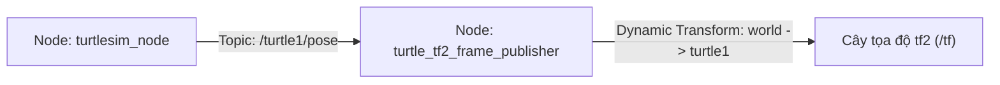

---
tags:
  - ros2
  - tf2
  - dynamic-broadcaster
  - python
  - rclpy
  - intermediate
created: 2026-08-25
aliases:
  - Viết Dynamic Broadcaster bằng Python
  - Writing a broadcaster (Python)
---

# 🚗 Viết Dynamic Broadcaster bằng Python (tf2_ros.TransformBroadcaster)

> [!INFO] **Mục tiêu bài học**
> Học cách xuất bản tọa độ biến thiên theo thời gian (**Dynamic Transforms**) của robot lên cây biến đổi không gian `tf2` bằng Python, bắt gói tin `Pose` từ Turtlesim và kiểm tra dòng dữ liệu bằng công cụ `tf2_echo`.
> - **Cấp độ:** Intermediate
> - **Thời lượng ước tính:** 15 phút
> - **Bài trước:** [[01 - Introduction to tf2 and Static Broadcaster (Python)|Viết Static Broadcaster bằng Python]]
> - **Bài song song (C++):** [[04 - Writing a Dynamic Broadcaster (C++)|Viết Dynamic Broadcaster bằng C++]]
> - **Bài tiếp theo:** [[05 - Writing a Listener (Python)|Viết tf2 Listener bằng Python]]

---

## 📖 Bối cảnh (Background)

Khác với các biến đổi tĩnh (như vị trí camera gắn trên khung robot), trạng thái của robot (vị trí $x, y$ và hướng quay $\theta$) **liên tục thay đổi theo thời gian** khi robot di chuyển trong môi trường thực tế hoặc trong mô phỏng.

Lớp **`TransformBroadcaster`** gửi dữ liệu liên tục vào topic `/tf` với dấu thời gian chính xác (`timestamp`) để hệ thống theo dõi toàn bộ quỹ đạo di chuyển của robot trong quá khứ và hiện tại.



---

## 🛠️ Triển khai mã nguồn Python (Tasks)

### 1. Viết Node Broadcaster (`learning_tf2_py/turtle_tf2_broadcaster.py`)

```python
import math
from geometry_msgs.msg import TransformStamped
import numpy as np
import rclpy
from rclpy.executors import ExternalShutdownException
from rclpy.node import Node
from tf2_ros import TransformBroadcaster
from turtlesim_msgs.msg import Pose


def quaternion_from_euler(ai, aj, ak):
    ai, aj, ak = ai / 2.0, aj / 2.0, ak / 2.0
    ci, si = math.cos(ai), math.sin(ai)
    cj, sj = math.cos(aj), math.sin(aj)
    ck, sk = math.cos(ak), math.sin(ak)
    cc, cs = ci * ck, ci * sk
    sc, ss = si * ck, si * sk

    q = np.empty((4, ))
    q[0] = cj * sc - sj * cs
    q[1] = cj * ss + sj * cc
    q[2] = cj * cs - sj * sc
    q[3] = cj * cc + sj * ss
    return q


class FramePublisher(Node):

    def __init__(self):
        super().__init__('turtle_tf2_frame_publisher')

        # 1. Khai báo parameter cho phép linh hoạt chọn tên rùa ('turtle1' hoặc 'turtle2')
        self.turtlename = self.declare_parameter(
            'turtlename', 'turtle'
        ).get_parameter_value().string_value

        # 2. Khởi tạo Dynamic TransformBroadcaster
        self.tf_broadcaster = TransformBroadcaster(self)

        # 3. Đăng ký Subscriber lắng nghe tọa độ từ turtlesim
        self.subscription = self.create_subscription(
            Pose,
            f'/{self.turtlename}/pose',
            self.handle_turtle_pose,
            1
        )

    # Callback chạy mỗi khi nhận được tin nhắn Pose mới
    def handle_turtle_pose(self, msg: Pose):
        t = TransformStamped()

        # Metadata
        t.header.stamp = self.get_clock().now().to_msg()
        t.header.frame_id = 'world'           # Frame gốc thế giới
        t.child_frame_id = self.turtlename     # Frame của rùa ('turtle1')

        # Vị trí tịnh tiến (Turtlesim chuyển động trên mặt phẳng 2D: z = 0)
        t.transform.translation.x = msg.x
        t.transform.translation.y = msg.y
        t.transform.translation.z = 0.0

        # Góc quay (Rùa chỉ quay quanh trục Z với góc theta)
        q = quaternion_from_euler(0.0, 0.0, msg.theta)
        t.transform.rotation.x = q[0]
        t.transform.rotation.y = q[1]
        t.transform.rotation.z = q[2]
        t.transform.rotation.w = q[3]

        # Phát Transform động lên /tf
        self.tf_broadcaster.sendTransform(t)


def main():
    try:
        with rclpy.init():
            node = FramePublisher()
            rclpy.spin(node)
    except (KeyboardInterrupt, ExternalShutdownException):
        pass


if __name__ == '__main__':
    main()
```

---

### 2. Cấu hình Entry Point trong `setup.py`
```python
entry_points={
    'console_scripts': [
        'static_turtle_tf2_broadcaster = learning_tf2_py.static_turtle_tf2_broadcaster:main',
        'turtle_tf2_broadcaster = learning_tf2_py.turtle_tf2_broadcaster:main',
    ],
},
```

---

### 3. Viết Launch File (`launch/turtle_tf2_demo_launch.py`)

```python
from launch import LaunchDescription
from launch_ros.actions import Node

def generate_launch_description():
    return LaunchDescription([
        # Khởi động Turtlesim GUI
        Node(
            package='turtlesim',
            executable='turtlesim_node',
            name='sim'
        ),
        # Khởi động Broadcaster cho turtle1
        Node(
            package='learning_tf2_py',
            executable='turtle_tf2_broadcaster',
            name='broadcaster1',
            parameters=[
                {'turtlename': 'turtle1'}
            ]
        ),
    ])
```

---

### 4. Biên dịch và Chạy thử nghiệm

```bash
cd ~/ros2_ws
colcon build --packages-select learning_tf2_py
source install/setup.bash

# Khởi chạy file launch
ros2 launch learning_tf2_py turtle_tf2_demo_launch.py
```

Mở terminal 2 để lái rùa:
```bash
ros2 run turtlesim turtle_teleop_key
```

Mở terminal 3 và sử dụng công cụ **`tf2_echo`** để theo dõi biến đổi tọa độ theo thời gian thực:
```bash
ros2 run tf2_ros tf2_echo world turtle1
```

Kết quả in ra liên tục khi bạn điều khiển rùa di chuyển:
```text
At time 1714913843.708748879
- Translation: [4.541, 3.889, 0.000]
- Rotation: in Quaternion [0.000, 0.000, 0.999, -0.035]
- Rotation: in RPY (radian) [0.000, -0.000, -3.072]
- Rotation: in RPY (degree) [0.000, -0.000, -176.013]
```

---

## 📌 Tóm tắt (Summary)
- Sử dụng `TransformBroadcaster` để xuất bản biến đổi động gắn kèm dấu thời gian `now()`.
- Công cụ CLI `tf2_echo <parent_frame> <child_frame>` cho phép quan sát trực tiếp ma trận biến đổi tọa độ 3D giữa hai frame bất kỳ.

---

## 🔗 Liên kết & Bài tiếp theo
- ⬅️ Bài trước: [[01 - Introduction to tf2 and Static Broadcaster (Python)|Viết Static Broadcaster bằng Python]]
- 💻 Phiên bản C++: [[04 - Writing a Dynamic Broadcaster (C++)|Viết Dynamic Broadcaster bằng C++]]
- ➡️ Bài tiếp theo: [[05 - Writing a Listener (Python)|Viết tf2 Listener bằng Python]]
