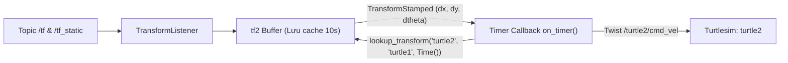

---
tags:
  - ros2
  - tf2
  - listener
  - lookup-transform
  - python
  - intermediate
created: 2026-08-25
aliases:
  - Viết tf2 Listener bằng Python
  - Writing a listener (Python)
---

# 👂 Viết tf2 Listener bằng Python (tf2_ros.TransformListener)

> [!INFO] **Mục tiêu bài học**
> Học cách sử dụng **`tf2_ros.TransformListener`** và **`Buffer`** trong Python để lắng nghe các biến đổi tọa độ, tra cứu ma trận chuyển đổi giữa hai hệ quy chiếu bất kỳ (`lookup_transform`) và tính toán vận tốc điều khiển để rùa 2 tự động bám theo rùa 1 (**Robot Follower**).
> - **Cấp độ:** Intermediate
> - **Thời lượng ước tính:** 15 phút
> - **Bài trước:** [[03 - Writing a Dynamic Broadcaster (Python)|Viết Dynamic Broadcaster bằng Python]]
> - **Bài song song (C++):** [[06 - Writing a Listener (C++)|Viết tf2 Listener bằng C++]]
> - **Bài tiếp theo:** [[07 - Adding Fixed and Dynamic Frames (Python)|Thêm Khung tọa độ Tĩnh và Động (Python)]]

---

## 📖 Bối cảnh (Background)

Trong hệ thống tf2:
- **`Buffer`**: Đóng vai trò như một bộ nhớ đệm lưu giữ toàn bộ lịch sử biến đổi của cây tọa độ trong khoảng thời gian (mặc định 10 giây).
- **`TransformListener`**: Đăng ký nhận tin nhắn từ các topic `/tf` và `/tf_static`, tự động nạp dữ liệu vào `Buffer`.
- **`lookup_transform(target_frame, source_frame, time)`**: Tính toán ma trận biến đổi tọa độ tương đối từ `source_frame` sang `target_frame` tại một thời điểm nhất định.



---

## 🛠️ Triển khai mã nguồn Python (Tasks)

### 1. Viết Node Listener (`learning_tf2_py/turtle_tf2_listener.py`)

```python
import math
from geometry_msgs.msg import Twist
import rclpy
from rclpy.executors import ExternalShutdownException
from rclpy.node import Node
from tf2_ros import TransformException
from tf2_ros.buffer import Buffer
from tf2_ros.transform_listener import TransformListener
from turtlesim_msgs.srv import Spawn


class FrameListener(Node):

    def __init__(self):
        super().__init__('turtle_tf2_frame_listener')

        # 1. Khai báo parameter frame mục tiêu cần bám theo
        self.target_frame = self.declare_parameter(
            'target_frame', 'turtle1'
        ).get_parameter_value().string_value

        # 2. Khởi tạo Buffer và TransformListener
        self.tf_buffer = Buffer()
        self.tf_listener = TransformListener(self.tf_buffer, self)

        # 3. Client gọi service spawn chú rùa thứ 2 ('turtle2')
        self.spawner = self.create_client(Spawn, 'spawn')
        self.turtle_spawning_service_ready = False
        self.turtle_spawned = False

        # 4. Publisher điều khiển vận tốc cho turtle2
        self.publisher = self.create_publisher(Twist, 'turtle2/cmd_vel', 1)

        # 5. Timer chu kỳ 10 Hz tính toán điều khiển
        self.timer = self.create_timer(0.1, self.on_timer)

    def on_timer(self):
        from_frame_rel = self.target_frame  # 'turtle1'
        to_frame_rel = 'turtle2'            # 'turtle2'

        if self.turtle_spawning_service_ready:
            if self.turtle_spawned:
                try:
                    # Tra cứu biến đổi tọa độ mới nhất từ target_frame sang turtle2
                    t = self.tf_buffer.lookup_transform(
                        to_frame_rel,
                        from_frame_rel,
                        rclpy.time.Time() # Thời gian = 0: Lấy giá trị mới nhất
                    )
                except TransformException as ex:
                    self.get_logger().info(
                        f'Chưa thể transform từ {to_frame_rel} sang {from_frame_rel}: {ex}'
                    )
                    return

                # Thuật toán điều khiển P (Proportional Controller) bám theo mục tiêu
                msg = Twist()
                # Điều khiển vận tốc góc z theo góc lệch atan2(dy, dx)
                scale_rotation_rate = 1.0
                msg.angular.z = scale_rotation_rate * math.atan2(
                    t.transform.translation.y,
                    t.transform.translation.x
                )

                # Điều khiển vận tốc tiến x theo khoảng cách Euclidean
                scale_forward_speed = 0.5
                msg.linear.x = scale_forward_speed * math.sqrt(
                    t.transform.translation.x ** 2 +
                    t.transform.translation.y ** 2
                )

                self.publisher.publish(msg)
            else:
                if self.result.done():
                    self.get_logger().info(f'Đã spawn thành công {self.result.result().name}')
                    self.turtle_spawned = True
        else:
            if self.spawner.service_is_ready():
                # Gửi request spawn turtle2 tại vị trí (x=4, y=2)
                request = Spawn.Request()
                request.name = 'turtle2'
                request.x = float(4)
                request.y = float(2)
                request.theta = float(0)
                self.result = self.spawner.call_async(request)
                self.turtle_spawning_service_ready = True


def main():
    try:
        with rclpy.init():
            node = FrameListener()
            rclpy.spin(node)
    except (KeyboardInterrupt, ExternalShutdownException):
        pass


if __name__ == '__main__':
    main()
```

---

### 2. Cập nhật Entry Point trong `setup.py`
```python
entry_points={
    'console_scripts': [
        'static_turtle_tf2_broadcaster = learning_tf2_py.static_turtle_tf2_broadcaster:main',
        'turtle_tf2_broadcaster = learning_tf2_py.turtle_tf2_broadcaster:main',
        'turtle_tf2_listener = learning_tf2_py.turtle_tf2_listener:main',
    ],
},
```

---

### 3. Cập nhật Launch File (`launch/turtle_tf2_demo_launch.py`)

```python
from launch import LaunchDescription
from launch.actions import DeclareLaunchArgument
from launch.substitutions import LaunchConfiguration
from launch_ros.actions import Node

def generate_launch_description():
    return LaunchDescription([
        Node(package='turtlesim', executable='turtlesim_node', name='sim'),
        
        # Broadcaster cho rùa 1
        Node(
            package='learning_tf2_py',
            executable='turtle_tf2_broadcaster',
            name='broadcaster1',
            parameters=[{'turtlename': 'turtle1'}]
        ),
        
        DeclareLaunchArgument('target_frame', default_value='turtle1'),
        
        # Broadcaster cho rùa 2
        Node(
            package='learning_tf2_py',
            executable='turtle_tf2_broadcaster',
            name='broadcaster2',
            parameters=[{'turtlename': 'turtle2'}]
        ),
        
        # Listener điều khiển rùa 2 đuổi theo target_frame
        Node(
            package='learning_tf2_py',
            executable='turtle_tf2_listener',
            name='listener',
            parameters=[{'target_frame': LaunchConfiguration('target_frame')}]
        ),
    ])
```

---

### 4. Biên dịch và Chạy thử nghiệm

```bash
cd ~/ros2_ws
colcon build --packages-select learning_tf2_py
source install/setup.bash

# Khởi chạy toàn bộ hệ thống
ros2 launch learning_tf2_py turtle_tf2_demo_launch.py
```

Mở terminal khác để điều khiển `turtle1`:
```bash
ros2 run turtlesim turtle_teleop_key
```

Khi bạn di chuyển `turtle1`, chú rùa `turtle2` sẽ tự động xoay và bơi theo sát nút `turtle1`!

---

## 📌 Tóm tắt (Summary)
- `Buffer` lưu giữ toàn bộ dữ liệu biến đổi; `TransformListener` tiếp nhận stream dữ liệu ngầm định.
- `lookup_transform(target, source, time)` trả về `TransformStamped` chứa độ dời $(dx, dy, dz)$ và góc quay giúp giải quyết bài toán bám mục tiêu dễ dàng.

---

## 🔗 Liên kết & Bài tiếp theo
- ⬅️ Bài trước: [[03 - Writing a Dynamic Broadcaster (Python)|Viết Dynamic Broadcaster bằng Python]]
- 💻 Phiên bản C++: [[06 - Writing a Listener (C++)|Viết tf2 Listener bằng C++]]
- ➡️ Bài tiếp theo: [[07 - Adding Fixed and Dynamic Frames (Python)|Thêm Khung tọa độ Tĩnh và Động (Python)]]
