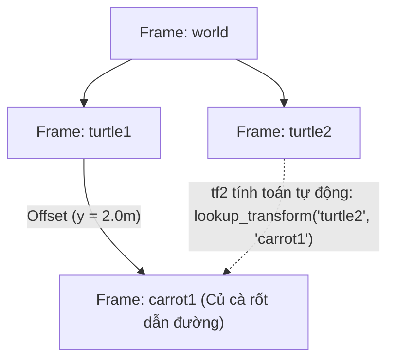

---
tags:
  - ros2
  - tf2
  - coordinate-frames
  - tf-tree
  - python
  - intermediate
created: 2026-08-25
aliases:
  - Thêm Khung tọa độ Tĩnh và Động bằng Python
  - Adding a frame (Python)
---

# 🌳 Thêm Khung tọa độ Tĩnh và Động bằng Python (Adding Frames to tf2)

> [!INFO] **Mục tiêu bài học**
> Tìm hiểu cấu trúc cây biến đổi tọa độ **`tf2 Tree`** (không chu trình đóng), cách tạo một hệ quy chiếu mới (**`carrot1`**) làm con của `turtle1` cả ở dạng cố định tương đối (**Fixed Frame**) và dạng chuyển động quỹ đạo tròn (**Dynamic Frame**) bằng Python.
> - **Cấp độ:** Intermediate
> - **Thời lượng ước tính:** 15 phút
> - **Bài trước:** [[05 - Writing a Listener (Python)|Viết tf2 Listener bằng Python]]
> - **Bài song song (C++):** [[08 - Adding Fixed and Dynamic Frames (C++)|Thêm Khung tọa độ Tĩnh và Động (C++)]]
> - **Bài tiếp theo:** [[09 - Using Time and Timeouts in tf2 (C++)|Sử dụng Thời gian và Timeout trong tf2 (C++)]]

---

## 📖 Bối cảnh & Quy tắc Cây tọa độ (tf2 Tree)

Trong ROS 2, toàn bộ các hệ tọa độ được tổ chức theo **cấu trúc cây (Tree Hierarchy)**:
1. **Không có chu trình đóng (No Closed Loops):** Mỗi frame chỉ được có **duy nhất một frame cha (Single Parent)**, nhưng một frame cha có thể có nhiều frame con.
2. **Suy diễn bắc cầu tự động:** Bạn chỉ cần khai báo biến đổi giữa các mắt xích liền kề (ví dụ: `world -> turtle1 -> carrot1`), `tf2` sẽ tự động tính toán ma trận chuyển đổi từ bất kỳ frame nào sang frame khác (`world -> carrot1` hoặc `turtle2 -> carrot1`).



---

## 🛠️ Phần 1: Thêm Fixed Frame `carrot1`

Tạo một điểm mốc cố định `carrot1` cách `turtle1` khoảng 2 mét về phía bên trái (trục Y).

### 1. Viết Node `fixed_frame_tf2_broadcaster.py`

```python
from geometry_msgs.msg import TransformStamped
import rclpy
from rclpy.executors import ExternalShutdownException
from rclpy.node import Node
from tf2_ros import TransformBroadcaster


class FixedFrameBroadcaster(Node):

    def __init__(self):
        super().__init__('fixed_frame_tf2_broadcaster')
        self.tf_broadcaster = TransformBroadcaster(self)
        # Phát liên tục định kỳ 10 Hz
        self.timer = self.create_timer(0.1, self.broadcast_timer_callback)

    def broadcast_timer_callback(self):
        t = TransformStamped()

        t.header.stamp = self.get_clock().now().to_msg()
        t.header.frame_id = 'turtle1'   # Frame cha là turtle1
        t.child_frame_id = 'carrot1'   # Frame con là carrot1

        # Cố định offset y = 2.0 mét so với turtle1
        t.transform.translation.x = 0.0
        t.transform.translation.y = 2.0
        t.transform.translation.z = 0.0

        # Không xoay
        t.transform.rotation.x = 0.0
        t.transform.rotation.y = 0.0
        t.transform.rotation.z = 0.0
        t.transform.rotation.w = 1.0

        self.tf_broadcaster.sendTransform(t)


def main():
    try:
        with rclpy.init():
            node = FixedFrameBroadcaster()
            rclpy.spin(node)
    except (KeyboardInterrupt, ExternalShutdownException):
        pass


if __name__ == '__main__':
    main()
```

---

### 2. Viết Launch File (`launch/turtle_tf2_fixed_frame_demo_launch.py`)

```python
from launch import LaunchDescription
from launch.actions import IncludeLaunchDescription
from launch.substitutions import PathJoinSubstitution
from launch_ros.actions import Node
from launch_ros.substitutions import FindPackageShare


def generate_launch_description():
    return LaunchDescription([
        # Gọi file launch demo cơ bản và truyền đè target_frame = 'carrot1'
        IncludeLaunchDescription(
            PathJoinSubstitution([
                FindPackageShare('learning_tf2_py'), 'launch', 'turtle_tf2_demo_launch.py'
            ]),
            launch_arguments={'target_frame': 'carrot1'}.items(),
        ),
        # Khởi chạy node phát frame carrot1
        Node(
            package='learning_tf2_py',
            executable='fixed_frame_tf2_broadcaster',
            name='fixed_broadcaster',
        ),
    ])
```

Khi chạy file launch này, chú rùa `turtle2` sẽ không đuổi thẳng vào tâm `turtle1` nữa mà bám theo điểm `carrot1` (cách turtle1 2m)!

---

## 🛠️ Phần 2: Thêm Dynamic Frame `carrot1` quay quanh `turtle1`

Thay vì đứng yên, ta lập trình cho `carrot1` bay vòng tròn xung quanh `turtle1` theo hàm sin và cos của thời gian thực.

### 1. Viết Node `dynamic_frame_tf2_broadcaster.py`

```python
import math
from geometry_msgs.msg import TransformStamped
import rclpy
from rclpy.executors import ExternalShutdownException
from rclpy.node import Node
from tf2_ros import TransformBroadcaster


class DynamicFrameBroadcaster(Node):

    def __init__(self):
        super().__init__('dynamic_frame_tf2_broadcaster')
        self.tf_broadcaster = TransformBroadcaster(self)
        self.timer = self.create_timer(0.1, self.broadcast_timer_callback)

    def broadcast_timer_callback(self):
        seconds, _ = self.get_clock().now().seconds_nanoseconds()
        x = seconds * math.pi

        t = TransformStamped()
        t.header.stamp = self.get_clock().now().to_msg()
        t.header.frame_id = 'turtle1'
        t.child_frame_id = 'carrot1'

        # Tọa độ carrot1 quay tròn bán kính 10 đơn vị quanh turtle1
        t.transform.translation.x = 10.0 * math.sin(x)
        t.transform.translation.y = 10.0 * math.cos(x)
        t.transform.translation.z = 0.0

        t.transform.rotation.x = 0.0
        t.transform.rotation.y = 0.0
        t.transform.rotation.z = 0.0
        t.transform.rotation.w = 1.0

        self.tf_broadcaster.sendTransform(t)


def main():
    try:
        with rclpy.init():
            node = DynamicFrameBroadcaster()
            rclpy.spin(node)
    except (KeyboardInterrupt, ExternalShutdownException):
        pass


if __name__ == '__main__':
    main()
```

---

## 📌 Tóm tắt (Summary)
- Tạo frame mới chỉ cần gán tên frame cha (`frame_id`) và frame con (`child_frame_id`).
- Hệ thống `tf2` cho phép bạn tạo bao nhiêu frame con tùy thích mà không làm ảnh hưởng đến các node khác đang chạy.

---

## 🔗 Liên kết & Bài tiếp theo
- ⬅️ Bài trước: [[05 - Writing a Listener (Python)|Viết tf2 Listener bằng Python]]
- 💻 Phiên bản C++: [[08 - Adding Fixed and Dynamic Frames (C++)|Thêm Khung tọa độ Tĩnh và Động (C++)]]
- ➡️ Bài tiếp theo: [[09 - Using Time and Timeouts in tf2 (C++)|Sử dụng Thời gian và Timeout trong tf2 (C++)]]
