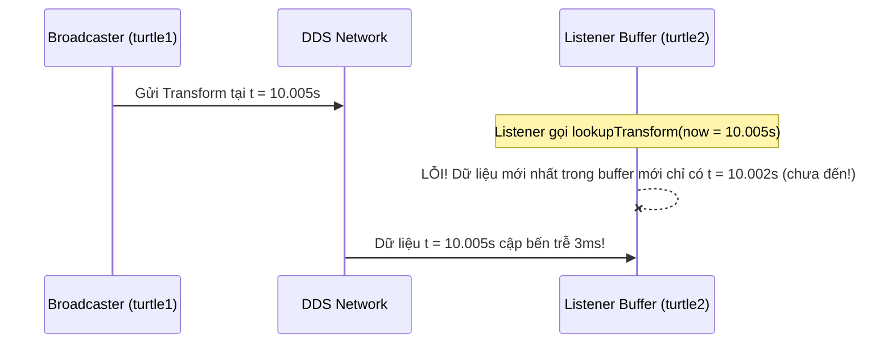

---
tags:
  - ros2
  - tf2
  - time
  - timeout
  - lookup-transform
  - cpp
  - intermediate
created: 2026-08-25
aliases:
  - Sử dụng Thời gian và Timeout trong tf2 (C++)
  - Using time (C++)
---

# ⏱️ Sử dụng Thời gian và Timeout trong tf2 (Using Time and Timeouts)

> [!INFO] **Mục tiêu bài học**
> Hiểu rõ cơ chế quản lý thời gian của bộ đệm `tf2 Buffer`, giải mã nguyên nhân gây ra lỗi phổ biến **`Extrapolation into the future`** và cách sử dụng tham số **`timeout`** trong hàm `lookupTransform` để đợi dữ liệu đến qua mạng DDS một cách an toàn.
> - **Cấp độ:** Intermediate
> - **Thời lượng ước tính:** 10 phút
> - **Bài trước:** [[08 - Adding Fixed and Dynamic Frames (C++)|Thêm Khung tọa độ Tĩnh và Động (C++)]]
> - **Bài tiếp theo:** [[10 - Time Travel with tf2 (C++)|Du hành Thời gian với tf2 (C++)]]

---

## 📖 Bí mật của `tf2::TimePointZero` vs `now()`

Trong các bài trước, chúng ta gọi:
```cpp
t = tf_buffer_->lookupTransform(toFrame, fromFrame, tf2::TimePointZero);
```
> [!NOTE] **Quy ước Thời gian 0 trong tf2:**
> Giá trị thời gian bằng **0** (`tf2::TimePointZero` hoặc `rclcpp::Time(0)`) không có nghĩa là thời điểm gốc vũ trụ, mà là chỉ thị cho tf2: **"Hãy lấy bản ghi biến đổi mới nhất hiện có trong Buffer"**.

Nếu bạn đổi thành thời điểm hiện tại `this->get_clock()->now()`:
```cpp
rclcpp::Time now = this->get_clock()->now();
t = tf_buffer_->lookupTransform(toFrame, fromFrame, now);
```

Hệ thống sẽ lập tức báo lỗi:
```text
[listener]: Could not transform turtle2 to turtle1: Lookup would require extrapolation into the future. 
Requested time 1629873136.345539 but the latest data is at time 1629873136.338804
```

---

## 🔍 Tại sao lại xảy ra lỗi "Extrapolation into the future"?

1. **Độ trễ truyền thông mạng (Network Latency):** Khi một broadcaster phát ra một biến đổi tọa độ gắn dấu thời gian $T$, gói tin phải mất từ **1 đến 5 mili-giây** để đi qua DDS và tới được Buffer của Listener.
2. **Sai lệch thời điểm:** Khi listener hỏi Buffer: *"Cho tôi tọa độ tại đúng thời điểm `now()`"*, gói tin ứng với thời điểm `now()` vẫn **đang trên đường truyền trên mạng**, chưa kịp ghi vào RAM của Buffer!



---

## 🛠️ Giải pháp: Sử dụng tham số `timeout` trong `lookupTransform`

Hàm `lookupTransform` hỗ trợ tham số thứ 4 là thời gian chờ tối đa (**`timeout`**). Khi truyền timeout, hàm sẽ block nhẹ (chờ tối đa số ms quy định) để gói tin kịp cập bến vào Buffer trước khi ném ra Exception:

```cpp
#include <chrono>
using namespace std::chrono_literals;

rclcpp::Time now = this->get_clock()->now();
try {
  // Chờ tối đa 50 mili-giây để gói tin cập bến Buffer
  geometry_msgs::msg::TransformStamped t = tf_buffer_->lookupTransform(
    toFrameRel,
    fromFrameRel,
    now,
    50ms // Timeout parameter (hoặc rclcpp::Duration::from_seconds(0.05))
  );
} catch (const tf2::TransformException & ex) {
  RCLCPP_WARN(this->get_logger(), "Vẫn không nhận được transform sau 50ms: %s", ex.what());
}
```

---

## 📌 Tóm tắt (Summary)
- Không bao giờ gọi `lookupTransform(..., now)` mà không có tham số `timeout`.
- Đặt `timeout` hợp lý (thường từ `50ms` đến `100ms`) để bù đắp độ trễ truyền thông mạng mà không làm đơ hệ thống quá lâu.

---

## 🔗 Liên kết & Bài tiếp theo
- ⬅️ Bài trước: [[08 - Adding Fixed and Dynamic Frames (C++)|Thêm Khung tọa độ Tĩnh và Động (C++)]]
- ➡️ Bài tiếp theo: [[10 - Time Travel with tf2 (C++)|Du hành Thời gian với tf2 (C++)]]
