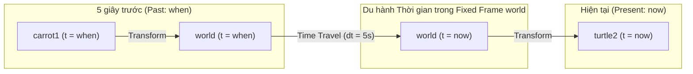

---
tags:
  - ros2
  - tf2
  - time-travel
  - advanced-lookup
  - cpp
  - intermediate
created: 2026-08-25
aliases:
  - Du hành Thời gian với tf2 trong C++
  - Traveling in time (C++)
---

# ⏳ Du hành Thời gian với tf2 trong C++ (Time Travel in tf2)

> [!INFO] **Mục tiêu bài học**
> Khám phá tính năng độc nhất vô nhị của `tf2`: **Biến đổi dữ liệu theo cả Không gian và Thời gian (Spatiotemporal Transformations)**. Lập trình cho robot `turtle2` bám theo vết chuyển động của `carrot1` ở thời điểm **5 giây trong quá khứ** bằng Advanced `lookupTransform` API.
> - **Cấp độ:** Intermediate
> - **Thời lượng ước tính:** 10 phút
> - **Bài trước:** [[09 - Using Time and Timeouts in tf2 (C++)|Sử dụng Thời gian và Timeout trong tf2 (C++)]]
> - **Bài tiếp theo:** [[11 - Quaternion Fundamentals in ROS 2|Cơ bản về Quaternion trong ROS 2]]

---

## 📖 Bối cảnh (Background)

Trong các ứng dụng robot thực tế:
- **Leader-Follower:** Robot con đi theo vết bánh xe của robot dẫn đường cách đó vài mét (hoặc vài giây trước).
- **Sensor Fusion:** Dữ liệu đám mây điểm 3D từ LiDAR đo được tại thời điểm $t - 100\text{ms}$ cần được biến đổi về vị trí hiện tại của thân xe tại thời điểm $t$.

`tf2 Buffer` lưu trữ toàn bộ lịch sử biến đổi trong quá khứ, cho phép bạn "du hành ngược thời gian" để tra cứu tọa độ!

---

## ⚠️ Cạm bẫy Logic thường gặp khi truy vấn quá khứ

Nếu bạn chỉ đơn giản hỏi:
```cpp
rclcpp::Time when = this->get_clock()->now() - rclcpp::Duration(5, 0); // 5 giây trước
t = tf_buffer_->lookupTransform(toFrame, fromFrame, when, 50ms);
```

> [!WARNING] **Sai lầm logic:**
> Đoạn mã trên tương đương với câu hỏi: *"Vị trí của carrot1 ở 5 giây trước là bao nhiêu **so với vị trí của turtle2 ở 5 giây trước**?"*.
> Hậu quả là `turtle2` sẽ quay cuồng mất kiểm soát vì nó tự so sánh với chính bản thân nó trong quá khứ!

👉 **Câu hỏi đúng cần đặt ra:**
> *"Vị trí của `carrot1` ở **5 giây trước**, so với vị trí của `turtle2` ở **thời điểm HIỆN TẠI (`now`)** là bao nhiêu?"*

---

## 🛠️ Triển khai với Advanced `lookupTransform` API (6 Tham số)

Để trả lời câu hỏi trên, tf2 cung cấp phiên bản hàm nâng cao nhận **6 tham số**:

```cpp
#include <chrono>
using namespace std::chrono_literals;

rclcpp::Time now = this->get_clock()->now();
rclcpp::Time when = now - rclcpp::Duration(5, 0); // 5 giây trong quá khứ

try {
  geometry_msgs::msg::TransformStamped t = tf_buffer_->lookupTransform(
    toFrameRel,   // 1. Target frame ("turtle2")
    now,          // 2. Thời điểm đánh giá target frame (HIỆN TẠI)
    fromFrameRel, // 3. Source frame ("carrot1")
    when,         // 4. Thời điểm đánh giá source frame (5 GIÂY TRƯỚC)
    "world",      // 5. Fixed frame không thay đổi theo thời gian ("world")
    50ms          // 6. Timeout chờ dữ liệu
  );
  
  // Tính toán điều khiển bám theo...
} catch (const tf2::TransformException & ex) {
  RCLCPP_INFO(this->get_logger(), "Đang đợi đủ 5 giây dữ liệu lịch sử...");
}
```



---

## 📌 Tóm tắt (Summary)
- `tf2` có khả năng tính toán ma trận chuyển đổi xuyên suốt cả trục thời gian và không gian.
- Sử dụng Advanced `lookupTransform` với 6 tham số kết hợp một **Fixed Frame** (`world` hoặc `map`) để làm cầu nối thời gian an toàn.

---

## 🔗 Liên kết & Bài tiếp theo
- ⬅️ Bài trước: [[09 - Using Time and Timeouts in tf2 (C++)|Sử dụng Thời gian và Timeout trong tf2 (C++)]]
- ➡️ Bài tiếp theo: [[11 - Quaternion Fundamentals in ROS 2|Cơ bản về Quaternion trong ROS 2]]
