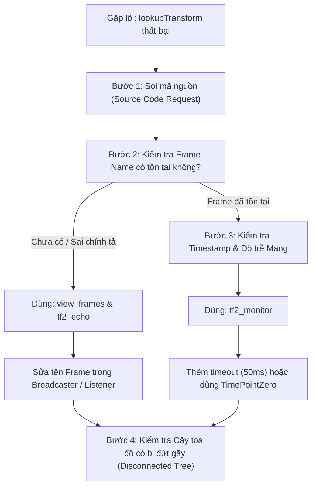

---
tags:
  - ros2
  - tf2
  - debugging
  - troubleshooting
  - view_frames
  - tf2_monitor
  - tf2_echo
  - intermediate
created: 2026-08-25
aliases:
  - Chẩn đoán và Debug lỗi tf2
  - Debugging tf2 problems
---

# 🛠️ Chẩn đoán và Debug lỗi tf2 (Debugging tf2 Problems)

> [!INFO] **Mục tiêu bài học**
> Xây dựng quy trình 4 bước chuẩn đoán lỗi hệ thống `tf2` một cách có hệ thống (*Systematic Debugging Approach*) bằng bộ 3 công cụ kinh điển: **`tf2_echo`**, **`view_frames`**, và **`tf2_monitor`**.
> - **Cấp độ:** Intermediate
> - **Thời lượng ước tính:** 15 phút
> - **Bài trước:** [[11 - Quaternion Fundamentals in ROS 2|Cơ bản về Quaternion trong ROS 2]]
> - **Bài tiếp theo:** [[13 - Using Sensor Messages with MessageFilter (C++ & Python)|Xử lý Dữ liệu Cảm biến với MessageFilter]]

---

## 📖 Quy trình 4 bước Debug lỗi tf2

Khi hệ thống robot báo lỗi không tìm thấy frame hoặc robot không chuyển động theo quỹ đạo mong muốn, hãy tuân theo lưu đồ sau:



---

## 🔍 Chi tiết 3 Công cụ Debug Cốt lõi

### 1. `tf2_echo`: Kiểm tra tức thì biến đổi giữa 2 Frame
Kiểm tra xem hai frame bất kỳ có đang liên kết được với nhau không và xem ma trận biến đổi tọa độ theo thời gian thực:

```bash
ros2 run tf2_ros tf2_echo <source_frame> <target_frame>
```

*Ví dụ khi sai tên frame:*
```text
[tf2_echo]: Waiting for transform turtle3 -> turtle1:
Invalid frame ID "turtle3" passed to canTransform argument target_frame - frame does not exist
```

---

### 2. `view_frames`: Xuất sơ đồ cây tọa độ ra file PDF
Đây là công cụ trực quan hóa toàn bộ cây `tf2 Tree` của hệ thống:

```bash
ros2 run tf2_tools view_frames
```

Lệnh này sẽ tạo ra file **`frames.pdf`** ngay tại thư mục hiện tại. Mở file PDF lên để xem:
- Cấu trúc cha - con của các frame.
- Node nào đang phát tán (broadcaster) từng liên kết.
- Tần số phát (Hz) và độ trễ trung bình.

---

### 3. `tf2_monitor`: Đo lường độ trễ mạng và tần số cập nhật
Khi frame đã tồn tại nhưng vẫn bị lỗi *"Lookup would require extrapolation into the future"*, dùng `tf2_monitor` để đo độ trễ:

```bash
ros2 run tf2_ros tf2_monitor turtle2 turtle1
```

Kết quả mẫu:
```text
RESULTS: for turtle2 to turtle1
Chain is: turtle1 -> world -> turtle2
Net delay     avg = 0.00287347s: max = 0.0167241s

Frames:
Frame: turtle1, published by <node_name>, Average Delay: 0.000295s
All Broadcasters:
Node: /turtle1_broadcaster 125.246 Hz, Average Delay: 0.000290s
```
> [!TIP]
> Kết quả trên cho thấy chuỗi biến đổi có độ trễ trung bình khoảng **3 mili-giây**. Vì vậy khi gọi `lookupTransform`, luôn cần thiết lập `timeout` tối thiểu 10ms–50ms để dữ liệu kịp cập nhật.

---

## 📌 Bảng tổng hợp các mã lỗi thường gặp

| Thông báo lỗi tf2 | Nguyên nhân gốc rễ | Cách khắc phục |
| :--- | :--- | :--- |
| `Frame [X] does not exist` | Sai chính tả tên frame hoặc node broadcaster chưa bật | Dùng `view_frames` kiểm tra danh sách frame thực tế. |
| `Lookup would require extrapolation into the future` | Yêu cầu thời gian `now()` nhưng dữ liệu mạng DDS bị trễ vài ms | Thêm tham số `timeout` (ví dụ `50ms`) vào `lookupTransform`. |
| `Lookup would require extrapolation into the past` | Yêu cầu thời điểm quá cũ vượt quá dung lượng 10s của Buffer | Giảm thời gian lùi hoặc tăng dung lượng `Buffer(clock, 30s)`. |
| `Could not find a connection between 'A' and 'B'` | Cây tf2 bị chia cắt thành 2 nhánh độc lập (Disconnected Tree) | Thêm static/dynamic transform nối frame gốc của 2 nhánh. |

---

## 🔗 Liên kết & Bài tiếp theo
- ⬅️ Bài trước: [[11 - Quaternion Fundamentals in ROS 2|Cơ bản về Quaternion trong ROS 2]]
- ➡️ Bài tiếp theo: [[13 - Using Sensor Messages with MessageFilter (C++ & Python)|Xử lý Dữ liệu Cảm biến với MessageFilter]]
