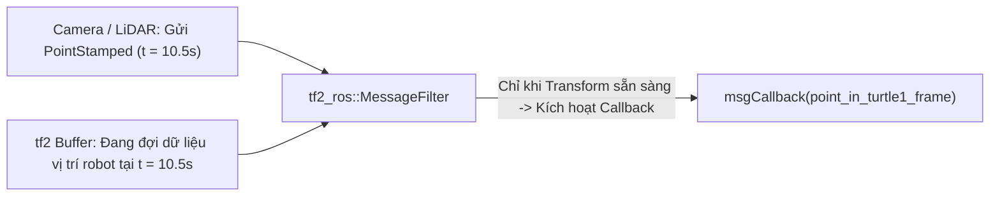

---
tags:
  - ros2
  - tf2
  - message-filter
  - sensor-data
  - stamped-messages
  - point-stamped
  - cpp
  - python
  - intermediate
created: 2026-08-25
aliases:
  - Xử lý Dữ liệu Cảm biến với MessageFilter
  - Using stamped datatypes with tf2_ros::MessageFilter
---

# 📡 Xử lý Dữ liệu Cảm biến với tf2 MessageFilter (tf2_ros::MessageFilter)

> [!INFO] **Mục tiêu bài học**
> Học cách đồng bộ và biến đổi dữ liệu cảm biến có gắn nhãn thời gian (**Stamped Datatypes** như `PointStamped`, `LaserScan`, `PointCloud2`, `Image`) sang hệ quy chiếu mong muốn bằng **`tf2_ros::MessageFilter`**, tự động đệm tin nhắn và chỉ kích hoạt callback khi dữ liệu biến đổi tọa độ đã sẵn sàng.
> - **Cấp độ:** Intermediate
> - **Thời lượng ước tính:** 15 phút
> - **Bài trước:** [[12 - Debugging tf2 Problems|Chẩn đoán và Debug lỗi tf2]]
> - **Mục lục tổng quan:** [[ROS 2 Learning Path]]
> - **Phần tiếp theo:** [[01 - Why Automatic Tests in ROS 2|Kiểm thử Tự động trong ROS 2]]

---

## 📖 Vấn đề nan giải khi xử lý dữ liệu Cảm biến

Giả sử camera gắn trên trần nhà phát hiện vị trí của vật cản `turtle3` và gửi tin nhắn `geometry_msgs/msg/PointStamped` theo hệ quy chiếu `world`.

Robot `turtle1` muốn tính toán vị trí vật cản đó theo **hệ quy chiếu của chính nó (`turtle1` frame)**:
- Nếu dùng subscriber thông thường, khi gói tin cảm biến vừa tới, phép tra cứu `lookupTransform("turtle1", "world", msg.header.stamp)` thường **bị lỗi thất bại** vì dữ liệu vị trí của robot tại đúng mili-giây đó chưa kịp nạp vào Buffer!
- Nếu tự viết vòng lặp `while` chờ đợi thì sẽ làm nghẽn luồng (blocking) toàn bộ node.



---

## 🛠️ Giải pháp: `tf2_ros::MessageFilter`

`MessageFilter` là một bộ lọc thông minh:
1. Lắng nghe topic dữ liệu cảm biến có trường `header` (`stamp`, `frame_id`).
2. Lưu các thông điệp vào hàng đợi đệm.
3. Khi và chỉ khi `tf2 Buffer` có đủ dữ liệu biến đổi từ `msg.header.frame_id` sang `target_frame` tại đúng thời điểm `msg.header.stamp`, filter mới lập tức gọi hàm callback của bạn và thực hiện chuyển đổi tọa độ **an toàn 100% không lo lỗi thời gian**.

---

## 🛠️ Triển khai mã nguồn C++

### 1. Viết Node C++ (`src/turtle_tf2_message_filter.cpp`)

```cpp
#include <chrono>
#include <memory>
#include <string>

#include "geometry_msgs/msg/point_stamped.hpp"
#include "message_filters/subscriber.h"
#include "rclcpp/rclcpp.hpp"
#include "tf2_geometry_msgs/tf2_geometry_msgs.hpp"
#include "tf2_ros/buffer.h"
#include "tf2_ros/create_timer_ros.h"
#include "tf2_ros/message_filter.h"
#include "tf2_ros/transform_listener.h"

using namespace std::chrono_literals;

class PoseDrawer : public rclcpp::Node
{
public:
  PoseDrawer()
  : Node("turtle_tf2_pose_drawer")
  {
    target_frame_ = this->declare_parameter<std::string>("target_frame", "turtle1");

    // 1. Khởi tạo Buffer và Timer Interface
    tf2_buffer_ = std::make_shared<tf2_ros::Buffer>(this->get_clock());
    auto timer_interface = std::make_shared<tf2_ros::CreateTimerROS>(
      this->get_node_base_interface(),
      this->get_node_timers_interface()
    );
    tf2_buffer_->setCreateTimerInterface(timer_interface);
    tf2_listener_ = std::make_shared<tf2_ros::TransformListener>(*tf2_buffer_);

    // 2. Đăng ký message_filters Subscriber
    point_sub_.subscribe(this, "/turtle3/turtle_point_stamped");

    // 3. Khởi tạo MessageFilter theo dõi target_frame_ ("turtle1")
    std::chrono::duration<int> buffer_timeout(1); // Chờ tối đa 1 giây
    tf2_filter_ = std::make_shared<tf2_ros::MessageFilter<geometry_msgs::msg::PointStamped>>(
      point_sub_,
      *tf2_buffer_,
      target_frame_,
      100, // Kích thước hàng đợi (queue size)
      this->get_node_logging_interface(),
      this->get_node_clock_interface(),
      buffer_timeout
    );

    // 4. Đăng ký hàm callback chỉ gọi khi dữ liệu transform đã sẵn sàng
    tf2_filter_->registerCallback(&PoseDrawer::msgCallback, this);
  }

private:
  void msgCallback(const geometry_msgs::msg::PointStamped::SharedPtr point_ptr)
  {
    geometry_msgs::msg::PointStamped point_out;
    try {
      // Biến đổi trực tiếp điểm tọa độ sang hệ quy chiếu của turtle1
      tf2_buffer_->transform(*point_ptr, point_out, target_frame_);
      
      RCLCPP_INFO(
        this->get_logger(),
        "Tọa độ vật thể turtle3 trong mắt turtle1: x = %.3f, y = %.3f, z = %.3f",
        point_out.point.x,
        point_out.point.y,
        point_out.point.z
      );
    } catch (const tf2::TransformException & ex) {
      RCLCPP_WARN(this->get_logger(), "Lỗi biến đổi dữ liệu: %s", ex.what());
    }
  }

  std::string target_frame_;
  std::shared_ptr<tf2_ros::Buffer> tf2_buffer_;
  std::shared_ptr<tf2_ros::TransformListener> tf2_listener_;
  message_filters::Subscriber<geometry_msgs::msg::PointStamped> point_sub_;
  std::shared_ptr<tf2_ros::MessageFilter<geometry_msgs::msg::PointStamped>> tf2_filter_;
};

int main(int argc, char * argv[])
{
  rclcpp::init(argc, argv);
  rclcpp::spin(std::make_shared<PoseDrawer>());
  rclcpp::shutdown();
  return 0;
}
```

---

### 2. Cấu hình Dependencies trong `package.xml` và `CMakeLists.txt`

#### `package.xml`:
```xml
<depend>message_filters</depend>
<depend>tf2_geometry_msgs</depend>
```

#### `CMakeLists.txt`:
```cmake
find_package(message_filters REQUIRED)
find_package(tf2_geometry_msgs REQUIRED)

add_executable(turtle_tf2_message_filter src/turtle_tf2_message_filter.cpp)
target_link_libraries(turtle_tf2_message_filter PUBLIC
  geometry_msgs::geometry_msgs
  message_filters::message_filters
  rclcpp::rclcpp
  tf2::tf2
  tf2_geometry_msgs::tf2_geometry_msgs
  tf2_ros::tf2_ros
)
```

---

## 📌 Tóm tắt (Summary)
- `tf2_ros::MessageFilter` là giải pháp chuẩn công nghiệp khi tích hợp cảm biến (Camera, Lidar, Radar, Sonar) vào robot.
- Tự động đồng bộ thời gian mà không cần viết mã polling chờ đợi thủ công.

---

## 🔗 Liên kết & Bài tiếp theo
- ⬅️ Bài trước: [[12 - Debugging tf2 Problems|Chẩn đoán và Debug lỗi tf2]]
- 🧪 Bước sang Phần 5 (Testing): [[01 - Why Automatic Tests in ROS 2|Tại sao cần Kiểm thử Tự động trong ROS 2]]
