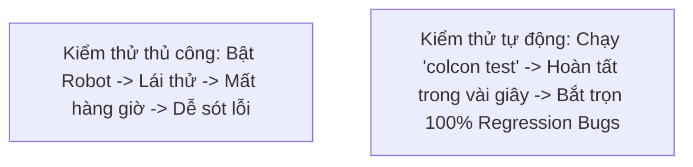

---
tags:
  - ros2
  - testing
  - quality-assurance
  - software-engineering
  - intermediate
created: 2026-08-25
aliases:
  - Tại sao cần Kiểm thử Tự động trong ROS 2
  - Why automatic tests?
---

# 🧪 Tại sao cần Kiểm thử Tự động trong ROS 2? (Why Automatic Tests?)

> [!INFO] **Mục tiêu bài học**
> Thấu hiểu tầm quan trọng sống còn của **Kiểm thử tự động (Automated Testing)** trong kỹ thuật phần mềm Robotics, các lợi ích chiến lược mang lại cho dự án và chi phí đầu tư cần thiết để duy trì hệ thống kiểm thử chất lượng cao.
> - **Cấp độ:** Intermediate
> - **Thời lượng ước tính:** 10 phút
> - **Mục lục tổng quan:** [[ROS 2 Learning Path]]
> - **Bài trước:** [[13 - Using Sensor Messages with MessageFilter (C++ & Python)|Xử lý Dữ liệu Cảm biến với MessageFilter]]
> - **Bài tiếp theo:** [[02 - Running Tests from Command Line|Chạy Kiểm thử từ Dòng lệnh với colcon]]

---

## 📖 Bối cảnh (Background)

Hệ thống phần mềm Robot là một trong những hệ thống phức tạp nhất: bao gồm hàng chục hoặc hàng trăm packages phụ thuộc chéo lẫn nhau, luồng dữ liệu đa luồng bất đồng bộ và tương tác với môi trường vật lý thực tế.

Nếu không có kiểm thử tự động, mỗi lần chỉnh sửa mã nguồn nhỏ bạn sẽ phải bật toàn bộ robot/mô phỏng, lái thủ công và quan sát bằng mắt thường — một quy trình cực kỳ tốn thời gian và dễ bỏ sót lỗi nghiêm trọng!

---

## 🌟 9 Lý do Chiến lược phải viết Automated Tests

1. **Cập nhật tính năng gia tăng nhanh hơn (Faster Incremental Updates):**  
   Tự tin thay đổi một module mà không sợ làm sụp đổ các module phụ thuộc khác.
2. **Tái cấu trúc mã nguồn an toàn (Fearless Refactoring):**  
   Thoải mái dọn dẹp và tối ưu mã nguồn; nếu bộ Unit Test vẫn hiển thị màu xanh (`Passed`), hệ thống hoàn toàn đảm bảo logic nghiệp vụ.
3. **Thúc đẩy kiến trúc Code phân lớp sạch sẽ (Better Designed Code):**  
   Để viết được Unit Test, bạn buộc phải tách biệt các thuật toán cốt lõi (Core Math/Logic) ra khỏi hạ tầng ROS (Nodes/Publishers/Subscribers), giúp mã nguồn module hóa cao.
4. **Ngăn chặn lỗi tái phát (Prevent Bug Regressions):**  
   *Quy tắc vàng:* Hãy viết một unit test mô phỏng lại lỗi **trước khi** sửa lỗi đó. Nhờ vậy lỗi đó sẽ không bao giờ có cơ hội tái xuất hiện trong tương lai.
5. **Đóng vai trò như tài liệu sống (Automatic Living Documentation):**  
   Các trường hợp kiểm thử chính là ví dụ trực quan nhất giải thích cho lập trình viên khác hiểu hàm/class này được kỳ vọng hoạt động như thế nào.
6. **Hạ thấp rào cản đóng góp mã nguồn (Easier Open-Source Contribution):**  
   Người mới có thể gửi Pull Request và biết ngay code của họ có vi phạm tiêu chuẩn nào không nhờ hệ thống CI tự động.
7. **Đơn giản hóa công tác bảo trì qua các phiên bản ROS (Simplified Maintainership):**  
   Khi nâng cấp từ ROS 2 Humble lên Iron/Jazzy/Rolling, chỉ cần chạy test là biết ngay package còn tương thích hay không.
8. **Tăng cường sức mạnh CI/CD (Continuous Integration):**  
   Tự động build và test trên các môi trường sạch (Clean Docker Containers) trước khi hợp nhất mã nguồn.
9. **Xây dựng văn hóa kỹ thuật chuẩn mực (Good Engineering Citizenship):**  
   Đảm bảo độ tin cậy và an toàn tối đa cho các hệ thống robot vận hành ngoài đời thực.

---

## ⚖️ Chi phí đầu tư (Is this all coming for free?)

Kiểm thử tự động mang lại giá trị to lớn nhưng cũng đòi hỏi chi phí:
- **Thời gian viết test & Mocking:** Cần tạo các dữ liệu giả lập (Mock data) cho các phần cứng không thể cắm trực tiếp vào máy chủ CI.
- **Bảo trì bài test khi API thay đổi:** Khi thiết kế class thay đổi lớn, bài test cũ cần được cập nhật tương ứng.
- **Thời gian chạy CI:** Dự án khổng lồ với hàng nghìn bài test tích hợp có thể kéo dài thời gian build.

---

## 📌 Tóm tắt (Summary)
- Tự động hóa kiểm thử là nền tảng cốt lõi của kỹ nghệ phần mềm robot hiện đại.
- ROS 2 hỗ trợ đầy đủ các cấp độ kiểm thử: **Unit Testing** (GTest / Pytest) và **Integration Testing** (`launch_testing`).

---

## 🔗 Liên kết & Bài tiếp theo
- ⬅️ Trở về: [[ROS 2 Learning Path|Lộ trình học ROS 2]]
- ➡️ Bài tiếp theo: [[02 - Running Tests from Command Line|Chạy Kiểm thử từ Dòng lệnh với colcon]]
