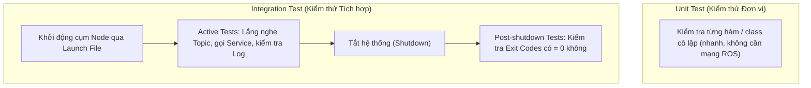

---
tags:
  - ros2
  - testing
  - integration-testing
  - launch_testing
  - turtlesim
  - unittest
  - intermediate
created: 2026-08-25
aliases:
  - Viết Integration Test với launch_testing
  - Writing Basic Integration Tests with launch_testing
---

# 🚀 Viết Integration Test với launch_testing (Integration Testing)

> [!INFO] **Mục tiêu bài học**
> Làm quen với **`launch_testing`** — công cụ kiểm thử tích hợp (Integration Testing) chuyên dụng của ROS 2, cho phép tự động khởi động một cụm nhiều node, thực hiện kiểm tra tương tác dữ liệu thực tế (**Active Tests**) và thẩm định trạng thái tắt sạch sẽ (**Post-shutdown Tests**).
> - **Cấp độ:** Intermediate
> - **Thời lượng ước tính:** 20 phút
> - **Bài trước:** [[03 - Writing Unit Tests with C++ and GTest|Viết Unit Test C++]] / [[04 - Writing Unit Tests with Python and Pytest|Viết Unit Test Python]]
> - **Bài tiếp theo:** [[06 - Testing Code with the ROS Build Farm|Kiểm thử với ROS Build Farm]]

---

## 📖 Unit Test vs Integration Test



`launch_testing` kết hợp sức mạnh của hệ thống Launch ROS 2 và thư viện chuẩn `unittest` của Python.

---

## 🛠️ Triển khai File Launch Test (`test/test_integration.py`)

### 1. Viết mã nguồn kiểm thử tích hợp

```python
import os
import sys
import time
import unittest

import launch
import launch_ros
import launch_testing.actions
import launch_testing.asserts
import rclpy
from turtlesim_msgs.msg import Pose


# 1. Định nghĩa Launch Description chứa node cần test
def generate_test_description():
    return (
        launch.LaunchDescription([
            # Khởi động Node Turtlesim
            launch_ros.actions.Node(
                package='turtlesim',
                namespace='',
                executable='turtlesim_node',
                name='turtle1',
            ),
            # Sau 0.5 giây báo hiệu hệ thống đã sẵn sàng để bắt đầu test
            launch.actions.TimerAction(
                period=0.5,
                actions=[launch_testing.actions.ReadyToTest()]
            ),
        ]),
        {},
    )


# 2. Active Tests: Chạy song song trong khi các Node đang hoạt động
class TestTurtleSim(unittest.TestCase):

    @classmethod
    def setUpClass(cls):
        rclpy.init()

    @classmethod
    def tearDownClass(cls):
        rclpy.shutdown()

    def setUp(self):
        self.node = rclpy.create_node('test_turtlesim')

    def tearDown(self):
        self.node.destroy_node()

    # Test 1: Kiểm tra xem node có xuất bản Pose lên topic không
    def test_publishes_pose(self, proc_output):
        msgs_rx = []
        sub = self.node.create_subscription(
            Pose, 'turtle1/pose', lambda msg: msgs_rx.append(msg), 100
        )
        try:
            # Lắng nghe topic trong 5 giây
            end_time = time.time() + 5.0
            while time.time() < end_time:
                rclpy.spin_once(self.node, timeout_sec=0.1)
            # Khẳng định (Assert) đã nhận được nhiều hơn 50 thông điệp
            self.assertGreater(len(msgs_rx), 50)
        finally:
            self.node.destroy_subscription(sub)

    # Test 2: Kiểm tra xem node có in đúng log khởi tạo ra stderr không
    def test_logs_spawning(self, proc_output):
        proc_output.assertWaitFor(
            'Spawning turtle [turtle1] at x=',
            timeout=5,
            stream='stderr'
        )


# 3. Post-shutdown Tests: Chạy sau khi các node đã tắt
@launch_testing.post_shutdown_test()
class TestTurtleSimShutdown(unittest.TestCase):

    def test_exit_codes(self, proc_info):
        """Khẳng định tất cả các tiến trình đều kết thúc bình thường (Exit code 0)."""
        launch_testing.asserts.assertExitCodes(proc_info)
```

---

## ⚙️ Đăng ký Test trong `CMakeLists.txt` và `package.xml`

### Trong `CMakeLists.txt`:
Sử dụng script `run_test_isolated.py` để mỗi bài test tự động nhận một `ROS_DOMAIN_ID` riêng biệt, tránh xung đột dữ liệu mạng:

```cmake
if(BUILD_TESTING)
  find_package(ament_cmake_ros REQUIRED)
  find_package(launch_testing_ament_cmake REQUIRED)

  # Hàm macro cô lập Domain ID
  function(add_ros_isolated_launch_test path)
    set(RUNNER "${ament_cmake_ros_DIR}/run_test_isolated.py")
    add_launch_test("${path}" RUNNER "${RUNNER}" ${ARGN})
  endfunction()

  add_ros_isolated_launch_test(test/test_integration.py)
endif()
```

### Trong `package.xml`:
```xml
<test_depend>ament_cmake_ros</test_depend>
<test_depend>launch</test_depend>
<test_depend>launch_ros</test_depend>
<test_depend>launch_testing</test_depend>
<test_depend>launch_testing_ament_cmake</test_depend>
<test_depend>rclpy</test_depend>
<test_depend>turtlesim</test_depend>
<test_depend>turtlesim_msgs</test_depend>
```

---

## 🚀 Chạy kiểm thử tích hợp

```bash
cd ~/ros2_ws
colcon test --packages-select my_app_pkg
colcon test-result --all --verbose
```

---

## 📌 Tóm tắt (Summary)
- `launch_testing` là chuẩn mực cao nhất để kiểm thử toàn diện hệ thống robot gồm nhiều node tương tác qua Topic, Service, Action và Log.
- Cung cấp cả 2 giai đoạn kiểm thử: **Active** (trong lúc chạy) và **Post-shutdown** (sau khi tắt).

---

## 🔗 Liên kết & Bài tiếp theo
- ⬅️ Bài trước: [[04 - Writing Unit Tests with Python and Pytest|Viết Unit Test Python với Pytest]]
- ➡️ Bài tiếp theo: [[06 - Testing Code with the ROS Build Farm|Kiểm thử với ROS Build Farm]]
