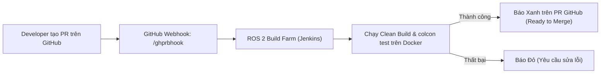

---
tags:
  - ros2
  - testing
  - build-farm
  - ci-cd
  - rosdistro
  - bloom
  - intermediate
created: 2026-08-25
aliases:
  - Kiểm thử với ROS Build Farm
  - Testing Your Code with the ROS Build Farm
---

# 🏭 Kiểm thử với ROS Build Farm (ROS Build Farm CI/CD)

> [!INFO] **Mục tiêu bài học**
> Khám phá hạ tầng máy chủ kiểm thử và đóng gói tự động chính thức của ROS — **ROS Build Farm** (dựa trên Jenkins), cấu hình tự động chạy test cho mọi **Pull Request (PR)** trên GitHub trước khi hợp nhất mã nguồn.
> - **Cấp độ:** Intermediate
> - **Thời lượng ước tính:** 10 phút
> - **Bài trước:** [[05 - Writing Integration Tests with launch_testing|Viết Integration Test với launch_testing]]
> - **Mục lục tổng quan:** [[ROS 2 Learning Path]]

---

## 📖 Bối cảnh (Background)

**ROS Build Farm** (`build.ros2.org`) là hạ tầng CI/CD phân tán quy mô lớn của Open Robotics chịu trách nhiệm:
1. **Kiểm thử Pull Request (PR Jobs):** Tự động build và chạy toàn bộ unit/integration test trên nhiều kiến trúc CPU (x86_64, ARM64) và hệ điều hành (Ubuntu, RHEL).
2. **Đóng gói Binary (.deb packages):** Tự động tạo các gói cài đặt `sudo apt install ros-<distro>-<your-package>` cho cộng đồng thế giới.



---

## 🛠️ 4 Bước Cấu hình PR Testing trên ROS Build Farm

### 1. Cấp quyền truy cập GitHub cho Bot `@ros-pull-request-builder`
- Truy cập cài đặt GitHub Repository của bạn: `Settings -> Collaborators and teams -> Add people`.
- Thêm tài khoản **`ros-pull-request-builder`** với quyền **Write** (hoặc Admin).

---

### 2. Thiết lập Webhook trên GitHub Repository
- Vào `Settings -> Webhooks -> Add webhook`.
- **Payload URL:** `https://build.ros2.org/ghprbhook/`
- **Content type:** `application/json`
- Chọn sự kiện (**Individual events**):
  - `Issue comments`
  - `Pull requests`

---

### 3. Đăng ký Package vào cơ sở dữ liệu `rosdistro`
Package của bạn cần được phát hành chính thức thông qua công cụ `bloom` vào kho [rosdistro](https://github.com/ros/rosdistro).

---

### 4. Kích hoạt cờ `test_pull_requests: true`
Trong file phân phối của bản ROS tương ứng (ví dụ `humble/distribution.yaml` hoặc `rolling/distribution.yaml` trên rosdistro), đảm bảo cờ `test_pull_requests` được bật:

```yaml
repositories:
  my_awesome_robot_pkg:
    source:
      type: git
      url: https://github.com/my-org/my_awesome_robot_pkg.git
      version: master
      test_pull_requests: true # Bật tự động kiểm thử PR
```

---

## 📌 Tóm tắt (Summary)
- ROS Build Farm đảm bảo phần mềm robot của bạn đạt chuẩn chất lượng quốc tế và sẵn sàng phân phối đến hàng triệu lập trình viên ROS trên toàn cầu.

---

## 🔗 Liên kết & Bài tiếp theo
- ⬅️ Trở về: [[ROS 2 Learning Path|Lộ trình học ROS 2]]
- 🚀 Bạn đã hoàn thành xuất sắc lộ trình kiến thức toàn diện về **tf2 Transformations** và **Testing trong ROS 2**!
