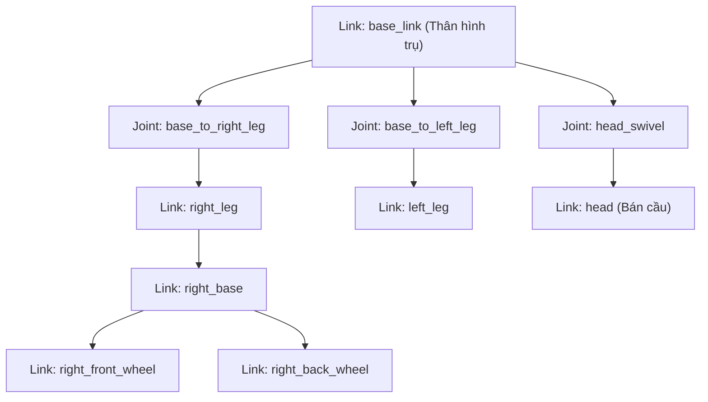

---
tags:
  - ros2
  - urdf
  - robot-modeling
  - rviz2
  - visual-geometry
  - intermediate
created: 2026-08-25
aliases:
  - Xây dựng Mô hình Robot Trực quan từ Đầu với URDF
  - Building a visual robot model from scratch
---

# 🤖 Xây dựng Mô hình Robot Trực quan từ Đầu với URDF (Building a Visual Robot Model)

> [!INFO] **Mục tiêu bài học**
> Học cú pháp **URDF (Unified Robot Description Format)** cơ bản dựa trên XML: tạo các mắt xích hình học (**`link`**), thiết lập liên kết (**`joint`**), hiệu chỉnh gốc tọa độ (**`origin`**), gán vật liệu/màu sắc (**`material`**) và nạp file 3D Mesh (`.dae`, `.stl`) để hiển thị robot R2D2 hoàn chỉnh trong **RViz2**.
> - **Cấp độ:** Intermediate
> - **Thời lượng ước tính:** 20 phút
> - **Mục lục tổng quan:** [[ROS 2 Learning Path]]
> - **Bài tiếp theo:** [[02 - Building a Movable Robot Model|Xây dựng Khớp Động cho Robot trong URDF]]

---

## 📖 Bối cảnh (Background)

**URDF** là định dạng file XML chuẩn của ROS 2 dùng để mô tả toàn bộ cấu trúc cơ học của một robot:
- **`link`**: Đại diện cho một bộ phận/mắt xích cứng của robot (thân xe, cánh tay, bánh xe, cảm biến).
- **`joint`**: Đại diện cho khớp nối giữa 2 link (khớp cố định, khớp xoay, khớp tịnh tiến).
- Cấu trúc URDF luôn là một **cây phân cấp (Tree Structure)** có một `root link` duy nhất (thường là `base_link` hoặc `base_footprint`).



---

## 🛠️ Quá trình Phát triển Mô hình URDF từng bước

### 1. Một hình khối đơn giản (`01-myfirst.urdf`)
Tạo một link hình trụ đại diện cho thân robot:

```xml
<?xml version="1.0"?>
<robot name="myfirst">
  <link name="base_link">
    <visual>
      <geometry>
        <cylinder length="0.6" radius="0.2"/>
      </geometry>
    </visual>
  </link>
</robot>
```

Khởi chạy trong RViz:
```bash
ros2 launch urdf_tutorial display.launch.py model:=urdf/01-myfirst.urdf
```
> [!NOTE]
> Mặc định, gốc tọa độ (`origin`) của các khối hình học cơ bản (`cylinder`, `box`, `sphere`) nằm tại **tâm hình học** của nó. Do đó, một nửa hình trụ sẽ chìm dưới mặt phẳng lưới (Grid).

---

### 2. Ghép nhiều hình khối với Joint Cố định (`02-multipleshapes.urdf`)
Để thêm chân bên phải (`right_leg`), ta phải định nghĩa một `<joint type="fixed">` nối từ `parent` (`base_link`) sang `child` (`right_leg`):

```xml
<?xml version="1.0"?>
<robot name="multipleshapes">
  <link name="base_link">
    <visual>
      <geometry>
        <cylinder length="0.6" radius="0.2"/>
      </geometry>
    </visual>
  </link>

  <link name="right_leg">
    <visual>
      <geometry>
        <box size="0.6 0.1 0.2"/>
      </geometry>
    </visual>
  </link>

  <joint name="base_to_right_leg" type="fixed">
    <parent link="base_link"/>
    <child link="right_leg"/>
  </joint>
</robot>
```

---

### 3. Tinh chỉnh Gốc tọa độ (`03-origins.urdf`)
Hai hình khối ở bước trên sẽ bị chồng lấn vào nhau vì dùng chung gốc $(0,0,0)$. Ta cần dùng thẻ `<origin>`:
- `<origin xyz="x y z" rpy="roll pitch yaw" />` trong **`joint`**: Đặt vị trí khớp nối so với frame cha.
- `<origin xyz="..." rpy="..." />` trong **`visual`**: Đặt vị trí của hình khối so với gốc của chính link đó.

```xml
<?xml version="1.0"?>
<robot name="origins">
  <link name="base_link">
    <visual>
      <geometry>
        <cylinder length="0.6" radius="0.2"/>
      </geometry>
    </visual>
  </link>

  <link name="right_leg">
    <visual>
      <geometry>
        <box size="0.6 0.1 0.2"/>
      </geometry>
      <!-- Dời tâm hình học xuống 0.3m và xoay đứng 90 độ quanh trục Y -->
      <origin rpy="0 1.57075 0" xyz="0 0 -0.3"/>
    </visual>
  </link>

  <joint name="base_to_right_leg" type="fixed">
    <parent link="base_link"/>
    <child link="right_leg"/>
    <!-- Vị trí khớp nối gắn ở nửa trên bên phải thân robot -->
    <origin xyz="0 -0.22 0.25"/>
  </joint>
</robot>
```

---

### 4. Thêm Vật liệu & Màu sắc (`04-materials.urdf`)
Định nghĩa bảng màu với kênh `rgba` (giá trị từ `0.0` đến `1.0`):

```xml
  <material name="blue">
    <color rgba="0 0 0.8 1"/>
  </material>
  <material name="white">
    <color rgba="1 1 1 1"/>
  </material>

  <link name="base_link">
    <visual>
      <geometry>
        <cylinder length="0.6" radius="0.2"/>
      </geometry>
      <material name="blue"/>
    </visual>
  </link>
```

---

### 5. Hoàn thiện Mô hình với Khối Cầu và File Mesh 3D (`05-visual.urdf`)

1. **Khối cầu (`sphere`):** Dùng làm đầu robot R2D2:
   ```xml
   <link name="head">
     <visual>
       <geometry>
         <sphere radius="0.2"/>
       </geometry>
       <material name="white"/>
     </visual>
   </link>
   ```

2. **File Mesh 3D phức tạp (`.dae` / `.stl`):** Dùng cho kẹp gắp (`gripper`):
   ```xml
   <link name="left_gripper">
     <visual>
       <origin rpy="0 0 0" xyz="0 0 0"/>
       <geometry>
         <!-- Cú pháp tham chiếu tài nguyên: package://<package_name>/path -->
         <mesh filename="package://urdf_tutorial/meshes/l_finger.dae"/>
       </geometry>
     </visual>
   </link>
   ```

---

## 🚀 Khởi chạy và Trực quan hóa

Chạy file launch hoàn chỉnh:
```bash
ros2 launch urdf_tutorial display.launch.py model:=urdf/05-visual.urdf
```

Launch file này tự động thực hiện 3 tác vụ:
1. Nạp file URDF thành tham số `robot_description` cho node **`robot_state_publisher`**.
2. Chạy node `joint_state_publisher` và broadcast các TF frames.
3. Mở **RViz2** hiển thị toàn bộ mô hình 3D của robot.

---

## 📌 Tóm tắt (Summary)
- URDF sử dụng cấu trúc cây gồm các `<link>` kết nối qua các `<joint>`.
- Các thẻ hình học cơ bản: `box`, `cylinder`, `sphere`, `mesh`.
- Thẻ `<origin xyz="..." rpy="..." />` quyết định vị trí tương đối và hướng xoay không gian 3D.

---

## 🔗 Liên kết & Bài tiếp theo
- ⬅️ Trở về: [[ROS 2 Learning Path|Lộ trình học ROS 2]]
- ➡️ Bài tiếp theo: [[02 - Building a Movable Robot Model|Xây dựng Khớp Động cho Robot trong URDF]]
