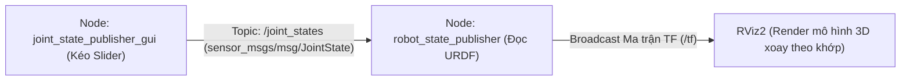

---
tags:
  - ros2
  - urdf
  - joints
  - kinematics
  - robot_state_publisher
  - joint_state_publisher
  - intermediate
created: 2026-08-25
aliases:
  - Xây dựng Khớp Động cho Robot trong URDF
  - Building a movable robot model
---

# 🦾 Xây dựng Khớp Động cho Robot trong URDF (Movable Joints)

> [!INFO] **Mục tiêu bài học**
> Chuyển đổi mô hình robot tĩnh thành mô hình động học có thể cử động: phân biệt 5 loại khớp (**`fixed`**, **`continuous`**, **`revolute`**, **`prismatic`**, **`planar`** / **`floating`**), thiết lập giới hạn góc quay/hành trình (`limit`), trục xoay (`axis`) và điều khiển trực quan qua `joint_state_publisher_gui`.
> - **Cấp độ:** Intermediate
> - **Thời lượng ước tính:** 15 phút
> - **Bài trước:** [[01 - Building a Visual Robot Model from Scratch|Xây dựng Mô hình Robot Trực quan từ Đầu với URDF]]
> - **Bài tiếp theo:** [[03 - Adding Physical and Collision Properties to URDF|Thêm Thuộc tính Vật lý và Va chạm vào URDF]]

---

## 📖 Bối cảnh & 5 Loại Khớp (Joint Types) trong URDF

| Loại Khớp (Type) | Bậc tự do (DOF) | Giới hạn chuyển động | Ứng dụng thực tế |
| :--- | :--- | :--- | :--- |
| **`fixed`** | 0 DOF | Khóa cứng hoàn toàn | Gắn cảm biến cố định, khung vỏ xe. |
| **`continuous`** | 1 DOF (Xoay) | Xoay tròn vô tận ($-\infty \to +\infty$) | Bánh xe dẫn động, trục quay Radar. |
| **`revolute`** | 1 DOF (Xoay) | Bị giới hạn bởi góc `lower` và `upper` | Khớp khuỷu tay robot, góc mở kẹp gắp. |
| **`prismatic`** | 1 DOF (Tịnh tiến) | Trượt dọc theo trục với giới hạn chiều dài | Trục nâng hạ xi-lanh, cánh tay co duỗi. |
| **`planar`** | 2 DOF (Mặt phẳng) | Di chuyển tự do trên mặt phẳng $XY$ | Robot di động đa hướng (Omni / Mecanum). |
| **`floating`** | 6 DOF (Không gian) | Tự do hoàn toàn 6 bậc ($3D + 3\text{D rotation}$) | Drone bay tự do, tàu ngầm dưới nước. |

---

## 🛠️ Triển khai 3 Khớp Động Điển hình cho R2D2

### 1. Khớp Xoay Vô Tận: Đầu Robot (`continuous`)
Đầu robot quay quanh trục thẳng đứng $Z$: `<axis xyz="0 0 1"/>`.

```xml
<joint name="head_swivel" type="continuous">
  <parent link="base_link"/>
  <child link="head"/>
  <axis xyz="0 0 1"/>
  <origin xyz="0 0 0.3"/>
</joint>
```

---

### 2. Khớp Xoay Giới Hạn: Ngón Tay Kẹp (`revolute`)
Khớp kẹp chỉ được phép mở từ $0.0$ đến $0.548$ radian ($\approx 31^\circ$). Bắt buộc phải có thẻ `<limit>`:

```xml
<joint name="left_gripper_joint" type="revolute">
  <axis xyz="0 0 1"/>
  <!-- lower: góc nhỏ nhất, upper: góc lớn nhất (radian) -->
  <limit effort="1000.0" lower="0.0" upper="0.548" velocity="0.5"/>
  <origin rpy="0 0 0" xyz="0.2 0.01 0"/>
  <parent link="gripper_pole"/>
  <child link="left_gripper"/>
</joint>
```

---

### 3. Khớp Tịnh Tiến: Cánh Tay Co Duỗi (`prismatic`)
Khớp trượt dọc theo trục, cho phép thụt vào và thò ra trong khoảng từ $-0.38\text{m}$ đến $0.0\text{m}$:

```xml
<joint name="gripper_extension" type="prismatic">
  <parent link="base_link"/>
  <child link="gripper_pole"/>
  <!-- Giới hạn đo bằng đơn vị MÉT thay vì radian -->
  <limit effort="1000.0" lower="-0.38" upper="0" velocity="0.5"/>
  <origin rpy="0 0 0" xyz="0.19 0 0.2"/>
</joint>
```

---

## ⚙️ Luồng Hoạt động Đồng bộ Động học trong ROS 2

Làm thế nào mà việc kéo thanh trượt trên màn hình GUI lại khiến mô hình 3D trong RViz chuyển động chính xác?



1. **`joint_state_publisher_gui`**: Quét file URDF, tìm tất cả các non-fixed joints và tạo thanh trượt. Khi người dùng kéo, node xuất bản thông điệp `sensor_msgs/msg/JointState` chứa vị trí các khớp (`swivel`, `tilt`, `extension`).
2. **`robot_state_publisher`**: Tiếp nhận `JointState`, kết hợp với mô hình hình học trong file URDF để tính toán bài toán Động học Thuận (**Forward Kinematics**).
3. **`/tf`**: Toàn bộ ma trận biến đổi tọa độ của từng mắt xích được xuất bản lên tf2, giúp RViz hiển thị chuyển động mượt mà.

---

## 🚀 Khởi chạy và Trải nghiệm Điều khiển

```bash
ros2 launch urdf_tutorial display.launch.py model:=urdf/06-flexible.urdf
```

Một cửa sổ GUI với các thanh trượt sẽ xuất hiện. Hãy kéo thử để thấy đầu robot xoay tròn 360 độ, cánh tay kẹp thò thụt và ngón tay mở đóng linh hoạt!

---

## 📌 Tóm tắt (Summary)
- Sử dụng `type="continuous"` cho bánh xe và trục quay vô tận.
- Sử dụng `type="revolute"` cho khớp quay có góc giới hạn (`lower`, `upper`).
- Sử dụng `type="prismatic"` cho khớp trượt tịnh tiến tuyến tính.
- `robot_state_publisher` giải quyết bài toán động học thuận và chuyển đổi `JointState` thành cây tọa độ `/tf`.

---

## 🔗 Liên kết & Bài tiếp theo
- ⬅️ Bài trước: [[01 - Building a Visual Robot Model from Scratch|Xây dựng Mô hình Robot Trực quan từ Đầu với URDF]]
- ➡️ Bài tiếp theo: [[03 - Adding Physical and Collision Properties to URDF|Thêm Thuộc tính Vật lý và Va chạm vào URDF]]
