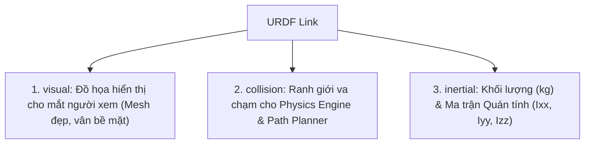

---
tags:
  - ros2
  - urdf
  - collision
  - inertial
  - mass
  - physics-simulation
  - gazebo
  - intermediate
created: 2026-08-25
aliases:
  - Thêm Thuộc tính Vật lý và Va chạm vào URDF
  - Adding physical and collision properties
---

# ⚖️ Thêm Thuộc tính Vật lý và Va chạm vào URDF (Collision & Inertia)

> [!INFO] **Mục tiêu bài học**
> Học cách chuẩn bị mô hình URDF sẵn sàng cho các công cụ mô phỏng vật lý thực tế (**Gazebo**, **Ignition**, **Isaac Sim**): khai báo hình học va chạm (**`<collision>`**), khối lượng (**`<mass>`**), ma trận mô-men quán tính 3D (**`<inertia>`**), ma sát và giảm chấn (**`<dynamics>`**).
> - **Cấp độ:** Intermediate
> - **Thời lượng ước tính:** 15 phút
> - **Bài trước:** [[02 - Building a Movable Robot Model|Xây dựng Khớp Động cho Robot trong URDF]]
> - **Bài tiếp theo:** [[04 - Using Xacro to Clean Up URDF Code|Sử dụng Xacro Tối ưu hóa Mã nguồn URDF]]

---

## 📖 3 Thẻ Trọng yếu trong mỗi `<link>`

Một `<link>` chuẩn hóa trong robot học chuyên nghiệp gồm **3 thành phần độc lập**:



---

## 🛡️ 1. Hình học Va chạm (`<collision>`)

Thẻ `<collision>` được đặt cùng cấp với `<visual>`. 

```xml
<link name="base_link">
  <!-- Đồ họa hiển thị -->
  <visual>
    <geometry>
      <cylinder length="0.6" radius="0.2"/>
    </geometry>
    <material name="blue"/>
  </visual>
  
  <!-- Ranh giới va chạm -->
  <collision>
    <geometry>
      <cylinder length="0.6" radius="0.2"/>
    </geometry>
  </collision>
</link>
```

> [!TIP] **Tại sao nên tách biệt `<visual>` và `<collision>`?**
> 1. **Tối ưu hiệu năng tính toán (Computational Efficiency):** Việc tính va chạm giữa các file Mesh 3D chứa hàng trăm nghìn tam giác (Polygons) sẽ làm chậm engine vật lý. Người ta thường thay thế Mesh phức tạp trong `<visual>` bằng các khối cơ bản (`box`, `cylinder`) trong `<collision>`.
> 2. **Vùng đệm an toàn (Safety Buffer):** Bạn có thể khai báo khối va chạm lớn hơn thực tế để ngăn các vật thể tiến lại quá gần các cảm biến đắt tiền (như Lidar, Camera).

---

## ⚖️ 2. Thuộc tính Quán tính (`<inertial>`)

Bất kỳ link nào được mô phỏng trong thế giới vật lý có trọng lực đều **bắt buộc phải có thẻ `<inertial>`**:

```xml
<link name="base_link">
  <inertial>
    <!-- Khối lượng: tính bằng Kilogram (kg) -->
    <mass value="10.0"/>
    
    <!-- Tọa độ trọng tâm (Center of Mass) so với gốc của Link -->
    <origin xyz="0 0 0" rpy="0 0 0"/>
    
    <!-- Ma trận Mô-men quán tính 3x3 đối xứng (6 giá trị độc lập) -->
    <inertia 
      ixx="1e-3" ixy="0.0"  ixz="0.0" 
                 iyy="1e-3" iyz="0.0" 
                            izz="1e-3"/>
  </inertial>
</link>
```

### Cấu trúc Ma trận Quán tính 3D (Inertia Tensor):
$$\mathbf{I} = \begin{bmatrix} I_{xx} & I_{xy} & I_{xz} \\ I_{xy} & I_{yy} & I_{yz} \\ I_{xz} & I_{yz} & I_{zz} \end{bmatrix}$$

> [!CAUTION] **Cảnh báo lỗi Quán tính bằng 0 (Zero Inertia Crash):**
> Trong các bộ điều khiển thời gian thực và Gazebo, nếu bạn để quán tính bằng `0` hoặc quá nhỏ, mô hình robot sẽ bị sụp đổ (collapse) hoặc phát nổ lực không kiểm soát! Luôn tính toán hoặc ước lượng $I_{xx}, I_{yy}, I_{zz} > 0$.

---

## ⚙️ 3. Động lực học Khớp (`<dynamics>`)

Thẻ `<dynamics>` được bổ sung bên trong thẻ `<joint>` để mô phỏng ma sát cơ khí thực tế:

```xml
<joint name="wheel_joint" type="continuous">
  <parent link="base_link"/>
  <child link="wheel_link"/>
  <axis xyz="0 0 1"/>
  
  <dynamics damping="0.1" friction="0.05"/>
</joint>
```

- **`friction` (Ma sát tĩnh):** Lực tối thiểu cần để bắt đầu chuyển động ($N$ cho khớp trượt, $N\cdot m$ cho khớp xoay).
- **`damping` (Hệ số giảm chấn/ma sát nhớt):** Lực cản tỉ lệ với vận tốc ($N\cdot s/m$ hoặc $N\cdot m\cdot s/\text{rad}$).

---

## 📌 Tóm tắt (Summary)
- `<collision>` giúp thuật toán lập quỹ đạo (MoveIt 2, Nav2) và engine vật lý (Gazebo) phát hiện va chạm nhanh chóng.
- `<inertial>` với `mass` và `inertia` tensor là điều kiện bắt buộc để mô phỏng động lực học robot.
- `<dynamics>` mô tả lực cản và ma sát của động cơ thực tế.

---

## 🔗 Liên kết & Bài tiếp theo
- ⬅️ Bài trước: [[02 - Building a Movable Robot Model|Xây dựng Khớp Động cho Robot trong URDF]]
- ➡️ Bài tiếp theo: [[04 - Using Xacro to Clean Up URDF Code|Sử dụng Xacro Tối ưu hóa Mã nguồn URDF]]
