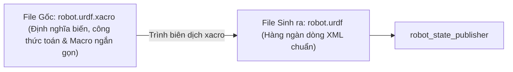

---
tags:
  - ros2
  - urdf
  - xacro
  - macros
  - robot-modeling
  - modularity
  - intermediate
created: 2026-08-25
aliases:
  - Sử dụng Xacro Tối ưu hóa Mã nguồn URDF
  - Using Xacro to clean up your code
---

# 🪄 Sử dụng Xacro Tối ưu hóa Mã nguồn URDF (Xacro Macro Language)

> [!INFO] **Mục tiêu bài học**
> Làm chủ **Xacro (XML Macros)** — ngôn ngữ mở rộng giúp biến các file URDF cồng kềnh, lặp lại hàng nghìn dòng mã thành các mô hình ngắn gọn, mô-đun hóa: khai báo hằng số (**`<xacro:property>`**), tính toán biểu thức toán học (**`${...}`**), tạo hàm macro (**`<xacro:macro>`**), truyền khối tham số (`*block`) và tích hợp trực tiếp vào Launch File.
> - **Cấp độ:** Intermediate
> - **Thời lượng ước tính:** 20 phút
> - **Bài trước:** [[03 - Adding Physical and Collision Properties to URDF|Thêm Thuộc tính Vật lý và Va chạm vào URDF]]
> - **Bài tiếp theo:** [[05 - Using URDF with robot_state_publisher (C++)|Sử dụng URDF với robot_state_publisher (C++)]]

---

## 📖 Tại sao phải dùng Xacro?

Viết URDF thuần (Raw XML) có 3 nhược điểm lớn:
1. **Lặp lại mã nguồn (Code Duplication):** 4 bánh xe hoặc 2 cánh tay giống hệt nhau phải copy-paste toàn bộ code nhiều lần.
2. **Khó bảo trì:** Muốn đổi bán kính bánh xe từ $5\text{cm}$ lên $7\text{cm}$, bạn phải sửa thủ công ở hàng chục vị trí (`visual`, `collision`, `inertia`, `joint origin`).
3. **Không hỗ trợ toán học:** Phải dùng máy tính cầm tay tính trước các vị trí $(x, y, z)$.

**Xacro giải quyết toàn bộ các vấn đề này!**



---

## 🛠️ 4 Vũ khí Cốt lõi của Xacro

Khai báo namespace Xacro ở đầu file XML:
```xml
<?xml version="1.0"?>
<robot xmlns:xacro="http://www.ros.org/wiki/xacro" name="my_robot">
```

---

### 1. Khai báo Hằng số / Thuộc tính (`<xacro:property>`)

Định nghĩa biến tập trung ở đầu file và truy xuất giá trị bằng cú pháp **`${tên_biến}`**:

```xml
<xacro:property name="wheel_radius" value="0.05" />
<xacro:property name="wheel_width" value="0.02" />
<xacro:property name="body_length" value="0.6" />

<link name="base_link">
  <visual>
    <geometry>
      <cylinder radius="${wheel_radius}" length="${body_length}"/>
    </geometry>
  </visual>
</link>
```

---

### 2. Tính toán Biểu thức Toán học (Math Expressions)

Thực hiện các phép toán cơ bản (`+`, `-`, `*`, `/`), số học âm và các hàm lượng giác (`sin`, `cos`, hằng số `pi`):

```xml
<!-- Tự động tính bán kính từ đường kính -->
<geometry>
  <cylinder radius="${wheel_diam / 2}" length="0.1"/>
</geometry>

<!-- Tính toán vị trí lắp khớp đối xứng -->
<origin xyz="${reflect * (width + 0.02)} 0 0.25" rpy="0 ${pi / 2} 0"/>
```

---

### 3. Macro Tham số hóa (`<xacro:macro params="...">`)

Tạo các hàm sinh mã tự động cho các bộ phận lặp lại:

#### Ví dụ: Macro tính toán Ma trận Quán tính tự động
```xml
<xacro:macro name="default_inertial" params="mass">
  <inertial>
    <mass value="${mass}" />
    <inertia ixx="${(1e-3) * mass}" ixy="0.0" ixz="0.0"
             iyy="${(1e-3) * mass}" iyz="0.0"
             izz="${(1e-3) * mass}" />
  </inertial>
</xacro:macro>

<!-- Gọi macro chỉ với 1 dòng ngắn gọn -->
<xacro:default_inertial mass="10.0"/>
```

#### Ví dụ: Macro tạo Chân Robot (Leg Macro)
Chỉ cần viết 1 macro và gọi 2 lần với tham số phản chiếu `reflect="1"` (cho chân phải) và `reflect="-1"` (cho chân trái):

```xml
<xacro:macro name="leg" params="prefix reflect">
  <link name="${prefix}_leg">
    <visual>
      <geometry>
        <box size="${leglen} 0.1 0.2"/>
      </geometry>
      <origin xyz="0 0 -${leglen/2}" rpy="0 ${pi/2} 0"/>
      <material name="white"/>
    </visual>
    <collision>
      <geometry>
        <box size="${leglen} 0.1 0.2"/>
      </geometry>
      <origin xyz="0 0 -${leglen/2}" rpy="0 ${pi/2} 0"/>
    </collision>
    <xacro:default_inertial mass="10"/>
  </link>

  <joint name="base_to_${prefix}_leg" type="fixed">
    <parent link="base_link"/>
    <child link="${prefix}_leg"/>
    <origin xyz="0 ${reflect * (width + 0.02)} 0.25" />
  </joint>
</xacro:macro>

<!-- Sinh ra 2 chân hoàn chỉnh đối xứng qua thân robot -->
<xacro:leg prefix="right" reflect="1" />
<xacro:leg prefix="left" reflect="-1" />
```

---

### 4. Truyền Khối Tham số Hình học (`*block`)

Dấu `*` trước tên tham số cho phép truyền nguyên một khối thẻ XML con:

```xml
<xacro:macro name="colored_link" params="name *shape_geometry">
  <link name="${name}">
    <visual>
      <geometry>
        <!-- Chèn nguyên khối geometry được truyền vào -->
        <xacro:insert_block name="shape_geometry" />
      </geometry>
      <material name="blue"/>
    </visual>
  </link>
</xacro:macro>

<!-- Gọi sử dụng -->
<xacro:colored_link name="custom_part">
  <cylinder radius="0.1" length="0.5" />
</xacro:colored_link>
```

---

## 🚀 Tích hợp Xacro trực tiếp trong Python Launch File

Bạn **không cần phải xuất thủ công ra file URDF**, mà có thể cho Launch File tự động dịch file `.xacro` lúc runtime bằng `Command(['xacro ', path])`:

```python
from launch import LaunchDescription
from launch.substitutions import Command, PathJoinSubstitution
from launch_ros.actions import Node
from launch_ros.parameter_descriptions import ParameterValue
from launch_ros.substitutions import FindPackageShare

def generate_launch_description():
    # 1. Đường dẫn tới file xacro
    xacro_file = PathJoinSubstitution([
        FindPackageShare('my_robot_description'), 'urdf', 'robot.urdf.xacro'
    ])

    # 2. Thực thi lệnh dịch xacro ra chuỗi text XML
    robot_description = ParameterValue(
        Command(['xacro ', xacro_file]),
        value_type=str
    )

    # 3. Nạp vào robot_state_publisher
    robot_state_publisher_node = Node(
        package='robot_state_publisher',
        executable='robot_state_publisher',
        parameters=[{'robot_description': robot_description}]
    )

    return LaunchDescription([robot_state_publisher_node])
```

---

## 📌 Tóm tắt (Summary)
- Xacro là công cụ bắt buộc phải dùng khi thiết kế mô hình robot thực tế trong ROS 2.
- Giúp mã nguồn cực kỳ gọn gàng, có cấu trúc hướng đối tượng và dễ dàng bảo trì tham số kích thước.

---

## 🔗 Liên kết & Bài tiếp theo
- ⬅️ Bài trước: [[03 - Adding Physical and Collision Properties to URDF|Thêm Thuộc tính Vật lý và Va chạm vào URDF]]
- 💻 Khởi chạy C++: [[05 - Using URDF with robot_state_publisher (C++)|Sử dụng URDF với robot_state_publisher (C++)]]
- 🐍 Khởi chạy Python: [[06 - Using URDF with robot_state_publisher (Python)|Sử dụng URDF với robot_state_publisher (Python)]]
