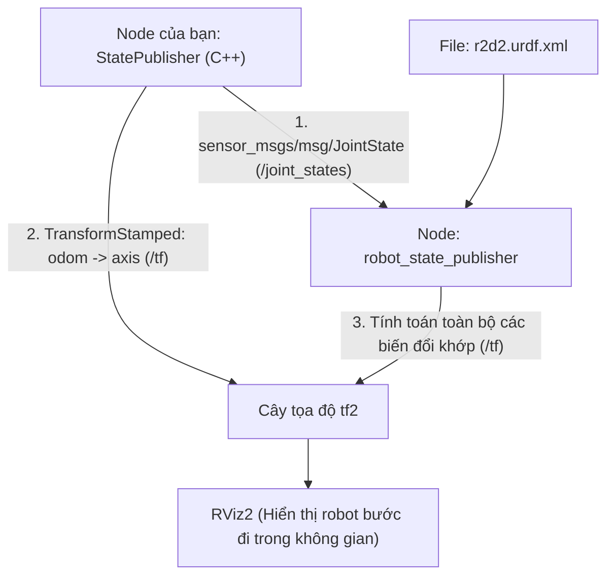

---
tags:
  - ros2
  - urdf
  - robot_state_publisher
  - joint_state
  - cpp
  - rviz2
  - intermediate
created: 2026-08-25
aliases:
  - Sử dụng URDF với robot_state_publisher bằng C++
  - Using URDF with robot_state_publisher (C++)
---

# 🤖 Sử dụng URDF với robot_state_publisher bằng C++ (State Publisher)

> [!INFO] **Mục tiêu bài học**
> Xây dựng một node C++ mô phỏng chuyển động của robot R2D2 đi dạo theo quỹ đạo tròn: xuất bản bản tin **`sensor_msgs/msg/JointState`** lên topic `/joint_states` và phát tọa độ vị trí tổng thể (**`odom -> axis`**) qua `TransformBroadcaster` để `robot_state_publisher` tự động tính toán toàn bộ cây khung tọa độ hiển thị trong **RViz2**.
> - **Cấp độ:** Intermediate
> - **Thời lượng ước tính:** 20 phút
> - **Bài trước:** [[04 - Using Xacro to Clean Up URDF Code|Sử dụng Xacro Tối ưu hóa Mã nguồn URDF]]
> - **Bài song song (Python):** [[06 - Using URDF with robot_state_publisher (Python)|Sử dụng URDF với robot_state_publisher (Python)]]
> - **Bài tiếp theo:** [[07 - Exporting URDF from CAD and Tools|Xuất file URDF từ phần mềm CAD]]

---

## 📖 Cơ chế Phối hợp giữa State Publisher và robot_state_publisher



---

## 🛠️ Triển khai mã nguồn C++ (Tasks)

### 1. Tạo Package `urdf_tutorial_cpp`
```bash
cd ~/ros2_ws/src
ros2 pkg create --build-type ament_cmake --license Apache-2.0 urdf_tutorial_cpp \
  --dependencies rclcpp geometry_msgs sensor_msgs tf2_ros tf2_geometry_msgs
```

---

### 2. Viết Node C++ (`src/urdf_tutorial.cpp`)

```cpp
#include <chrono>
#include <cmath>
#include <memory>
#include <thread>

#include "geometry_msgs/msg/quaternion.hpp"
#include "geometry_msgs/msg/transform_stamped.hpp"
#include "rclcpp/rclcpp.hpp"
#include "sensor_msgs/msg/joint_state.hpp"
#include "tf2/LinearMath/Quaternion.hpp"
#include "tf2_geometry_msgs/tf2_geometry_msgs.hpp"
#include "tf2_ros/transform_broadcaster.hpp"

using namespace std::chrono_literals;

class StatePublisher : public rclcpp::Node
{
public:
  StatePublisher(rclcpp::NodeOptions options = rclcpp::NodeOptions())
  : Node("state_publisher", options)
  {
    // 1. Publisher phát vị trí các góc khớp
    joint_pub_ = this->create_publisher<sensor_msgs::msg::JointState>("joint_states", 10);

    // 2. Broadcaster phát vị trí tổng thể robot trong thế giới odom
    broadcaster_ = std::make_shared<tf2_ros::TransformBroadcaster>(this);

    RCLCPP_INFO(this->get_logger(), "Đang khởi động State Publisher (30 Hz)...");
    timer_ = this->create_wall_timer(33ms, std::bind(&StatePublisher::publish, this));
  }

private:
  void publish()
  {
    const auto ts = this->get_clock()->now();

    // A. Xuất bản JointState (3 khớp động: swivel, tilt, periscope)
    sensor_msgs::msg::JointState joint_state;
    joint_state.header.stamp = ts;
    joint_state.name = {"swivel", "tilt", "periscope"};
    joint_state.position = {swivel_, tilt_, height_};
    joint_pub_->publish(joint_state);

    // B. Xuất bản Transform tổng thể: odom -> axis (robot đi vòng tròn bán kính 2m)
    geometry_msgs::msg::TransformStamped t;
    t.header.stamp = ts;
    t.header.frame_id = "odom";
    t.child_frame_id = "axis";

    t.transform.translation.x = cos(angle_) * 2.0;
    t.transform.translation.y = sin(angle_) * 2.0;
    t.transform.translation.z = 0.7;

    tf2::Quaternion q;
    q.setRPY(0.0, 0.0, angle_ + M_PI / 2.0);
    t.transform.rotation = tf2::toMsg(q);

    broadcaster_->sendTransform(t);

    // C. Cập nhật biến trạng thái cho chu kỳ kế tiếp
    tilt_ += tinc_;
    if (tilt_ < -0.5 || tilt_ > 0.0) {
      tinc_ *= -1.0;
    }
    height_ += hinc_;
    if (height_ > 0.2 || height_ < 0.0) {
      hinc_ *= -1.0;
    }
    swivel_ += degree_;
    angle_ += degree_ / 4.0;
  }

  rclcpp::Publisher<sensor_msgs::msg::JointState>::SharedPtr joint_pub_;
  std::shared_ptr<tf2_ros::TransformBroadcaster> broadcaster_;
  rclcpp::TimerBase::SharedPtr timer_;

  const double degree_ = M_PI / 180.0;
  double tilt_ = 0.0, tinc_ = degree_;
  double swivel_ = 0.0;
  double angle_ = 0.0;
  double height_ = 0.0, hinc_ = 0.005;
};

int main(int argc, char * argv[])
{
  rclcpp::init(argc, argv);
  rclcpp::spin(std::make_shared<StatePublisher>());
  rclcpp::shutdown();
  return 0;
}
```

---

### 3. Viết Launch File (`launch/launch.py`)

```python
from launch import LaunchDescription
from launch.actions import DeclareLaunchArgument
from launch.substitutions import FileContent, LaunchConfiguration, PathJoinSubstitution
from launch_ros.actions import Node
from launch_ros.substitutions import FindPackageShare

def generate_launch_description():
    use_sim_time = LaunchConfiguration('use_sim_time', default='false')

    urdf_path = PathJoinSubstitution([
        FindPackageShare('urdf_tutorial_cpp'), 'urdf', 'r2d2.urdf.xml'
    ])
    urdf = FileContent(urdf_path)

    return LaunchDescription([
        DeclareLaunchArgument('use_sim_time', default_value='false'),
        
        # Node robot_state_publisher nạp file URDF và tính TF
        Node(
            package='robot_state_publisher',
            executable='robot_state_publisher',
            name='robot_state_publisher',
            parameters=[{'use_sim_time': use_sim_time, 'robot_description': urdf}],
        ),
        
        # Node StatePublisher C++ của chúng ta
        Node(
            package='urdf_tutorial_cpp',
            executable='urdf_tutorial_cpp',
            name='urdf_tutorial_cpp',
        ),
    ])
```

---

### 4. Cấu hình `CMakeLists.txt`
```cmake
add_executable(urdf_tutorial_cpp src/urdf_tutorial.cpp)
target_link_libraries(urdf_tutorial_cpp PUBLIC
  geometry_msgs::geometry_msgs sensor_msgs::sensor_msgs
  tf2_ros::tf2_ros tf2_geometry_msgs::tf2_geometry_msgs rclcpp::rclcpp
)

install(TARGETS urdf_tutorial_cpp DESTINATION lib/${PROJECT_NAME})
install(DIRECTORY launch urdf DESTINATION share/${PROJECT_NAME})
```

---

## 🚀 Biên dịch và Xem Robot Di chuyển trong RViz

```bash
cd ~/ros2_ws
colcon build --symlink-install --packages-select urdf_tutorial_cpp
source install/setup.bash

# Khởi chạy node và robot_state_publisher
ros2 launch urdf_tutorial_cpp launch.py
```

Mở terminal 2 và bật RViz với file cấu hình:
```bash
rviz2 -d install/urdf_tutorial_cpp/share/urdf_tutorial_cpp/urdf/r2d2.rviz
```

Bạn sẽ thấy mô hình 3D của R2D2 đang vừa xoay đầu, vừa nâng hạ kính tiềm vọng và di chuyển thành vòng tròn tuyệt đẹp trên sàn!

---

## 📌 Tóm tắt (Summary)
- `robot_state_publisher` là cầu nối trọng yếu giữa mô hình hình học tĩnh URDF và các chuyển động động học thời gian thực trong ROS 2.

---

## 🔗 Liên kết & Bài tiếp theo
- ⬅️ Bài trước: [[04 - Using Xacro to Clean Up URDF Code|Sử dụng Xacro Tối ưu hóa Mã nguồn URDF]]
- 🐍 Phiên bản Python: [[06 - Using URDF with robot_state_publisher (Python)|Sử dụng URDF với robot_state_publisher (Python)]]
- ➡️ Bài tiếp theo: [[07 - Exporting URDF from CAD and Tools|Xuất file URDF từ phần mềm CAD]]
