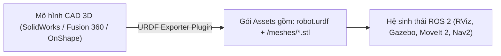

---
tags:
  - ros2
  - urdf
  - cad
  - solidworks
  - fusion360
  - onshape
  - freecad
  - blender
  - intermediate
created: 2026-08-25
aliases:
  - Xuất file URDF từ phần mềm CAD
  - Generating an URDF File
---

# 🏭 Xuất file URDF từ phần mềm CAD (CAD URDF Exporters)

> [!INFO] **Mục tiêu bài học**
> Khám phá các công cụ và plugin tự động xuất khẩu (**Export**) mô hình hình học, khối lượng, tọa độ trọng tâm và ma trận quán tính từ các phần mềm thiết kế cơ khí 3D CAD chuyên nghiệp (**SolidWorks**, **Autodesk Fusion 360**, **OnShape**, **FreeCAD**, **Blender**) sang định dạng chuẩn URDF của ROS 2.
> - **Cấp độ:** Intermediate
> - **Thời lượng ước tính:** 10 phút
> - **Bài trước:** [[06 - Using URDF with robot_state_publisher (Python)|Sử dụng URDF với robot_state_publisher (Python)]]
> - **Mục lục tổng quan:** [[ROS 2 Learning Path]]
> - **Phần tiếp theo:** [[01 - RViz User Guide and Core Concepts|Hướng dẫn Sử dụng RViz2 Toàn diện]]

---

## 📖 Bối cảnh Thực tế (Industrial Context)

Trong các đội ngũ phát triển robot chuyên nghiệp:
- Kỹ sư cơ khí (Mechanical Engineers) thiết kế robot chi tiết trong phần mềm CAD (kèm vật liệu thép, nhôm, nhựa chính xác).
- Việc viết tay hàng nghìn dòng XML cho các robot nhiều bậc tự do (như robot hình người, tay máy 7 trục, chó robot 4 chân) là bất khả thi và dễ sai sót.

Các công cụ **URDF Exporter** tự động tính toán trọng tâm, trích xuất file lưới 3D `.stl`/`.dae` và sinh file `.urdf` chỉ với vài cú nhấp chuột.

---

## 🛠️ Danh sách các Công cụ CAD Exporters Phổ biến nhất

### 1. SolidWorks
- **`sw_urdf_exporter` (SolidWorks to URDF Exporter):** Plugin chính thức phổ biến nhất. Cho phép chọn cây khớp, định vị trục quay và tự động tính toán tensor quán tính từ khối lượng riêng của vật liệu.

### 2. Autodesk Fusion 360
- **`fusion2urdf`:** Xuất trực tiếp cấu trúc cụm chi tiết (Assembly) sang URDF kèm cấu hình `ros2_control`.
- **`FusionSDF`:** Xuất mô hình sang định dạng SDFormat cho Gazebo Ignition.

### 3. OnShape (Nền tảng Cloud CAD)
- **`onshape-to-robot`:** Công cụ dòng lệnh kết nối trực tiếp qua OnShape API, tự động tải các part meshes và sinh file URDF/SDF mà không cần cài phần mềm nặng.

### 4. FreeCAD (Mã nguồn mở)
- **`FreeCAD ROS Workbench` & `RobotCAD`:** Môi trường thiết kế mã nguồn mở hoàn toàn miễn phí tích hợp sẵn công cụ xuất URDF.

### 5. Blender (3D Animation & Modeling)
- **`Blender URDF Exporter`:** Nằm trong bộ công cụ *Blender Robotics Tools*, hữu ích cho các mô hình đồ họa phức tạp.

---

## 🌐 Các Công cụ Chuyển đổi và Xem trước URDF Trực tuyến

| Tên Công cụ | Chức năng chính |
| :--- | :--- |
| **`urdf-viz` / Web URDF Viewer** | Xem và kiểm tra chuyển động khớp URDF trực tiếp trên trình duyệt Web không cần cài ROS. |
| **`JupyterLab URDF Viewer`** | Xem mô hình robot tương tác bên trong Jupyter Notebook. |
| **`sdformat_urdf`** | Bộ chuyển đổi qua lại giữa định dạng Gazebo SDF và ROS URDF. |

---

## 📌 Tóm tắt (Summary)
- Tận dụng CAD Exporters giúp tiết kiệm hàng tuần làm việc thủ công khi tích hợp robot cơ khí vào ROS 2.
- Sau khi export, bạn nên tinh chỉnh lại bằng [[04 - Using Xacro to Clean Up URDF Code|Xacro]] để mô hình linh hoạt hơn.

---

## 🔗 Liên kết & Bài tiếp theo
- ⬅️ Bài trước: [[06 - Using URDF with robot_state_publisher (Python)|Sử dụng URDF với robot_state_publisher (Python)]]
- 👁️ Bước sang Phần 7 (Visualization): [[01 - RViz User Guide and Core Concepts|Hướng dẫn Sử dụng RViz2 Toàn diện]]
