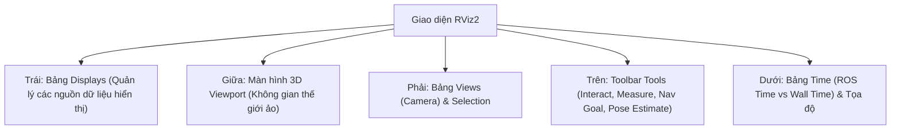

---
tags:
  - ros2
  - rviz2
  - visualization
  - 3d-rendering
  - displays
  - coordinate-frames
  - intermediate
created: 2026-08-25
aliases:
  - Hướng dẫn Sử dụng RViz2 Toàn diện
  - RViz User Guide
---

# 👁️ Hướng dẫn Sử dụng RViz2 Toàn diện (RViz2 User Guide & Core Concepts)

> [!INFO] **Mục tiêu bài học**
> Làm chủ **RViz2** — môi trường trực quan hóa không gian 3D cốt lõi của ROS 2: quản lý danh sách **Displays**, phân biệt **Fixed Frame** và **Target Frame**, chuyển đổi các góc nhìn Camera (**Views**), sử dụng thanh công cụ đo đạc & điều hướng (**Tools**), và lưu trữ tệp cấu hình `.rviz`.
> - **Cấp độ:** Intermediate
> - **Thời lượng ước tính:** 25 phút
> - **Mục lục tổng quan:** [[ROS 2 Learning Path]]
> - **Bài trước:** [[07 - Exporting URDF from CAD and Tools|Xuất file URDF từ phần mềm CAD]]
> - **Bài tiếp theo:** [[02 - Sending Basic Shape Markers to RViz (C++)|Gửi Marker Hình học Cơ bản lên RViz2 (C++)]]

---

## 📖 RViz2 là gì? (What is RViz2?)

**RViz2 (ROS Visualization 2)** là phần mềm giao diện đồ họa 3D dựa trên thư viện **Qt** và công cụ render **OGRE**, cho phép lập trình viên "nhìn thấy những gì robot đang cảm nhận":
- Hiển thị mô hình robot theo thời gian thực (URDF + TF).
- Trực quan hóa dữ liệu cảm biến: Đám mây điểm 3D (PointCloud2), quét laser (LaserScan), hình ảnh camera, bản đồ chiếm dụng (OccupancyGrid Map).
- Tương tác điều hướng: Đặt điểm bắt đầu ước lượng vị trí (**2D Pose Estimate**) và chỉ định đích đến cho robot (**2D Nav Goal**).

```bash
# Khởi động RViz2
ros2 run rviz2 rviz2
```

---

## 🖥️ Cấu trúc Giao diện RViz2 (Layout Overview)



---

## 📦 Các Loại Displays Tích hợp Sẵn (Built-in Display Types)

| Tên Display | Mô tả chức năng | Thông điệp ROS 2 sử dụng |
| :--- | :--- | :--- |
| **`RobotModel`** | Render mô hình 3D hoàn chỉnh của robot từ URDF | `robot_description` parameter + `/tf` |
| **`TF`** | Hiển thị toàn bộ hệ trục tọa độ $XYZ$ của cây `tf2 Tree` | `/tf`, `/tf_static` |
| **`LaserScan`** | Hiển thị các tia quét 2D/3D từ cảm biến Lidar | `sensor_msgs/msg/LaserScan` |
| **`PointCloud2`** | Hiển thị đám mây điểm 3D (từ RGB-D Camera, Lidar 3D) | `sensor_msgs/msg/PointCloud2` |
| **`Map`** | Hiển thị bản đồ 2D dạng lưới Occupancy Grid | `nav_msgs/msg/OccupancyGrid` |
| **`Path`** | Hiển thị đường đi dự kiến của thuật toán điều hướng Nav2 | `nav_msgs/msg/Path` |
| **`Pose` / `PoseArray`** | Hiển thị mũi tên hướng vị trí của robot hoặc các hạt định vị AMCL | `geometry_msgs/msg/PoseStamped` |
| **`Marker` / `MarkerArray`** | Hiển thị hình khối tùy chỉnh (hình hộp, hình cầu, chữ 3D) do người dùng lập trình | `visualization_msgs/msg/Marker` |
| **`Image` / `Camera`** | Mở cửa sổ xem luồng hình ảnh Camera kèm góc phối cảnh 3D | `sensor_msgs/msg/Image` |
| **`Grid`** | Lưới tham chiếu mặt phẳng sàn (Ground Plane) | Internal render |

---

## 🎯 Phân biệt Fixed Frame vs Target Frame

> [!IMPORTANT] **Khái niệm sống còn trong RViz2:**

1. **`Fixed Frame` (Hệ quy chiếu Cố định Toàn cục):**
   - Đại diện cho gốc tọa độ bất biến của thế giới thực (thường là **`map`** hoặc **`odom`** hoặc `world`).
   - Mọi dữ liệu cảm biến đến từ các frame con khác đều được `tf2` chuyển đổi về Fixed Frame trước khi vẽ.
   - *Cảnh báo:* Không bao giờ đặt Fixed Frame là `base_link` (thân robot), nếu không toàn bộ bản đồ và vật thể sẽ chuyển động ngược quanh robot!

2. **`Target Frame` (Hệ quy chiếu Mục tiêu của Camera):**
   - Xác định điểm mà Camera trong RViz sẽ lấy làm tâm để nhìn vào.
   - Nếu chọn Target Frame là `base_link`, camera sẽ tự động "bay theo" robot khi robot di chuyển.

---

## 📷 Các Chế độ Xem Camera (Views Panel)

- **`Orbital Camera` (Mặc định):** Xoay quanh một tâm hội tụ (*Focal point*). (Chuột trái: Xoay, Chuột giữa: Di chuyển mặt phẳng, Cuộn chuột: Phóng to/thu nhỏ).
- **`FPS Camera` (Góc nhìn Người thứ nhất):** Điều khiển như trong game bắn súng góc nhìn thứ nhất (WASD hoặc chuột).
- **`Top-down Orthographic`:** Góc nhìn thẳng từ trên trần nhà nhìn xuống (không có hiệu ứng phối cảnh xa gần), cực kỳ chuẩn xác để đo đạc bản đồ 2D.
- **`Third Person Follower`:** Camera tự động bám phía sau lưng robot và xoay theo hướng robot rẽ.

---

## 🛠️ Thanh Công cụ Tương tác (Toolbar Tools)

| Phím tắt | Tên công cụ | Chức năng |
| :---: | :--- | :--- |
| `i` | **Interact** | Tương tác với các Interactive Marker 3D. |
| `m` | **Move Camera** | Chế độ di chuyển và xoay góc nhìn camera 3D. |
| `s` | **Select** | Chọn các đối tượng/điểm trên màn hình để xem thông số chi tiết. |
| `c` | **Focus Camera** | Nhấp vào một vật thể bất kỳ để đưa tâm camera về vật thể đó. |
| `n` | **Measure** | Đo khoảng cách thẳng giữa 2 điểm bất kỳ trong không gian 3D. |
| `p` | **2D Pose Estimate** | Nhấp và kéo chuột để gán vị trí ước lượng ban đầu cho robot (xuất bản vào topic `/initialpose`). |
| `g` | **2D Nav Goal** | Nhấp và kéo chuột để ra lệnh điểm đích cần đến cho robot (xuất bản vào topic `/goal_pose`). |
| `u` | **Publish Point** | Xuất bản tọa độ 3D của điểm vừa nhấp chuột vào topic `/clicked_point`. |

---

## 📌 Tóm tắt (Summary)
- RViz2 là công cụ giám sát trực quan không thể thiếu trong phát triển robot ROS 2.
- Luôn cấu hình chính xác `Fixed Frame` và lưu lại cấu hình làm việc vào file `.rviz` để tái sử dụng nhanh chóng.

---

## 🔗 Liên kết & Bài tiếp theo
- ⬅️ Trở về: [[ROS 2 Learning Path|Lộ trình học ROS 2]]
- ➡️ Bài tiếp theo: [[02 - Sending Basic Shape Markers to RViz (C++)|Gửi Marker Hình học Cơ bản lên RViz2 (C++)]]
